# Python for analysis: Scikit-HEP tutorial

**June 20, 2025 at HSF/IRIS-HEP Software Basics Training at CERN**

based on [Scikit-HEP Tutorial](https://hsf-training.github.io/hsf-training-scikit-hep-webpage/index.html)

<br><br><br><br><br>

## Z peak in PyROOT

Let's start with the most straightforward way to analyze HEP data in Python: "for" loops in PyROOT.


```python
import time
import numpy as np
import ROOT

canvas = ROOT.TCanvas()
```


```python
rootfile = ROOT.TFile.Open("data/HiggsZZ4mu.root")
roottree = rootfile.Get("Events")
```


```python
starttime = time.time()

roothist = ROOT.TH1D("roothist", "mass", 120, 0, 120)

for index, event in enumerate(roottree):
    # cuts are "if" statements
    if event.nMuon >= 2 and event.Muon_charge[0] + event.Muon_charge[1] == 0:
        mu1_pt = event.Muon_pt[0]
        mu2_pt = event.Muon_pt[1]
        mu1_eta = event.Muon_eta[0]
        mu2_eta = event.Muon_eta[1]
        mu1_phi = event.Muon_phi[0]
        mu2_phi = event.Muon_phi[1]

        # histograms are filled in the loop
        roothist.Fill(
            np.sqrt(2*mu1_pt*mu2_pt*(np.cosh(mu1_eta - mu2_eta) - np.cos(mu1_phi - mu2_phi)))
        )

pyroot_time = time.time() - starttime
print(f"total time: {pyroot_time} sec")
```

    total time: 3.611024856567383 sec


```python
roothist.Draw()
canvas.Draw()
```


<div id="root_plot_1750334366691" style="width: 700px; height: 500px; position: relative">
</div>

<script>

function display_root_plot_1750334366691(Core) {
   let obj = Core.parse({"_typename":"TCanvasWebSnapshot","fUniqueID":0,"fBits":0,"fObjectID":"","fOption":"","fKind":3,"fSnapshot":{"_typename":"TCanvas","fUniqueID":0,"fBits":3342344,"fLineColor":1,"fLineStyle":1,"fLineWidth":1,"fFillColor":0,"fFillStyle":1001,"fLeftMargin":0.1,"fRightMargin":0.1,"fBottomMargin":0.1,"fTopMargin":0.1,"fXfile":2,"fYfile":2,"fAfile":1,"fXstat":0.99,"fYstat":0.99,"fAstat":2,"fFrameFillColor":0,"fFrameLineColor":1,"fFrameFillStyle":1001,"fFrameLineStyle":1,"fFrameLineWidth":1,"fFrameBorderSize":1,"fFrameBorderMode":0,"fX1":-15.0000011175872,"fY1":-827.531311655886,"fX2":135.000001117587,"fY2":7447.78131165589,"fXtoAbsPixelk":69.6000041484835,"fXtoPixelk":69.6000041484835,"fXtoPixel":4.63999993085861,"fYtoAbsPixelk":424.799997186661,"fYtoPixelk":424.799997186661,"fYtoPixel":-0.0570371201047274,"fUtoAbsPixelk":0,"fUtoPixelk":0,"fUtoPixel":696,"fVtoAbsPixelk":472,"fVtoPixelk":472,"fVtoPixel":-472,"fAbsPixeltoXk":-15.0000011175872,"fPixeltoXk":-15.0000011175872,"fPixeltoX":0.215517244590768,"fAbsPixeltoYk":7447.78131165589,"fPixeltoYk":-827.531311655886,"fPixeltoY":-17.5324419985419,"fXlowNDC":0,"fYlowNDC":0,"fXUpNDC":1,"fYUpNDC":1,"fWNDC":1,"fHNDC":1,"fAbsXlowNDC":0,"fAbsYlowNDC":0,"fAbsWNDC":1,"fAbsHNDC":1,"fUxmin":0,"fUymin":0,"fUxmax":120,"fUymax":6620.25,"fTheta":30,"fPhi":30,"fAspectRatio":0,"fNumber":0,"fTickx":0,"fTicky":0,"fLogx":0,"fLogy":0,"fLogz":0,"fPadPaint":0,"fCrosshair":0,"fCrosshairPos":0,"fBorderSize":2,"fBorderMode":0,"fModified":false,"fGridx":false,"fGridy":false,"fAbsCoord":false,"fEditable":true,"fFixedAspectRatio":false,"fPrimitives":{"_typename":"TList","name":"TList","arr":[],"opt":[]},"fExecs":null,"fName":"c1","fTitle":"c1","fNumPaletteColor":0,"fNextPaletteColor":0,"fDISPLAY":"$DISPLAY","fDoubleBuffer":0,"fRetained":true,"fXsizeUser":0,"fYsizeUser":0,"fXsizeReal":20,"fYsizeReal":14.28571,"fWindowTopX":0,"fWindowTopY":0,"fWindowWidth":0,"fWindowHeight":0,"fCw":696,"fCh":472,"fCatt":{"_typename":"TAttCanvas","fXBetween":2,"fYBetween":2,"fTitleFromTop":1.2,"fXdate":0.2,"fYdate":0.3,"fAdate":1},"kMoveOpaque":true,"kResizeOpaque":true,"fHighLightColor":2,"fBatch":true,"kShowEventStatus":false,"kAutoExec":true,"kMenuBar":true},"fActive":false,"fReadOnly":true,"fWithoutPrimitives":false,"fHasExecs":false,"fPrimitives":[{"_typename":"TWebSnapshot","fUniqueID":0,"fBits":0,"fObjectID":"","fOption":"","fKind":4,"fSnapshot":{"_typename":"TWebPainting","fUniqueID":0,"fBits":0,"fOper":"0:255,255,255;1:0,0,0;2:255,0,0;3:0,255,0;4:0,0,255;5:255,255,0;6:255,0,255;7:0,255,255;8:89,211,84;9:89,84,216;10:254,254,254;11:192,182,172;12:76,76,76;13:102,102,102;14:127,127,127;15:153,153,153;16:178,178,178;17:204,204,204;18:229,229,229;19:242,242,242;20:204,198,170;21:204,198,170;22:193,191,168;23:186,181,163;24:178,165,150;25:183,163,155;26:173,153,140;27:155,142,130;28:135,102,86;29:175,206,198;30:132,193,163;31:137,168,160;32:130,158,140;33:173,188,198;34:122,142,153;35:117,137,145;36:104,130,150;37:109,122,132;38:124,153,209;39:127,127,155;40:170,165,191;41:211,206,135;42:221,186,135;43:188,158,130;44:198,153,124;45:191,130,119;46:206,94,96;47:170,142,147;48:165,119,122;49:147,104,112;50:211,89,84;51:146,0,255;52:122,0,255;53:98,0,255;54:74,0,255;55:51,0,255;56:27,0,255;57:3,0,255;58:0,20,255;59:0,44,255;60:0,68,255;61:0,91,255;62:0,115,255;63:0,139,255;64:0,163,255;65:0,187,255;66:0,210,255;67:0,234,255;68:0,255,251;69:0,255,227;70:0,255,204;71:0,255,180;72:0,255,156;73:0,255,132;74:0,255,108;75:0,255,85;76:0,255,61;77:0,255,37;78:0,255,13;79:10,255,0;80:34,255,0;81:57,255,0;82:81,255,0;83:105,255,0;84:129,255,0;85:153,255,0;86:176,255,0;87:200,255,0;88:224,255,0;89:248,255,0;90:255,238,0;91:255,214,0;92:255,190,0;93:255,166,0;94:255,142,0;95:255,119,0;96:255,95,0;97:255,71,0;98:255,47,0;99:255,23,0;100:111,45,168;101:165,42,42;102:178,190,181;103:87,144,252;104:248,156,32;105:228,37,54;106:150,74,139;107:156,156,161;108:122,33,221;109:24,69,251;110:255,94,2;111:201,31,22;112:200,73,169;113:173,173,125;114:134,200,221;115:87,141,255;116:101,99,100;117:63,144,218;118:255,169,14;119:189,31,1;120:148,164,162;121:131,45,182;122:169,107,89;123:231,99,0;124:185,172,112;125:113,117,129;126:146,218,221;127:178,178,178;201:91,91,91;202:122,122,122;203:183,183,183;204:214,214,214;205:137,15,15;206:183,20,20;207:234,71,71;208:239,117,117;209:15,137,15;210:20,183,20;211:71,234,71;212:117,239,117;213:15,15,137;214:20,20,183;215:71,71,234;216:117,117,239;217:137,137,15;218:183,183,20;219:234,234,71;220:239,239,117;221:137,15,137;222:183,20,183;223:234,71,234;224:239,117,239;225:15,137,137;226:20,183,183;227:71,234,234;228:117,239,239;390:255,255,204;391:255,255,153;392:204,204,153;393:255,255,102;394:204,204,102;395:153,153,102;396:255,255,51;397:204,204,51;398:153,153,51;399:102,102,51;400:255,255,0;401:204,204,0;402:153,153,0;403:102,102,0;404:51,51,0;406:204,255,204;407:153,255,153;408:153,204,153;409:102,255,102;410:102,204,102;411:102,153,102;412:51,255,51;413:51,204,51;414:51,153,51;415:51,102,51;416:0,255,0;417:0,204,0;418:0,153,0;419:0,102,0;420:0,51,0;422:204,255,255;423:153,255,255;424:153,204,204;425:102,255,255;426:102,204,204;427:102,153,153;428:51,255,255;429:51,204,204;430:51,153,153;431:51,102,102;432:0,255,255;433:0,204,204;434:0,153,153;435:0,102,102;436:0,51,51;590:204,204,255;591:153,153,255;592:153,153,204;593:102,102,255;594:102,102,204;595:102,102,153;596:51,51,255;597:51,51,204;598:51,51,153;599:51,51,102;600:0,0,255;601:0,0,204;602:0,0,153;603:0,0,102;604:0,0,51;606:255,204,255;607:255,153,255;608:204,153,204;609:255,102,255;610:204,102,204;611:153,102,153;612:255,51,255;613:204,51,204;614:153,51,153;615:102,51,102;616:255,0,255;617:204,0,204;618:153,0,153;619:102,0,102;620:51,0,51;622:255,204,204;623:255,153,153;624:204,153,153;625:255,102,102;626:204,102,102;627:153,102,102;628:255,51,51;629:204,51,51;630:153,51,51;631:102,51,51;632:255,0,0;633:204,0,0;634:153,0,0;635:102,0,0;636:51,0,0;791:255,204,153;792:204,153,102;793:153,102,51;794:153,102,0;795:204,153,51;796:255,204,102;797:255,153,0;798:255,204,51;799:204,153,0;800:255,204,0;801:255,153,51;802:204,102,0;803:102,51,0;804:153,51,0;805:204,102,51;806:255,153,102;807:255,102,0;808:255,102,51;809:204,51,0;810:255,51,0;811:153,255,51;812:102,204,0;813:51,102,0;814:51,153,0;815:102,204,51;816:153,255,102;817:102,255,0;818:102,255,51;819:51,204,0;820:51,255,0;821:204,255,153;822:153,204,102;823:102,153,51;824:102,153,0;825:153,204,51;826:204,255,102;827:153,255,0;828:204,255,51;829:153,204,0;830:204,255,0;831:153,255,204;832:102,204,153;833:51,153,102;834:0,153,102;835:51,204,153;836:102,255,204;837:0,255,102;838:51,255,204;839:0,204,153;840:0,255,204;841:51,255,153;842:0,204,102;843:0,102,51;844:0,153,51;845:51,204,102;846:102,255,153;847:0,255,153;848:51,255,102;849:0,204,51;850:0,255,51;851:153,204,255;852:102,153,204;853:51,102,153;854:0,51,153;855:51,102,204;856:102,153,255;857:0,102,255;858:51,102,255;859:0,51,204;860:0,51,255;861:51,153,255;862:0,102,204;863:0,51,102;864:0,102,153;865:51,153,204;866:102,204,255;867:0,153,255;868:51,204,255;869:0,153,204;870:0,204,255;871:204,153,255;872:153,102,204;873:102,51,153;874:102,0,153;875:153,51,204;876:204,102,255;877:153,0,255;878:204,51,255;879:153,0,204;880:204,0,255;881:153,51,255;882:102,0,204;883:51,0,102;884:51,0,153;885:102,51,204;886:153,102,255;887:102,0,255;888:102,51,255;889:51,0,204;890:51,0,255;891:255,51,153;892:204,0,102;893:102,0,51;894:153,0,51;895:204,51,102;896:255,102,153;897:255,0,102;898:255,51,102;899:204,0,51;900:255,0,51;901:255,153,204;902:204,102,153;903:153,51,102;904:153,0,102;905:204,51,153;906:255,102,204;907:255,0,153;908:204,0,153;909:255,51,204;910:255,0,153;920:204,204,204;921:153,153,153;922:102,102,102;923:51,51,51;924:53,42,134;925:51,44,137;926:50,45,140;927:49,47,143;928:48,48,146;929:46,50,148;930:45,51,151;931:44,53,154;932:43,55,157;933:42,56,160;934:40,58,162;935:39,59,165;936:38,61,168;937:37,63,171;938:35,64,174;939:34,66,176;940:33,67,179;941:32,69,182;942:31,71,185;943:29,72,187;944:28,74,190;945:27,75,193;946:26,77,196;947:24,79,199;948:23,80,201;949:22,82,204;950:21,83,207;951:19,85,210;952:18,86,213;953:17,88,215;954:16,90,218;955:15,91,221;956:15,92,221;957:15,94,220;958:15,95,220;959:15,96,220;960:15,97,220;961:15,98,220;962:16,99,219;963:16,100,219;964:16,102,219;965:16,103,219;966:16,104,218;967:16,105,218;968:17,106,218;969:17,107,218;970:17,109,217;971:17,110,217;972:17,111,217;973:17,112,217;974:17,113,216;975:18,114,216;976:18,115,216;977:18,117,216;978:18,118,215;979:18,119,215;980:18,120,215;981:18,121,215;982:19,122,215;983:19,123,214;984:19,125,214;985:19,126,214;986:19,127,214;987:19,128,213;988:19,129,213;989:19,130,213;990:18,131,212;991:18,132,212;992:17,134,211;993:17,135,211;994:16,136,211;995:16,137,210;996:15,138,210;997:15,139,210;998:15,140,209;999:14,141,209;1000:14,142,208;1001:13,143,208;1002:13,145,208;1003:12,146,207;1004:12,147,207;1005:12,148,207;1006:11,149,206;1007:11,150,206;1008:10,151,205;1009:10,152,205;1010:9,153,205;1011:9,154,204;1012:8,155,204;1013:8,157,204;1014:8,158,203;1015:7,159,203;1016:7,160,202;1017:6,161,202;1018:6,162,202;1019:5,163,201;1020:7,164,200;1021:8,164,199;1022:9,165,198;1023:10,166,197;1024:12,166,195;1025:13,167,194;1026:14,167,193;1027:15,168,192;1028:17,169,191;1029:18,169,189;1030:19,170,188;1031:20,170,187;1032:22,171,186;1033:23,172,185;1034:24,172,184;1035:25,173,182;1036:27,173,181;1037:28,174,180;1038:29,175,179;1039:30,175,178;1040:32,176,176;1041:33,176,175;1042:34,177,174;1043:35,178,173;1044:37,178,172;1045:38,179,170;1046:39,180,169;1047:40,180,168;1048:42,181,167;1049:43,181,166;1050:44,182,165;1051:45,183,163;1052:48,183,162;1053:51,183,161;1054:54,183,159;1055:57,184,158;1056:59,184,156;1057:62,184,155;1058:65,184,154;1059:68,185,152;1060:71,185,151;1061:73,185,149;1062:76,185,148;1063:79,186,146;1064:82,186,145;1065:84,186,144;1066:87,186,142;1067:90,187,141;1068:93,187,139;1069:96,187,138;1070:98,187,137;1071:101,188,135;1072:104,188,134;1073:107,188,132;1074:110,188,131;1075:112,189,130;1076:115,189,128;1077:118,189,127;1078:121,189,125;1079:124,190,124;1080:126,190,123;1081:129,190,121;1082:132,190,120;1083:135,191,118;1084:137,190,117;1085:139,190,117;1086:142,190,116;1087:144,190,115;1088:146,190,114;1089:148,190,113;1090:151,190,112;1091:153,190,111;1092:155,189,110;1093:158,189,109;1094:160,189,108;1095:162,189,107;1096:165,189,106;1097:167,189,105;1098:169,189,104;1099:171,188,104;1100:174,188,103;1101:176,188,102;1102:178,188,101;1103:181,188,100;1104:183,188,99;1105:185,188,98;1106:188,188,97;1107:190,187,96;1108:192,187,95;1109:194,187,94;1110:197,187,93;1111:199,187,92;1112:201,187,92;1113:204,187,91;1114:206,186,90;1115:208,186,89;1116:210,187,88;1117:211,187,86;1118:212,188,85;1119:214,188,84;1120:215,188,83;1121:217,189,81;1122:218,189,80;1123:220,190,79;1124:221,190,78;1125:222,191,77;1126:224,191,75;1127:225,191,74;1128:227,192,73;1129:228,192,72;1130:229,193,70;1131:231,193,69;1132:232,194,68;1133:234,194,67;1134:235,194,66;1135:236,195,64;1136:238,195,63;1137:239,196,62;1138:241,196,61;1139:242,197,59;1140:244,197,58;1141:245,197,57;1142:246,198,56;1143:248,198,55;1144:249,199,53;1145:251,199,52;1146:252,200,51;1147:253,200,50;1148:253,202,49;1149:253,203,47;1150:253,205,46;1151:253,206,45;1152:253,208,44;1153:252,209,43;1154:252,211,42;1155:252,213,41;1156:252,214,39;1157:252,216,38;1158:252,217,37;1159:252,219,36;1160:251,220,35;1161:251,222,34;1162:251,224,33;1163:251,225,31;1164:251,227,30;1165:251,228,29;1166:250,230,28;1167:250,231,27;1168:250,233,26;1169:250,235,25;1170:250,236,23;1171:250,238,22;1172:250,239,21;1173:249,241,20;1174:249,242,19;1175:249,244,18;1176:249,246,17;1177:249,247,16;1178:249,249,14","fBuf":{"$arr":"Float32","len":255,"v":[924,925,926,927,928,929,930,931,932,933,934,935,936,937,938,939,940,941,942,943,944,945,946,947,948,949,950,951,952,953,954,955,956,957,958,959,960,961,962,963,964,965,966,967,968,969,970,971,972,973,974,975,976,977,978,979,980,981,982,983,984,985,986,987,988,989,990,991,992,993,994,995,996,997,998,999,1000,1001,1002,1003,1004,1005,1006,1007,1008,1009,1010,1011,1012,1013,1014,1015,1016,1017,1018,1019,1020,1021,1022,1023,1024,1025,1026,1027,1028,1029,1030,1031,1032,1033,1034,1035,1036,1037,1038,1039,1040,1041,1042,1043,1044,1045,1046,1047,1048,1049,1050,1051,1052,1053,1054,1055,1056,1057,1058,1059,1060,1061,1062,1063,1064,1065,1066,1067,1068,1069,1070,1071,1072,1073,1074,1075,1076,1077,1078,1079,1080,1081,1082,1083,1084,1085,1086,1087,1088,1089,1090,1091,1092,1093,1094,1095,1096,1097,1098,1099,1100,1101,1102,1103,1104,1105,1106,1107,1108,1109,1110,1111,1112,1113,1114,1115,1116,1117,1118,1119,1120,1121,1122,1123,1124,1125,1126,1127,1128,1129,1130,1131,1132,1133,1134,1135,1136,1137,1138,1139,1140,1141,1142,1143,1144,1145,1146,1147,1148,1149,1150,1151,1152,1153,1154,1155,1156,1157,1158,1159,1160,1161,1162,1163,1164,1165,1166,1167,1168,1169,1170,1171,1172,1173,1174,1175,1176,1177,1178]}}},{"_typename":"TWebSnapshot","fUniqueID":0,"fBits":0,"fObjectID":"","fOption":"","fKind":5,"fSnapshot":{"_typename":"TStyle","fUniqueID":0,"fBits":0,"fName":"Modern","fTitle":"Modern Style","fLineColor":1,"fLineStyle":1,"fLineWidth":1,"fFillColor":19,"fFillStyle":1001,"fMarkerColor":1,"fMarkerStyle":1,"fMarkerSize":1,"fTextAngle":0,"fTextSize":0.05,"fTextAlign":11,"fTextColor":1,"fTextFont":62,"fXaxis":{"_typename":"TAttAxis","fNdivisions":510,"fAxisColor":1,"fLabelColor":1,"fLabelFont":42,"fLabelOffset":0.005,"fLabelSize":0.035,"fTickLength":0.03,"fTitleOffset":1,"fTitleSize":0.035,"fTitleColor":1,"fTitleFont":42},"fYaxis":{"_typename":"TAttAxis","fNdivisions":510,"fAxisColor":1,"fLabelColor":1,"fLabelFont":42,"fLabelOffset":0.005,"fLabelSize":0.035,"fTickLength":0.03,"fTitleOffset":0,"fTitleSize":0.035,"fTitleColor":1,"fTitleFont":42},"fZaxis":{"_typename":"TAttAxis","fNdivisions":510,"fAxisColor":1,"fLabelColor":1,"fLabelFont":42,"fLabelOffset":0.005,"fLabelSize":0.035,"fTickLength":0.03,"fTitleOffset":1,"fTitleSize":0.035,"fTitleColor":1,"fTitleFont":42},"fBarWidth":1,"fBarOffset":0,"fColorModelPS":0,"fDrawBorder":0,"fOptLogx":0,"fOptLogy":0,"fOptLogz":0,"fOptDate":0,"fOptStat":1111,"fOptTitle":1,"fOptFile":0,"fOptFit":0,"fShowEventStatus":0,"fShowEditor":0,"fShowToolBar":0,"fNumberContours":20,"fAttDate":{"_typename":"TAttText","fTextAngle":0,"fTextSize":0.025,"fTextAlign":11,"fTextColor":1,"fTextFont":62},"fDateX":0.01,"fDateY":0.01,"fEndErrorSize":2,"fErrorX":0.5,"fFuncColor":2,"fFuncStyle":1,"fFuncWidth":2,"fGridColor":0,"fGridStyle":3,"fGridWidth":1,"fLegendBorderSize":1,"fLegendFillColor":0,"fLegendFillStyle":1001,"fLegendFont":42,"fLegendTextSize":0,"fHatchesLineWidth":1,"fHatchesSpacing":1,"fFrameFillColor":0,"fFrameLineColor":1,"fFrameFillStyle":1001,"fFrameLineStyle":1,"fFrameLineWidth":1,"fFrameBorderSize":1,"fFrameBorderMode":0,"fHistFillColor":0,"fHistLineColor":602,"fHistFillStyle":1001,"fHistLineStyle":1,"fHistLineWidth":1,"fHistMinimumZero":false,"fHistTopMargin":0.05,"fCanvasPreferGL":false,"fCanvasColor":0,"fCanvasBorderSize":2,"fCanvasBorderMode":0,"fCanvasDefH":500,"fCanvasDefW":700,"fCanvasDefX":10,"fCanvasDefY":10,"fPadColor":0,"fPadBorderSize":2,"fPadBorderMode":0,"fPadBottomMargin":0.1,"fPadTopMargin":0.1,"fPadLeftMargin":0.1,"fPadRightMargin":0.1,"fPadGridX":false,"fPadGridY":false,"fPadTickX":0,"fPadTickY":0,"fPaperSizeX":20,"fPaperSizeY":26,"fScreenFactor":1,"fStatColor":0,"fStatTextColor":1,"fStatBorderSize":1,"fStatFont":42,"fStatFontSize":0,"fStatStyle":1001,"fStatFormat":"6.4g","fStatX":0.98,"fStatY":0.935,"fStatW":0.2,"fStatH":0.16,"fStripDecimals":true,"fTitleAlign":23,"fTitleColor":0,"fTitleTextColor":1,"fTitleBorderSize":0,"fTitleFont":42,"fTitleFontSize":0.05,"fTitleStyle":0,"fTitleX":0.5,"fTitleY":0.995,"fTitleW":0,"fTitleH":0,"fLegoInnerR":0.5,"fLineStyles":["","  "," 12 12"," 4 8"," 12 16 4 16"," 20 12 4 12"," 20 12 4 12 4 12 4 12"," 20 20"," 20 12 4 12 4 12"," 80 20"," 80 40 4 40","  ","  ","  ","  ","  ","  ","  ","  ","  ","  ","  ","  ","  ","  ","  ","  ","  ","  ","  "],"fHeaderPS":"","fTitlePS":"","fFitFormat":"5.4g","fPaintTextFormat":"g","fLineScalePS":3,"fJoinLinePS":0,"fCapLinePS":0,"fTimeOffset":788918400,"fImageScaling":1,"fCandleWhiskerRange":1,"fCandleBoxRange":0.5,"fCandleScaled":false,"fViolinScaled":true,"fXAxisExpXOffset":0,"fXAxisExpYOffset":0,"fYAxisExpXOffset":0,"fYAxisExpYOffset":0,"fAxisMaxDigits":5,"fOrthoCamera":false}},{"_typename":"TWebSnapshot","fUniqueID":0,"fBits":0,"fObjectID":"","fOption":"","fKind":1,"fSnapshot":{"_typename":"TFrame","fUniqueID":0,"fBits":8,"fLineColor":1,"fLineStyle":1,"fLineWidth":1,"fFillColor":0,"fFillStyle":1001,"fX1":0,"fY1":0,"fX2":120,"fY2":6620.25,"fBorderSize":1,"fBorderMode":0}},{"_typename":"TWebSnapshot","fUniqueID":0,"fBits":0,"fObjectID":"","fOption":"","fKind":1,"fSnapshot":{"_typename":"TH1D","fUniqueID":0,"fBits":8,"fName":"roothist","fTitle":"mass","fLineColor":602,"fLineStyle":1,"fLineWidth":1,"fFillColor":0,"fFillStyle":1001,"fMarkerColor":1,"fMarkerStyle":1,"fMarkerSize":1,"fNcells":122,"fXaxis":{"_typename":"TAxis","fUniqueID":0,"fBits":0,"fName":"xaxis","fTitle":"","fNdivisions":510,"fAxisColor":1,"fLabelColor":1,"fLabelFont":42,"fLabelOffset":0.005,"fLabelSize":0.035,"fTickLength":0.03,"fTitleOffset":1,"fTitleSize":0.035,"fTitleColor":1,"fTitleFont":42,"fNbins":120,"fXmin":0,"fXmax":120,"fXbins":[],"fFirst":0,"fLast":0,"fBits2":0,"fTimeDisplay":false,"fTimeFormat":"","fLabels":null,"fModLabs":null},"fYaxis":{"_typename":"TAxis","fUniqueID":0,"fBits":0,"fName":"yaxis","fTitle":"","fNdivisions":510,"fAxisColor":1,"fLabelColor":1,"fLabelFont":42,"fLabelOffset":0.005,"fLabelSize":0.035,"fTickLength":0.03,"fTitleOffset":0,"fTitleSize":0.035,"fTitleColor":1,"fTitleFont":42,"fNbins":1,"fXmin":0,"fXmax":1,"fXbins":[],"fFirst":0,"fLast":0,"fBits2":0,"fTimeDisplay":false,"fTimeFormat":"","fLabels":null,"fModLabs":null},"fZaxis":{"_typename":"TAxis","fUniqueID":0,"fBits":0,"fName":"zaxis","fTitle":"","fNdivisions":510,"fAxisColor":1,"fLabelColor":1,"fLabelFont":42,"fLabelOffset":0.005,"fLabelSize":0.035,"fTickLength":0.03,"fTitleOffset":1,"fTitleSize":0.035,"fTitleColor":1,"fTitleFont":42,"fNbins":1,"fXmin":0,"fXmax":1,"fXbins":[],"fFirst":0,"fLast":0,"fBits2":0,"fTimeDisplay":false,"fTimeFormat":"","fLabels":null,"fModLabs":null},"fBarOffset":0,"fBarWidth":1000,"fEntries":123800,"fTsumw":123753,"fTsumw2":123753,"fTsumwx":6291396.78282876,"fTsumwx2":437808894.221498,"fMaximum":-1111,"fMinimum":-1111,"fNormFactor":0,"fContour":[],"fSumw2":[],"fOption":"","fFunctions":{"_typename":"TList","name":"TList","arr":[{"_typename":"TPaveStats","fUniqueID":0,"fBits":9,"fLineColor":1,"fLineStyle":1,"fLineWidth":1,"fFillColor":0,"fFillStyle":1001,"fX1":102.000003039837,"fY1":5585.83602073544,"fX2":132.000003933907,"fY2":6909.8860108705,"fX1NDC":0.780000016093254,"fY1NDC":0.775000005960464,"fX2NDC":0.980000019073486,"fY2NDC":0.935000002384186,"fBorderSize":1,"fInit":1,"fShadowColor":1,"fCornerRadius":0,"fOption":"brNDC","fName":"stats","fTextAngle":0,"fTextSize":0,"fTextAlign":12,"fTextColor":1,"fTextFont":42,"fLabel":"","fLongest":18,"fMargin":0.05,"fLines":{"_typename":"TList","name":"TList","arr":[{"_typename":"TLatex","fUniqueID":0,"fBits":0,"fName":"","fTitle":"roothist","fTextAngle":0,"fTextSize":0.0368,"fTextAlign":0,"fTextColor":0,"fTextFont":0,"fX":0,"fY":0,"fLineColor":1,"fLineStyle":1,"fLineWidth":2,"fLimitFactorSize":3,"fOriginSize":0.0368000008165836},{"_typename":"TLatex","fUniqueID":0,"fBits":0,"fName":"","fTitle":"Entries = 123800 ","fTextAngle":0,"fTextSize":0,"fTextAlign":0,"fTextColor":0,"fTextFont":0,"fX":0,"fY":0,"fLineColor":1,"fLineStyle":1,"fLineWidth":2,"fLimitFactorSize":3,"fOriginSize":0.04},{"_typename":"TLatex","fUniqueID":0,"fBits":0,"fName":"","fTitle":"Mean  =  50.84","fTextAngle":0,"fTextSize":0,"fTextAlign":0,"fTextColor":0,"fTextFont":0,"fX":0,"fY":0,"fLineColor":1,"fLineStyle":1,"fLineWidth":2,"fLimitFactorSize":3,"fOriginSize":0.04},{"_typename":"TLatex","fUniqueID":0,"fBits":0,"fName":"","fTitle":"Std Dev   =  30.87","fTextAngle":0,"fTextSize":0,"fTextAlign":0,"fTextColor":0,"fTextFont":0,"fX":0,"fY":0,"fLineColor":1,"fLineStyle":1,"fLineWidth":2,"fLimitFactorSize":3,"fOriginSize":0.04}],"opt":["","","",""]},"fOptFit":0,"fOptStat":1111,"fFitFormat":"5.4g","fStatFormat":"6.4g","fParent":{"$ref":15}}],"opt":["brNDC"]},"fBufferSize":0,"fBuffer":[],"fBinStatErrOpt":0,"fStatOverflows":2,"fArray":{"$arr":"Float64","len":122,"p":1,"v":[125,216,367,452,604,724,790,856,934,1007,1167,1205,1381,1407,1543,1636,1780,1831,1909,2109,2161,2260,2376,2469,2614,2632,2646,2564,2630,2557,2467,2191,2011,1602,1318,1121,1046,951,832,832,829,736,728,794,709,710,700,647,589,612,623,596,573,602,577,531,556,546,559,545,501,480,494,468,479,449,435,468,462,457,508,481,462,513,508,522,519,560,637,579,716,756,819,985,1160,1420,1709,2475,3631,5097,6305,5828,3947,2113,1121,574,358,214,146,91,60,43,25,24,13,10,10,6,3,4,8,2,4,3,2,1,1,0,1,1,47]}}},{"_typename":"TWebSnapshot","fUniqueID":0,"fBits":0,"fObjectID":"","fOption":"blNDC","fKind":1,"fSnapshot":{"_typename":"TPaveText","fUniqueID":0,"fBits":9,"fLineColor":1,"fLineStyle":1,"fLineWidth":1,"fFillColor":0,"fFillStyle":0,"fX1":51.9267240176298,"fY1":6951.2625869348,"fX2":68.0732759823701,"fY2":7406.40478799909,"fX1NDC":0.44617816091954,"fY1NDC":0.940000003948808,"fX2NDC":0.55382183908046,"fY2NDC":0.995000004768372,"fBorderSize":0,"fInit":1,"fShadowColor":1,"fCornerRadius":0,"fOption":"blNDC","fName":"title","fTextAngle":0,"fTextSize":0,"fTextAlign":22,"fTextColor":1,"fTextFont":42,"fLabel":"","fLongest":4,"fMargin":0.05,"fLines":{"_typename":"TList","name":"TList","arr":[{"_typename":"TLatex","fUniqueID":0,"fBits":0,"fName":"","fTitle":"mass","fTextAngle":0,"fTextSize":0,"fTextAlign":0,"fTextColor":0,"fTextFont":0,"fX":0,"fY":0,"fLineColor":1,"fLineStyle":1,"fLineWidth":2,"fLimitFactorSize":3,"fOriginSize":0.0467500016093254}],"opt":[""]}}}],"fScripts":"","fHighlightConnect":false,"fFixedSize":false});
   Core.settings.HandleKeys = false;
   Core.draw("root_plot_1750334366691", obj, "");
}

function script_load_root_plot_1750334366691(src, on_error) {
    let script = document.createElement('script');
    script.src = src;
    script.onload = function() { display_root_plot_1750334366691(JSROOT); };
    script.onerror = function() { script.remove(); on_error(); };
    document.head.appendChild(script);
}

if (typeof requirejs !== 'undefined') {

    // We are in jupyter notebooks, use require.js which should be configured already
    requirejs.config({
       paths: { 'JSRootCore' : [ 'build/jsroot', 'https://root.cern/js/7.7.4/build/jsroot', 'https://jsroot.gsi.de/7.7.4/build/jsroot' ] }
    })(['JSRootCore'],  function(Core) {
       display_root_plot_1750334366691(Core);
    });

} else if (typeof JSROOT !== 'undefined') {

   // JSROOT already loaded, just use it
   display_root_plot_1750334366691(JSROOT);

} else {

    // We are in jupyterlab without require.js, directly loading jsroot
    // Jupyterlab might be installed in a different base_url so we need to know it.
    try {
        var base_url = JSON.parse(document.getElementById('jupyter-config-data').innerHTML).baseUrl;
    } catch(_) {
        var base_url = '/';
    }

    // Try loading a local version of requirejs and fallback to cdn if not possible.
    script_load_root_plot_1750334366691(base_url + 'static/build/jsroot.js', function(){
        console.error('Fail to load JSROOT locally, please check your jupyter_notebook_config.py file');
        script_load_root_plot_1750334366691('https://root.cern/js/7.7.4/build/jsroot.js', function(){
            document.getElementById("root_plot_1750334366691").innerHTML = "Failed to load JSROOT";
        });
    });
}

</script>


<br><br><br><br><br>

## Z peak in C++ ROOT

It works, but 3 seconds is a long time to wait for 299683 dimuons.

The traditional way to speed things up is to translate it into C++.


```python
ROOT.gInterpreter.Declare('''
void compute(TH1D& roothist, TTree& roottree) {
    UInt_t nMuon;
    float Muon_pt[50];
    float Muon_eta[50];
    float Muon_phi[50];
    int32_t Muon_charge[50];

    roottree.SetBranchStatus("*", 0);
    roottree.SetBranchStatus("nMuon", 1);
    roottree.SetBranchStatus("Muon_pt", 1);
    roottree.SetBranchStatus("Muon_eta", 1);
    roottree.SetBranchStatus("Muon_phi", 1);
    roottree.SetBranchStatus("Muon_charge", 1);

    roottree.SetBranchAddress("nMuon", &nMuon);
    roottree.SetBranchAddress("Muon_pt", Muon_pt);
    roottree.SetBranchAddress("Muon_eta", Muon_eta);
    roottree.SetBranchAddress("Muon_phi", Muon_phi);
    roottree.SetBranchAddress("Muon_charge", Muon_charge);

    for (int index = 0; index < 100000; index++) {
        roottree.GetEntry(index);
        if (nMuon >= 2 && Muon_charge[0] + Muon_charge[1] == 0) {
            float mu1_pt = Muon_pt[0];
            float mu2_pt = Muon_pt[1];
            float mu1_eta = Muon_eta[0];
            float mu2_eta = Muon_eta[1];
            float mu1_phi = Muon_phi[0];
            float mu2_phi = Muon_phi[1];
            roothist.Fill(
                sqrt(2*mu1_pt*mu2_pt*(cosh(mu1_eta - mu2_eta) - cos(mu1_phi - mu2_phi)))
            );
        }
    }
}
''')
```


    True


ROOT lets you compile a C++ function and run it through PyROOT.

The important thing here is that the _loop over events_ is in the compiled code.


```python
starttime = time.time()

roothist2 = ROOT.TH1D("roothist2", "mass", 120, 0, 120)

ROOT.compute(roothist2, roottree)

cpproot_time = time.time() - starttime
print(f"total time: {cpproot_time} sec")
```

    total time: 0.024491071701049805 sec


```python
pyroot_time / cpproot_time
```


    147.44250070578155


```python
roothist2.Draw()
canvas.Draw()
```


<div id="root_plot_1750334367168" style="width: 700px; height: 500px; position: relative">
</div>

<script>

function display_root_plot_1750334367168(Core) {
   let obj = Core.parse({"_typename":"TCanvasWebSnapshot","fUniqueID":0,"fBits":0,"fObjectID":"","fOption":"","fKind":3,"fSnapshot":{"_typename":"TCanvas","fUniqueID":0,"fBits":3342344,"fLineColor":1,"fLineStyle":1,"fLineWidth":1,"fFillColor":0,"fFillStyle":1001,"fLeftMargin":0.1,"fRightMargin":0.1,"fBottomMargin":0.1,"fTopMargin":0.1,"fXfile":2,"fYfile":2,"fAfile":1,"fXstat":0.99,"fYstat":0.99,"fAstat":2,"fFrameFillColor":0,"fFrameLineColor":1,"fFrameFillStyle":1001,"fFrameLineStyle":1,"fFrameLineWidth":1,"fFrameBorderSize":1,"fFrameBorderMode":0,"fX1":-15.0000011175872,"fY1":-283.368771112618,"fX2":135.000001117587,"fY2":2550.31877111262,"fXtoAbsPixelk":69.6000041484835,"fXtoPixelk":69.6000041484835,"fXtoPixel":4.63999993085861,"fYtoAbsPixelk":424.799997186661,"fYtoPixelk":424.799997186661,"fYtoPixel":-0.166567411885274,"fUtoAbsPixelk":0,"fUtoPixelk":0,"fUtoPixel":696,"fVtoAbsPixelk":472,"fVtoPixelk":472,"fVtoPixel":-472,"fAbsPixeltoXk":-15.0000011175872,"fPixeltoXk":-15.0000011175872,"fPixeltoX":0.215517244590768,"fAbsPixeltoYk":2550.31877111262,"fPixeltoYk":-283.368771112618,"fPixeltoY":-6.00357530132465,"fXlowNDC":0,"fYlowNDC":0,"fXUpNDC":1,"fYUpNDC":1,"fWNDC":1,"fHNDC":1,"fAbsXlowNDC":0,"fAbsYlowNDC":0,"fAbsWNDC":1,"fAbsHNDC":1,"fUxmin":0,"fUymin":0,"fUxmax":120,"fUymax":2266.95,"fTheta":30,"fPhi":30,"fAspectRatio":0,"fNumber":0,"fTickx":0,"fTicky":0,"fLogx":0,"fLogy":0,"fLogz":0,"fPadPaint":0,"fCrosshair":0,"fCrosshairPos":0,"fBorderSize":2,"fBorderMode":0,"fModified":false,"fGridx":false,"fGridy":false,"fAbsCoord":false,"fEditable":true,"fFixedAspectRatio":false,"fPrimitives":{"_typename":"TList","name":"TList","arr":[],"opt":[]},"fExecs":null,"fName":"c1","fTitle":"c1","fNumPaletteColor":0,"fNextPaletteColor":0,"fDISPLAY":"$DISPLAY","fDoubleBuffer":0,"fRetained":true,"fXsizeUser":0,"fYsizeUser":0,"fXsizeReal":20,"fYsizeReal":14.28571,"fWindowTopX":0,"fWindowTopY":0,"fWindowWidth":0,"fWindowHeight":0,"fCw":696,"fCh":472,"fCatt":{"_typename":"TAttCanvas","fXBetween":2,"fYBetween":2,"fTitleFromTop":1.2,"fXdate":0.2,"fYdate":0.3,"fAdate":1},"kMoveOpaque":true,"kResizeOpaque":true,"fHighLightColor":2,"fBatch":true,"kShowEventStatus":false,"kAutoExec":true,"kMenuBar":true},"fActive":false,"fReadOnly":true,"fWithoutPrimitives":false,"fHasExecs":false,"fPrimitives":[{"_typename":"TWebSnapshot","fUniqueID":0,"fBits":0,"fObjectID":"","fOption":"","fKind":4,"fSnapshot":{"_typename":"TWebPainting","fUniqueID":0,"fBits":0,"fOper":"0:255,255,255;1:0,0,0;2:255,0,0;3:0,255,0;4:0,0,255;5:255,255,0;6:255,0,255;7:0,255,255;8:89,211,84;9:89,84,216;10:254,254,254;11:192,182,172;12:76,76,76;13:102,102,102;14:127,127,127;15:153,153,153;16:178,178,178;17:204,204,204;18:229,229,229;19:242,242,242;20:204,198,170;21:204,198,170;22:193,191,168;23:186,181,163;24:178,165,150;25:183,163,155;26:173,153,140;27:155,142,130;28:135,102,86;29:175,206,198;30:132,193,163;31:137,168,160;32:130,158,140;33:173,188,198;34:122,142,153;35:117,137,145;36:104,130,150;37:109,122,132;38:124,153,209;39:127,127,155;40:170,165,191;41:211,206,135;42:221,186,135;43:188,158,130;44:198,153,124;45:191,130,119;46:206,94,96;47:170,142,147;48:165,119,122;49:147,104,112;50:211,89,84;51:146,0,255;52:122,0,255;53:98,0,255;54:74,0,255;55:51,0,255;56:27,0,255;57:3,0,255;58:0,20,255;59:0,44,255;60:0,68,255;61:0,91,255;62:0,115,255;63:0,139,255;64:0,163,255;65:0,187,255;66:0,210,255;67:0,234,255;68:0,255,251;69:0,255,227;70:0,255,204;71:0,255,180;72:0,255,156;73:0,255,132;74:0,255,108;75:0,255,85;76:0,255,61;77:0,255,37;78:0,255,13;79:10,255,0;80:34,255,0;81:57,255,0;82:81,255,0;83:105,255,0;84:129,255,0;85:153,255,0;86:176,255,0;87:200,255,0;88:224,255,0;89:248,255,0;90:255,238,0;91:255,214,0;92:255,190,0;93:255,166,0;94:255,142,0;95:255,119,0;96:255,95,0;97:255,71,0;98:255,47,0;99:255,23,0;100:111,45,168;101:165,42,42;102:178,190,181;103:87,144,252;104:248,156,32;105:228,37,54;106:150,74,139;107:156,156,161;108:122,33,221;109:24,69,251;110:255,94,2;111:201,31,22;112:200,73,169;113:173,173,125;114:134,200,221;115:87,141,255;116:101,99,100;117:63,144,218;118:255,169,14;119:189,31,1;120:148,164,162;121:131,45,182;122:169,107,89;123:231,99,0;124:185,172,112;125:113,117,129;126:146,218,221;127:178,178,178;201:91,91,91;202:122,122,122;203:183,183,183;204:214,214,214;205:137,15,15;206:183,20,20;207:234,71,71;208:239,117,117;209:15,137,15;210:20,183,20;211:71,234,71;212:117,239,117;213:15,15,137;214:20,20,183;215:71,71,234;216:117,117,239;217:137,137,15;218:183,183,20;219:234,234,71;220:239,239,117;221:137,15,137;222:183,20,183;223:234,71,234;224:239,117,239;225:15,137,137;226:20,183,183;227:71,234,234;228:117,239,239;390:255,255,204;391:255,255,153;392:204,204,153;393:255,255,102;394:204,204,102;395:153,153,102;396:255,255,51;397:204,204,51;398:153,153,51;399:102,102,51;400:255,255,0;401:204,204,0;402:153,153,0;403:102,102,0;404:51,51,0;406:204,255,204;407:153,255,153;408:153,204,153;409:102,255,102;410:102,204,102;411:102,153,102;412:51,255,51;413:51,204,51;414:51,153,51;415:51,102,51;416:0,255,0;417:0,204,0;418:0,153,0;419:0,102,0;420:0,51,0;422:204,255,255;423:153,255,255;424:153,204,204;425:102,255,255;426:102,204,204;427:102,153,153;428:51,255,255;429:51,204,204;430:51,153,153;431:51,102,102;432:0,255,255;433:0,204,204;434:0,153,153;435:0,102,102;436:0,51,51;590:204,204,255;591:153,153,255;592:153,153,204;593:102,102,255;594:102,102,204;595:102,102,153;596:51,51,255;597:51,51,204;598:51,51,153;599:51,51,102;600:0,0,255;601:0,0,204;602:0,0,153;603:0,0,102;604:0,0,51;606:255,204,255;607:255,153,255;608:204,153,204;609:255,102,255;610:204,102,204;611:153,102,153;612:255,51,255;613:204,51,204;614:153,51,153;615:102,51,102;616:255,0,255;617:204,0,204;618:153,0,153;619:102,0,102;620:51,0,51;622:255,204,204;623:255,153,153;624:204,153,153;625:255,102,102;626:204,102,102;627:153,102,102;628:255,51,51;629:204,51,51;630:153,51,51;631:102,51,51;632:255,0,0;633:204,0,0;634:153,0,0;635:102,0,0;636:51,0,0;791:255,204,153;792:204,153,102;793:153,102,51;794:153,102,0;795:204,153,51;796:255,204,102;797:255,153,0;798:255,204,51;799:204,153,0;800:255,204,0;801:255,153,51;802:204,102,0;803:102,51,0;804:153,51,0;805:204,102,51;806:255,153,102;807:255,102,0;808:255,102,51;809:204,51,0;810:255,51,0;811:153,255,51;812:102,204,0;813:51,102,0;814:51,153,0;815:102,204,51;816:153,255,102;817:102,255,0;818:102,255,51;819:51,204,0;820:51,255,0;821:204,255,153;822:153,204,102;823:102,153,51;824:102,153,0;825:153,204,51;826:204,255,102;827:153,255,0;828:204,255,51;829:153,204,0;830:204,255,0;831:153,255,204;832:102,204,153;833:51,153,102;834:0,153,102;835:51,204,153;836:102,255,204;837:0,255,102;838:51,255,204;839:0,204,153;840:0,255,204;841:51,255,153;842:0,204,102;843:0,102,51;844:0,153,51;845:51,204,102;846:102,255,153;847:0,255,153;848:51,255,102;849:0,204,51;850:0,255,51;851:153,204,255;852:102,153,204;853:51,102,153;854:0,51,153;855:51,102,204;856:102,153,255;857:0,102,255;858:51,102,255;859:0,51,204;860:0,51,255;861:51,153,255;862:0,102,204;863:0,51,102;864:0,102,153;865:51,153,204;866:102,204,255;867:0,153,255;868:51,204,255;869:0,153,204;870:0,204,255;871:204,153,255;872:153,102,204;873:102,51,153;874:102,0,153;875:153,51,204;876:204,102,255;877:153,0,255;878:204,51,255;879:153,0,204;880:204,0,255;881:153,51,255;882:102,0,204;883:51,0,102;884:51,0,153;885:102,51,204;886:153,102,255;887:102,0,255;888:102,51,255;889:51,0,204;890:51,0,255;891:255,51,153;892:204,0,102;893:102,0,51;894:153,0,51;895:204,51,102;896:255,102,153;897:255,0,102;898:255,51,102;899:204,0,51;900:255,0,51;901:255,153,204;902:204,102,153;903:153,51,102;904:153,0,102;905:204,51,153;906:255,102,204;907:255,0,153;908:204,0,153;909:255,51,204;910:255,0,153;920:204,204,204;921:153,153,153;922:102,102,102;923:51,51,51;924:53,42,134;925:51,44,137;926:50,45,140;927:49,47,143;928:48,48,146;929:46,50,148;930:45,51,151;931:44,53,154;932:43,55,157;933:42,56,160;934:40,58,162;935:39,59,165;936:38,61,168;937:37,63,171;938:35,64,174;939:34,66,176;940:33,67,179;941:32,69,182;942:31,71,185;943:29,72,187;944:28,74,190;945:27,75,193;946:26,77,196;947:24,79,199;948:23,80,201;949:22,82,204;950:21,83,207;951:19,85,210;952:18,86,213;953:17,88,215;954:16,90,218;955:15,91,221;956:15,92,221;957:15,94,220;958:15,95,220;959:15,96,220;960:15,97,220;961:15,98,220;962:16,99,219;963:16,100,219;964:16,102,219;965:16,103,219;966:16,104,218;967:16,105,218;968:17,106,218;969:17,107,218;970:17,109,217;971:17,110,217;972:17,111,217;973:17,112,217;974:17,113,216;975:18,114,216;976:18,115,216;977:18,117,216;978:18,118,215;979:18,119,215;980:18,120,215;981:18,121,215;982:19,122,215;983:19,123,214;984:19,125,214;985:19,126,214;986:19,127,214;987:19,128,213;988:19,129,213;989:19,130,213;990:18,131,212;991:18,132,212;992:17,134,211;993:17,135,211;994:16,136,211;995:16,137,210;996:15,138,210;997:15,139,210;998:15,140,209;999:14,141,209;1000:14,142,208;1001:13,143,208;1002:13,145,208;1003:12,146,207;1004:12,147,207;1005:12,148,207;1006:11,149,206;1007:11,150,206;1008:10,151,205;1009:10,152,205;1010:9,153,205;1011:9,154,204;1012:8,155,204;1013:8,157,204;1014:8,158,203;1015:7,159,203;1016:7,160,202;1017:6,161,202;1018:6,162,202;1019:5,163,201;1020:7,164,200;1021:8,164,199;1022:9,165,198;1023:10,166,197;1024:12,166,195;1025:13,167,194;1026:14,167,193;1027:15,168,192;1028:17,169,191;1029:18,169,189;1030:19,170,188;1031:20,170,187;1032:22,171,186;1033:23,172,185;1034:24,172,184;1035:25,173,182;1036:27,173,181;1037:28,174,180;1038:29,175,179;1039:30,175,178;1040:32,176,176;1041:33,176,175;1042:34,177,174;1043:35,178,173;1044:37,178,172;1045:38,179,170;1046:39,180,169;1047:40,180,168;1048:42,181,167;1049:43,181,166;1050:44,182,165;1051:45,183,163;1052:48,183,162;1053:51,183,161;1054:54,183,159;1055:57,184,158;1056:59,184,156;1057:62,184,155;1058:65,184,154;1059:68,185,152;1060:71,185,151;1061:73,185,149;1062:76,185,148;1063:79,186,146;1064:82,186,145;1065:84,186,144;1066:87,186,142;1067:90,187,141;1068:93,187,139;1069:96,187,138;1070:98,187,137;1071:101,188,135;1072:104,188,134;1073:107,188,132;1074:110,188,131;1075:112,189,130;1076:115,189,128;1077:118,189,127;1078:121,189,125;1079:124,190,124;1080:126,190,123;1081:129,190,121;1082:132,190,120;1083:135,191,118;1084:137,190,117;1085:139,190,117;1086:142,190,116;1087:144,190,115;1088:146,190,114;1089:148,190,113;1090:151,190,112;1091:153,190,111;1092:155,189,110;1093:158,189,109;1094:160,189,108;1095:162,189,107;1096:165,189,106;1097:167,189,105;1098:169,189,104;1099:171,188,104;1100:174,188,103;1101:176,188,102;1102:178,188,101;1103:181,188,100;1104:183,188,99;1105:185,188,98;1106:188,188,97;1107:190,187,96;1108:192,187,95;1109:194,187,94;1110:197,187,93;1111:199,187,92;1112:201,187,92;1113:204,187,91;1114:206,186,90;1115:208,186,89;1116:210,187,88;1117:211,187,86;1118:212,188,85;1119:214,188,84;1120:215,188,83;1121:217,189,81;1122:218,189,80;1123:220,190,79;1124:221,190,78;1125:222,191,77;1126:224,191,75;1127:225,191,74;1128:227,192,73;1129:228,192,72;1130:229,193,70;1131:231,193,69;1132:232,194,68;1133:234,194,67;1134:235,194,66;1135:236,195,64;1136:238,195,63;1137:239,196,62;1138:241,196,61;1139:242,197,59;1140:244,197,58;1141:245,197,57;1142:246,198,56;1143:248,198,55;1144:249,199,53;1145:251,199,52;1146:252,200,51;1147:253,200,50;1148:253,202,49;1149:253,203,47;1150:253,205,46;1151:253,206,45;1152:253,208,44;1153:252,209,43;1154:252,211,42;1155:252,213,41;1156:252,214,39;1157:252,216,38;1158:252,217,37;1159:252,219,36;1160:251,220,35;1161:251,222,34;1162:251,224,33;1163:251,225,31;1164:251,227,30;1165:251,228,29;1166:250,230,28;1167:250,231,27;1168:250,233,26;1169:250,235,25;1170:250,236,23;1171:250,238,22;1172:250,239,21;1173:249,241,20;1174:249,242,19;1175:249,244,18;1176:249,246,17;1177:249,247,16;1178:249,249,14","fBuf":{"$arr":"Float32","len":255,"v":[924,925,926,927,928,929,930,931,932,933,934,935,936,937,938,939,940,941,942,943,944,945,946,947,948,949,950,951,952,953,954,955,956,957,958,959,960,961,962,963,964,965,966,967,968,969,970,971,972,973,974,975,976,977,978,979,980,981,982,983,984,985,986,987,988,989,990,991,992,993,994,995,996,997,998,999,1000,1001,1002,1003,1004,1005,1006,1007,1008,1009,1010,1011,1012,1013,1014,1015,1016,1017,1018,1019,1020,1021,1022,1023,1024,1025,1026,1027,1028,1029,1030,1031,1032,1033,1034,1035,1036,1037,1038,1039,1040,1041,1042,1043,1044,1045,1046,1047,1048,1049,1050,1051,1052,1053,1054,1055,1056,1057,1058,1059,1060,1061,1062,1063,1064,1065,1066,1067,1068,1069,1070,1071,1072,1073,1074,1075,1076,1077,1078,1079,1080,1081,1082,1083,1084,1085,1086,1087,1088,1089,1090,1091,1092,1093,1094,1095,1096,1097,1098,1099,1100,1101,1102,1103,1104,1105,1106,1107,1108,1109,1110,1111,1112,1113,1114,1115,1116,1117,1118,1119,1120,1121,1122,1123,1124,1125,1126,1127,1128,1129,1130,1131,1132,1133,1134,1135,1136,1137,1138,1139,1140,1141,1142,1143,1144,1145,1146,1147,1148,1149,1150,1151,1152,1153,1154,1155,1156,1157,1158,1159,1160,1161,1162,1163,1164,1165,1166,1167,1168,1169,1170,1171,1172,1173,1174,1175,1176,1177,1178]}}},{"_typename":"TWebSnapshot","fUniqueID":0,"fBits":0,"fObjectID":"","fOption":"","fKind":5,"fSnapshot":{"_typename":"TStyle","fUniqueID":0,"fBits":0,"fName":"Modern","fTitle":"Modern Style","fLineColor":1,"fLineStyle":1,"fLineWidth":1,"fFillColor":19,"fFillStyle":1001,"fMarkerColor":1,"fMarkerStyle":1,"fMarkerSize":1,"fTextAngle":0,"fTextSize":0.05,"fTextAlign":11,"fTextColor":1,"fTextFont":62,"fXaxis":{"_typename":"TAttAxis","fNdivisions":510,"fAxisColor":1,"fLabelColor":1,"fLabelFont":42,"fLabelOffset":0.005,"fLabelSize":0.035,"fTickLength":0.03,"fTitleOffset":1,"fTitleSize":0.035,"fTitleColor":1,"fTitleFont":42},"fYaxis":{"_typename":"TAttAxis","fNdivisions":510,"fAxisColor":1,"fLabelColor":1,"fLabelFont":42,"fLabelOffset":0.005,"fLabelSize":0.035,"fTickLength":0.03,"fTitleOffset":0,"fTitleSize":0.035,"fTitleColor":1,"fTitleFont":42},"fZaxis":{"_typename":"TAttAxis","fNdivisions":510,"fAxisColor":1,"fLabelColor":1,"fLabelFont":42,"fLabelOffset":0.005,"fLabelSize":0.035,"fTickLength":0.03,"fTitleOffset":1,"fTitleSize":0.035,"fTitleColor":1,"fTitleFont":42},"fBarWidth":1,"fBarOffset":0,"fColorModelPS":0,"fDrawBorder":0,"fOptLogx":0,"fOptLogy":0,"fOptLogz":0,"fOptDate":0,"fOptStat":1111,"fOptTitle":1,"fOptFile":0,"fOptFit":0,"fShowEventStatus":0,"fShowEditor":0,"fShowToolBar":0,"fNumberContours":20,"fAttDate":{"_typename":"TAttText","fTextAngle":0,"fTextSize":0.025,"fTextAlign":11,"fTextColor":1,"fTextFont":62},"fDateX":0.01,"fDateY":0.01,"fEndErrorSize":2,"fErrorX":0.5,"fFuncColor":2,"fFuncStyle":1,"fFuncWidth":2,"fGridColor":0,"fGridStyle":3,"fGridWidth":1,"fLegendBorderSize":1,"fLegendFillColor":0,"fLegendFillStyle":1001,"fLegendFont":42,"fLegendTextSize":0,"fHatchesLineWidth":1,"fHatchesSpacing":1,"fFrameFillColor":0,"fFrameLineColor":1,"fFrameFillStyle":1001,"fFrameLineStyle":1,"fFrameLineWidth":1,"fFrameBorderSize":1,"fFrameBorderMode":0,"fHistFillColor":0,"fHistLineColor":602,"fHistFillStyle":1001,"fHistLineStyle":1,"fHistLineWidth":1,"fHistMinimumZero":false,"fHistTopMargin":0.05,"fCanvasPreferGL":false,"fCanvasColor":0,"fCanvasBorderSize":2,"fCanvasBorderMode":0,"fCanvasDefH":500,"fCanvasDefW":700,"fCanvasDefX":10,"fCanvasDefY":10,"fPadColor":0,"fPadBorderSize":2,"fPadBorderMode":0,"fPadBottomMargin":0.1,"fPadTopMargin":0.1,"fPadLeftMargin":0.1,"fPadRightMargin":0.1,"fPadGridX":false,"fPadGridY":false,"fPadTickX":0,"fPadTickY":0,"fPaperSizeX":20,"fPaperSizeY":26,"fScreenFactor":1,"fStatColor":0,"fStatTextColor":1,"fStatBorderSize":1,"fStatFont":42,"fStatFontSize":0,"fStatStyle":1001,"fStatFormat":"6.4g","fStatX":0.98,"fStatY":0.935,"fStatW":0.2,"fStatH":0.16,"fStripDecimals":true,"fTitleAlign":23,"fTitleColor":0,"fTitleTextColor":1,"fTitleBorderSize":0,"fTitleFont":42,"fTitleFontSize":0.05,"fTitleStyle":0,"fTitleX":0.5,"fTitleY":0.995,"fTitleW":0,"fTitleH":0,"fLegoInnerR":0.5,"fLineStyles":["","  "," 12 12"," 4 8"," 12 16 4 16"," 20 12 4 12"," 20 12 4 12 4 12 4 12"," 20 20"," 20 12 4 12 4 12"," 80 20"," 80 40 4 40","  ","  ","  ","  ","  ","  ","  ","  ","  ","  ","  ","  ","  ","  ","  ","  ","  ","  ","  "],"fHeaderPS":"","fTitlePS":"","fFitFormat":"5.4g","fPaintTextFormat":"g","fLineScalePS":3,"fJoinLinePS":0,"fCapLinePS":0,"fTimeOffset":788918400,"fImageScaling":1,"fCandleWhiskerRange":1,"fCandleBoxRange":0.5,"fCandleScaled":false,"fViolinScaled":true,"fXAxisExpXOffset":0,"fXAxisExpYOffset":0,"fYAxisExpXOffset":0,"fYAxisExpYOffset":0,"fAxisMaxDigits":5,"fOrthoCamera":false}},{"_typename":"TWebSnapshot","fUniqueID":0,"fBits":0,"fObjectID":"","fOption":"","fKind":1,"fSnapshot":{"_typename":"TFrame","fUniqueID":0,"fBits":8,"fLineColor":1,"fLineStyle":1,"fLineWidth":1,"fFillColor":0,"fFillStyle":1001,"fX1":0,"fY1":0,"fX2":120,"fY2":2266.95,"fBorderSize":1,"fBorderMode":0}},{"_typename":"TWebSnapshot","fUniqueID":0,"fBits":0,"fObjectID":"","fOption":"","fKind":1,"fSnapshot":{"_typename":"TH1D","fUniqueID":0,"fBits":8,"fName":"roothist2","fTitle":"mass","fLineColor":602,"fLineStyle":1,"fLineWidth":1,"fFillColor":0,"fFillStyle":1001,"fMarkerColor":1,"fMarkerStyle":1,"fMarkerSize":1,"fNcells":122,"fXaxis":{"_typename":"TAxis","fUniqueID":0,"fBits":0,"fName":"xaxis","fTitle":"","fNdivisions":510,"fAxisColor":1,"fLabelColor":1,"fLabelFont":42,"fLabelOffset":0.005,"fLabelSize":0.035,"fTickLength":0.03,"fTitleOffset":1,"fTitleSize":0.035,"fTitleColor":1,"fTitleFont":42,"fNbins":120,"fXmin":0,"fXmax":120,"fXbins":[],"fFirst":0,"fLast":0,"fBits2":0,"fTimeDisplay":false,"fTimeFormat":"","fLabels":null,"fModLabs":null},"fYaxis":{"_typename":"TAxis","fUniqueID":0,"fBits":0,"fName":"yaxis","fTitle":"","fNdivisions":510,"fAxisColor":1,"fLabelColor":1,"fLabelFont":42,"fLabelOffset":0.005,"fLabelSize":0.035,"fTickLength":0.03,"fTitleOffset":0,"fTitleSize":0.035,"fTitleColor":1,"fTitleFont":42,"fNbins":1,"fXmin":0,"fXmax":1,"fXbins":[],"fFirst":0,"fLast":0,"fBits2":0,"fTimeDisplay":false,"fTimeFormat":"","fLabels":null,"fModLabs":null},"fZaxis":{"_typename":"TAxis","fUniqueID":0,"fBits":0,"fName":"zaxis","fTitle":"","fNdivisions":510,"fAxisColor":1,"fLabelColor":1,"fLabelFont":42,"fLabelOffset":0.005,"fLabelSize":0.035,"fTickLength":0.03,"fTitleOffset":1,"fTitleSize":0.035,"fTitleColor":1,"fTitleFont":42,"fNbins":1,"fXmin":0,"fXmax":1,"fXbins":[],"fFirst":0,"fLast":0,"fBits2":0,"fTimeDisplay":false,"fTimeFormat":"","fLabels":null,"fModLabs":null},"fBarOffset":0,"fBarWidth":1000,"fEntries":41297,"fTsumw":41283,"fTsumw2":41283,"fTsumwx":2106869.85182197,"fTsumwx2":147018946.635879,"fMaximum":-1111,"fMinimum":-1111,"fNormFactor":0,"fContour":[],"fSumw2":[],"fOption":"","fFunctions":{"_typename":"TList","name":"TList","arr":[{"_typename":"TPaveStats","fUniqueID":0,"fBits":9,"fLineColor":1,"fLineStyle":1,"fLineWidth":1,"fFillColor":0,"fFillStyle":1001,"fX1":102.000003039837,"fY1":1912.73909100203,"fX2":132.000003933907,"fY2":2366.12908762402,"fX1NDC":0.780000016093254,"fY1NDC":0.775000005960464,"fX2NDC":0.980000019073486,"fY2NDC":0.935000002384186,"fBorderSize":1,"fInit":1,"fShadowColor":1,"fCornerRadius":0,"fOption":"brNDC","fName":"stats","fTextAngle":0,"fTextSize":0,"fTextAlign":12,"fTextColor":1,"fTextFont":42,"fLabel":"","fLongest":18,"fMargin":0.05,"fLines":{"_typename":"TList","name":"TList","arr":[{"_typename":"TLatex","fUniqueID":0,"fBits":0,"fName":"","fTitle":"roothist2","fTextAngle":0,"fTextSize":0.0368,"fTextAlign":0,"fTextColor":0,"fTextFont":0,"fX":0,"fY":0,"fLineColor":1,"fLineStyle":1,"fLineWidth":2,"fLimitFactorSize":3,"fOriginSize":0.0368000008165836},{"_typename":"TLatex","fUniqueID":0,"fBits":0,"fName":"","fTitle":"Entries = 41297  ","fTextAngle":0,"fTextSize":0,"fTextAlign":0,"fTextColor":0,"fTextFont":0,"fX":0,"fY":0,"fLineColor":1,"fLineStyle":1,"fLineWidth":2,"fLimitFactorSize":3,"fOriginSize":0.04},{"_typename":"TLatex","fUniqueID":0,"fBits":0,"fName":"","fTitle":"Mean  =  51.03","fTextAngle":0,"fTextSize":0,"fTextAlign":0,"fTextColor":0,"fTextFont":0,"fX":0,"fY":0,"fLineColor":1,"fLineStyle":1,"fLineWidth":2,"fLimitFactorSize":3,"fOriginSize":0.04},{"_typename":"TLatex","fUniqueID":0,"fBits":0,"fName":"","fTitle":"Std Dev   =  30.93","fTextAngle":0,"fTextSize":0,"fTextAlign":0,"fTextColor":0,"fTextFont":0,"fX":0,"fY":0,"fLineColor":1,"fLineStyle":1,"fLineWidth":2,"fLimitFactorSize":3,"fOriginSize":0.04}],"opt":["","","",""]},"fOptFit":0,"fOptStat":1111,"fFitFormat":"5.4g","fStatFormat":"6.4g","fParent":{"$ref":15}}],"opt":["brNDC"]},"fBufferSize":0,"fBuffer":[],"fBinStatErrOpt":0,"fStatOverflows":2,"fArray":{"$arr":"Float64","len":122,"p":1,"v":[36,69,126,152,198,239,258,289,314,328,382,421,459,455,516,537,603,599,623,679,752,757,798,810,850,856,860,882,872,837,815,744,659,551,457,354,335,335,287,277,276,250,257,245,237,243,232,229,204,208,185,223,181,208,186,168,179,183,186,170,164,145,164,151,160,154,137,144,139,152,176,146,150,158,164,174,186,191,222,210,233,253,267,322,390,471,577,835,1216,1675,2159,1993,1343,716,372,201,123,63,55,27,25,18,7,8,3,5,4,1,1,2,3,2,1,1,1,0,1,0,1,0,14]}}},{"_typename":"TWebSnapshot","fUniqueID":0,"fBits":0,"fObjectID":"","fOption":"blNDC","fKind":1,"fSnapshot":{"_typename":"TPaveText","fUniqueID":0,"fBits":9,"fLineColor":1,"fLineStyle":1,"fLineWidth":1,"fFillColor":0,"fFillStyle":0,"fX1":51.9267240176298,"fY1":2380.29752976879,"fX2":68.0732759823701,"fY2":2536.15034691357,"fX1NDC":0.44617816091954,"fY1NDC":0.940000003948808,"fX2NDC":0.55382183908046,"fY2NDC":0.995000004768372,"fBorderSize":0,"fInit":1,"fShadowColor":1,"fCornerRadius":0,"fOption":"blNDC","fName":"title","fTextAngle":0,"fTextSize":0,"fTextAlign":22,"fTextColor":1,"fTextFont":42,"fLabel":"","fLongest":4,"fMargin":0.05,"fLines":{"_typename":"TList","name":"TList","arr":[{"_typename":"TLatex","fUniqueID":0,"fBits":0,"fName":"","fTitle":"mass","fTextAngle":0,"fTextSize":0,"fTextAlign":0,"fTextColor":0,"fTextFont":0,"fX":0,"fY":0,"fLineColor":1,"fLineStyle":1,"fLineWidth":2,"fLimitFactorSize":3,"fOriginSize":0.0467500016093254}],"opt":[""]}}}],"fScripts":"","fHighlightConnect":false,"fFixedSize":false});
   Core.settings.HandleKeys = false;
   Core.draw("root_plot_1750334367168", obj, "");
}

function script_load_root_plot_1750334367168(src, on_error) {
    let script = document.createElement('script');
    script.src = src;
    script.onload = function() { display_root_plot_1750334367168(JSROOT); };
    script.onerror = function() { script.remove(); on_error(); };
    document.head.appendChild(script);
}

if (typeof requirejs !== 'undefined') {

    // We are in jupyter notebooks, use require.js which should be configured already
    requirejs.config({
       paths: { 'JSRootCore' : [ 'build/jsroot', 'https://root.cern/js/7.7.4/build/jsroot', 'https://jsroot.gsi.de/7.7.4/build/jsroot' ] }
    })(['JSRootCore'],  function(Core) {
       display_root_plot_1750334367168(Core);
    });

} else if (typeof JSROOT !== 'undefined') {

   // JSROOT already loaded, just use it
   display_root_plot_1750334367168(JSROOT);

} else {

    // We are in jupyterlab without require.js, directly loading jsroot
    // Jupyterlab might be installed in a different base_url so we need to know it.
    try {
        var base_url = JSON.parse(document.getElementById('jupyter-config-data').innerHTML).baseUrl;
    } catch(_) {
        var base_url = '/';
    }

    // Try loading a local version of requirejs and fallback to cdn if not possible.
    script_load_root_plot_1750334367168(base_url + 'static/build/jsroot.js', function(){
        console.error('Fail to load JSROOT locally, please check your jupyter_notebook_config.py file');
        script_load_root_plot_1750334367168('https://root.cern/js/7.7.4/build/jsroot.js', function(){
            document.getElementById("root_plot_1750334367168").innerHTML = "Failed to load JSROOT";
        });
    });
}

</script>


<br><br><br><br><br>

## Z peak in RDataFrame

RDataFrame is the modern way to build workflows over HEP data in ROOT.

Each node in this pipeline is compiled in C++. The pipeline itself can be built in Python.


```python
df = ROOT.RDataFrame("Events", "data/HiggsZZ4mu.root")

# Each node is connected to the previous, in a chain (which can split and recombine).
df_2mu = df.Filter("nMuon >= 2")
df_os = df_2mu.Filter("Muon_charge[0] + Muon_charge[1] == 0")

# This node is a big C++ block.
df_mass = df_os.Define("Dimuon_mass", '''
float mu1_pt = Muon_pt[0];
float mu2_pt = Muon_pt[1];
float mu1_eta = Muon_eta[0];
float mu2_eta = Muon_eta[1];
float mu1_phi = Muon_phi[0];
float mu2_phi = Muon_phi[1];
return sqrt(2*mu1_pt*mu2_pt*(cosh(mu1_eta - mu2_eta) - cos(mu1_phi - mu2_phi)));
''')

roothist3 = df_mass.Histo1D(("h3", "mass", 120, 0, 120), "Dimuon_mass")
```

The calculation doesn't actually start until you attempt to look at a result (convert to NumPy or draw a plot).


```python
starttime = time.time()

# This one is an endpoint (action).
array = df_mass.AsNumpy(["Dimuon_mass"])

rdfroot_time = time.time() - starttime
print(f"total time: {rdfroot_time} sec")
```

    total time: 1.270599126815796 sec


```python
pyroot_time / rdfroot_time
```


    2.8419859421884275


```python
array
```


    {'Dimuon_mass': ndarray([36.91503 , 88.4434  , 22.870972, ..., 26.973433, 68.36317 ,
              68.305984], shape=(123800,), dtype=float32)}


```python
roothist3.Draw()
canvas.Draw()
```


<div id="root_plot_1750334369195" style="width: 700px; height: 500px; position: relative">
</div>

<script>

function display_root_plot_1750334369195(Core) {
   let obj = Core.parse({"_typename":"TCanvasWebSnapshot","fUniqueID":0,"fBits":0,"fObjectID":"","fOption":"","fKind":3,"fSnapshot":{"_typename":"TCanvas","fUniqueID":0,"fBits":3342344,"fLineColor":1,"fLineStyle":1,"fLineWidth":1,"fFillColor":0,"fFillStyle":1001,"fLeftMargin":0.1,"fRightMargin":0.1,"fBottomMargin":0.1,"fTopMargin":0.1,"fXfile":2,"fYfile":2,"fAfile":1,"fXstat":0.99,"fYstat":0.99,"fAstat":2,"fFrameFillColor":0,"fFrameLineColor":1,"fFrameFillStyle":1001,"fFrameLineStyle":1,"fFrameLineWidth":1,"fFrameBorderSize":1,"fFrameBorderMode":0,"fX1":-15.0000011175872,"fY1":-827.531311655886,"fX2":135.000001117587,"fY2":7447.78131165589,"fXtoAbsPixelk":69.6000041484835,"fXtoPixelk":69.6000041484835,"fXtoPixel":4.63999993085861,"fYtoAbsPixelk":424.799997186661,"fYtoPixelk":424.799997186661,"fYtoPixel":-0.0570371201047274,"fUtoAbsPixelk":0,"fUtoPixelk":0,"fUtoPixel":696,"fVtoAbsPixelk":472,"fVtoPixelk":472,"fVtoPixel":-472,"fAbsPixeltoXk":-15.0000011175872,"fPixeltoXk":-15.0000011175872,"fPixeltoX":0.215517244590768,"fAbsPixeltoYk":7447.78131165589,"fPixeltoYk":-827.531311655886,"fPixeltoY":-17.5324419985419,"fXlowNDC":0,"fYlowNDC":0,"fXUpNDC":1,"fYUpNDC":1,"fWNDC":1,"fHNDC":1,"fAbsXlowNDC":0,"fAbsYlowNDC":0,"fAbsWNDC":1,"fAbsHNDC":1,"fUxmin":0,"fUymin":0,"fUxmax":120,"fUymax":6620.25,"fTheta":30,"fPhi":30,"fAspectRatio":0,"fNumber":0,"fTickx":0,"fTicky":0,"fLogx":0,"fLogy":0,"fLogz":0,"fPadPaint":0,"fCrosshair":0,"fCrosshairPos":0,"fBorderSize":2,"fBorderMode":0,"fModified":false,"fGridx":false,"fGridy":false,"fAbsCoord":false,"fEditable":true,"fFixedAspectRatio":false,"fPrimitives":{"_typename":"TList","name":"TList","arr":[],"opt":[]},"fExecs":null,"fName":"c1","fTitle":"c1","fNumPaletteColor":0,"fNextPaletteColor":0,"fDISPLAY":"$DISPLAY","fDoubleBuffer":0,"fRetained":true,"fXsizeUser":0,"fYsizeUser":0,"fXsizeReal":20,"fYsizeReal":14.28571,"fWindowTopX":0,"fWindowTopY":0,"fWindowWidth":0,"fWindowHeight":0,"fCw":696,"fCh":472,"fCatt":{"_typename":"TAttCanvas","fXBetween":2,"fYBetween":2,"fTitleFromTop":1.2,"fXdate":0.2,"fYdate":0.3,"fAdate":1},"kMoveOpaque":true,"kResizeOpaque":true,"fHighLightColor":2,"fBatch":true,"kShowEventStatus":false,"kAutoExec":true,"kMenuBar":true},"fActive":false,"fReadOnly":true,"fWithoutPrimitives":false,"fHasExecs":false,"fPrimitives":[{"_typename":"TWebSnapshot","fUniqueID":0,"fBits":0,"fObjectID":"","fOption":"","fKind":4,"fSnapshot":{"_typename":"TWebPainting","fUniqueID":0,"fBits":0,"fOper":"0:255,255,255;1:0,0,0;2:255,0,0;3:0,255,0;4:0,0,255;5:255,255,0;6:255,0,255;7:0,255,255;8:89,211,84;9:89,84,216;10:254,254,254;11:192,182,172;12:76,76,76;13:102,102,102;14:127,127,127;15:153,153,153;16:178,178,178;17:204,204,204;18:229,229,229;19:242,242,242;20:204,198,170;21:204,198,170;22:193,191,168;23:186,181,163;24:178,165,150;25:183,163,155;26:173,153,140;27:155,142,130;28:135,102,86;29:175,206,198;30:132,193,163;31:137,168,160;32:130,158,140;33:173,188,198;34:122,142,153;35:117,137,145;36:104,130,150;37:109,122,132;38:124,153,209;39:127,127,155;40:170,165,191;41:211,206,135;42:221,186,135;43:188,158,130;44:198,153,124;45:191,130,119;46:206,94,96;47:170,142,147;48:165,119,122;49:147,104,112;50:211,89,84;51:146,0,255;52:122,0,255;53:98,0,255;54:74,0,255;55:51,0,255;56:27,0,255;57:3,0,255;58:0,20,255;59:0,44,255;60:0,68,255;61:0,91,255;62:0,115,255;63:0,139,255;64:0,163,255;65:0,187,255;66:0,210,255;67:0,234,255;68:0,255,251;69:0,255,227;70:0,255,204;71:0,255,180;72:0,255,156;73:0,255,132;74:0,255,108;75:0,255,85;76:0,255,61;77:0,255,37;78:0,255,13;79:10,255,0;80:34,255,0;81:57,255,0;82:81,255,0;83:105,255,0;84:129,255,0;85:153,255,0;86:176,255,0;87:200,255,0;88:224,255,0;89:248,255,0;90:255,238,0;91:255,214,0;92:255,190,0;93:255,166,0;94:255,142,0;95:255,119,0;96:255,95,0;97:255,71,0;98:255,47,0;99:255,23,0;100:111,45,168;101:165,42,42;102:178,190,181;103:87,144,252;104:248,156,32;105:228,37,54;106:150,74,139;107:156,156,161;108:122,33,221;109:24,69,251;110:255,94,2;111:201,31,22;112:200,73,169;113:173,173,125;114:134,200,221;115:87,141,255;116:101,99,100;117:63,144,218;118:255,169,14;119:189,31,1;120:148,164,162;121:131,45,182;122:169,107,89;123:231,99,0;124:185,172,112;125:113,117,129;126:146,218,221;127:178,178,178;201:91,91,91;202:122,122,122;203:183,183,183;204:214,214,214;205:137,15,15;206:183,20,20;207:234,71,71;208:239,117,117;209:15,137,15;210:20,183,20;211:71,234,71;212:117,239,117;213:15,15,137;214:20,20,183;215:71,71,234;216:117,117,239;217:137,137,15;218:183,183,20;219:234,234,71;220:239,239,117;221:137,15,137;222:183,20,183;223:234,71,234;224:239,117,239;225:15,137,137;226:20,183,183;227:71,234,234;228:117,239,239;390:255,255,204;391:255,255,153;392:204,204,153;393:255,255,102;394:204,204,102;395:153,153,102;396:255,255,51;397:204,204,51;398:153,153,51;399:102,102,51;400:255,255,0;401:204,204,0;402:153,153,0;403:102,102,0;404:51,51,0;406:204,255,204;407:153,255,153;408:153,204,153;409:102,255,102;410:102,204,102;411:102,153,102;412:51,255,51;413:51,204,51;414:51,153,51;415:51,102,51;416:0,255,0;417:0,204,0;418:0,153,0;419:0,102,0;420:0,51,0;422:204,255,255;423:153,255,255;424:153,204,204;425:102,255,255;426:102,204,204;427:102,153,153;428:51,255,255;429:51,204,204;430:51,153,153;431:51,102,102;432:0,255,255;433:0,204,204;434:0,153,153;435:0,102,102;436:0,51,51;590:204,204,255;591:153,153,255;592:153,153,204;593:102,102,255;594:102,102,204;595:102,102,153;596:51,51,255;597:51,51,204;598:51,51,153;599:51,51,102;600:0,0,255;601:0,0,204;602:0,0,153;603:0,0,102;604:0,0,51;606:255,204,255;607:255,153,255;608:204,153,204;609:255,102,255;610:204,102,204;611:153,102,153;612:255,51,255;613:204,51,204;614:153,51,153;615:102,51,102;616:255,0,255;617:204,0,204;618:153,0,153;619:102,0,102;620:51,0,51;622:255,204,204;623:255,153,153;624:204,153,153;625:255,102,102;626:204,102,102;627:153,102,102;628:255,51,51;629:204,51,51;630:153,51,51;631:102,51,51;632:255,0,0;633:204,0,0;634:153,0,0;635:102,0,0;636:51,0,0;791:255,204,153;792:204,153,102;793:153,102,51;794:153,102,0;795:204,153,51;796:255,204,102;797:255,153,0;798:255,204,51;799:204,153,0;800:255,204,0;801:255,153,51;802:204,102,0;803:102,51,0;804:153,51,0;805:204,102,51;806:255,153,102;807:255,102,0;808:255,102,51;809:204,51,0;810:255,51,0;811:153,255,51;812:102,204,0;813:51,102,0;814:51,153,0;815:102,204,51;816:153,255,102;817:102,255,0;818:102,255,51;819:51,204,0;820:51,255,0;821:204,255,153;822:153,204,102;823:102,153,51;824:102,153,0;825:153,204,51;826:204,255,102;827:153,255,0;828:204,255,51;829:153,204,0;830:204,255,0;831:153,255,204;832:102,204,153;833:51,153,102;834:0,153,102;835:51,204,153;836:102,255,204;837:0,255,102;838:51,255,204;839:0,204,153;840:0,255,204;841:51,255,153;842:0,204,102;843:0,102,51;844:0,153,51;845:51,204,102;846:102,255,153;847:0,255,153;848:51,255,102;849:0,204,51;850:0,255,51;851:153,204,255;852:102,153,204;853:51,102,153;854:0,51,153;855:51,102,204;856:102,153,255;857:0,102,255;858:51,102,255;859:0,51,204;860:0,51,255;861:51,153,255;862:0,102,204;863:0,51,102;864:0,102,153;865:51,153,204;866:102,204,255;867:0,153,255;868:51,204,255;869:0,153,204;870:0,204,255;871:204,153,255;872:153,102,204;873:102,51,153;874:102,0,153;875:153,51,204;876:204,102,255;877:153,0,255;878:204,51,255;879:153,0,204;880:204,0,255;881:153,51,255;882:102,0,204;883:51,0,102;884:51,0,153;885:102,51,204;886:153,102,255;887:102,0,255;888:102,51,255;889:51,0,204;890:51,0,255;891:255,51,153;892:204,0,102;893:102,0,51;894:153,0,51;895:204,51,102;896:255,102,153;897:255,0,102;898:255,51,102;899:204,0,51;900:255,0,51;901:255,153,204;902:204,102,153;903:153,51,102;904:153,0,102;905:204,51,153;906:255,102,204;907:255,0,153;908:204,0,153;909:255,51,204;910:255,0,153;920:204,204,204;921:153,153,153;922:102,102,102;923:51,51,51;924:53,42,134;925:51,44,137;926:50,45,140;927:49,47,143;928:48,48,146;929:46,50,148;930:45,51,151;931:44,53,154;932:43,55,157;933:42,56,160;934:40,58,162;935:39,59,165;936:38,61,168;937:37,63,171;938:35,64,174;939:34,66,176;940:33,67,179;941:32,69,182;942:31,71,185;943:29,72,187;944:28,74,190;945:27,75,193;946:26,77,196;947:24,79,199;948:23,80,201;949:22,82,204;950:21,83,207;951:19,85,210;952:18,86,213;953:17,88,215;954:16,90,218;955:15,91,221;956:15,92,221;957:15,94,220;958:15,95,220;959:15,96,220;960:15,97,220;961:15,98,220;962:16,99,219;963:16,100,219;964:16,102,219;965:16,103,219;966:16,104,218;967:16,105,218;968:17,106,218;969:17,107,218;970:17,109,217;971:17,110,217;972:17,111,217;973:17,112,217;974:17,113,216;975:18,114,216;976:18,115,216;977:18,117,216;978:18,118,215;979:18,119,215;980:18,120,215;981:18,121,215;982:19,122,215;983:19,123,214;984:19,125,214;985:19,126,214;986:19,127,214;987:19,128,213;988:19,129,213;989:19,130,213;990:18,131,212;991:18,132,212;992:17,134,211;993:17,135,211;994:16,136,211;995:16,137,210;996:15,138,210;997:15,139,210;998:15,140,209;999:14,141,209;1000:14,142,208;1001:13,143,208;1002:13,145,208;1003:12,146,207;1004:12,147,207;1005:12,148,207;1006:11,149,206;1007:11,150,206;1008:10,151,205;1009:10,152,205;1010:9,153,205;1011:9,154,204;1012:8,155,204;1013:8,157,204;1014:8,158,203;1015:7,159,203;1016:7,160,202;1017:6,161,202;1018:6,162,202;1019:5,163,201;1020:7,164,200;1021:8,164,199;1022:9,165,198;1023:10,166,197;1024:12,166,195;1025:13,167,194;1026:14,167,193;1027:15,168,192;1028:17,169,191;1029:18,169,189;1030:19,170,188;1031:20,170,187;1032:22,171,186;1033:23,172,185;1034:24,172,184;1035:25,173,182;1036:27,173,181;1037:28,174,180;1038:29,175,179;1039:30,175,178;1040:32,176,176;1041:33,176,175;1042:34,177,174;1043:35,178,173;1044:37,178,172;1045:38,179,170;1046:39,180,169;1047:40,180,168;1048:42,181,167;1049:43,181,166;1050:44,182,165;1051:45,183,163;1052:48,183,162;1053:51,183,161;1054:54,183,159;1055:57,184,158;1056:59,184,156;1057:62,184,155;1058:65,184,154;1059:68,185,152;1060:71,185,151;1061:73,185,149;1062:76,185,148;1063:79,186,146;1064:82,186,145;1065:84,186,144;1066:87,186,142;1067:90,187,141;1068:93,187,139;1069:96,187,138;1070:98,187,137;1071:101,188,135;1072:104,188,134;1073:107,188,132;1074:110,188,131;1075:112,189,130;1076:115,189,128;1077:118,189,127;1078:121,189,125;1079:124,190,124;1080:126,190,123;1081:129,190,121;1082:132,190,120;1083:135,191,118;1084:137,190,117;1085:139,190,117;1086:142,190,116;1087:144,190,115;1088:146,190,114;1089:148,190,113;1090:151,190,112;1091:153,190,111;1092:155,189,110;1093:158,189,109;1094:160,189,108;1095:162,189,107;1096:165,189,106;1097:167,189,105;1098:169,189,104;1099:171,188,104;1100:174,188,103;1101:176,188,102;1102:178,188,101;1103:181,188,100;1104:183,188,99;1105:185,188,98;1106:188,188,97;1107:190,187,96;1108:192,187,95;1109:194,187,94;1110:197,187,93;1111:199,187,92;1112:201,187,92;1113:204,187,91;1114:206,186,90;1115:208,186,89;1116:210,187,88;1117:211,187,86;1118:212,188,85;1119:214,188,84;1120:215,188,83;1121:217,189,81;1122:218,189,80;1123:220,190,79;1124:221,190,78;1125:222,191,77;1126:224,191,75;1127:225,191,74;1128:227,192,73;1129:228,192,72;1130:229,193,70;1131:231,193,69;1132:232,194,68;1133:234,194,67;1134:235,194,66;1135:236,195,64;1136:238,195,63;1137:239,196,62;1138:241,196,61;1139:242,197,59;1140:244,197,58;1141:245,197,57;1142:246,198,56;1143:248,198,55;1144:249,199,53;1145:251,199,52;1146:252,200,51;1147:253,200,50;1148:253,202,49;1149:253,203,47;1150:253,205,46;1151:253,206,45;1152:253,208,44;1153:252,209,43;1154:252,211,42;1155:252,213,41;1156:252,214,39;1157:252,216,38;1158:252,217,37;1159:252,219,36;1160:251,220,35;1161:251,222,34;1162:251,224,33;1163:251,225,31;1164:251,227,30;1165:251,228,29;1166:250,230,28;1167:250,231,27;1168:250,233,26;1169:250,235,25;1170:250,236,23;1171:250,238,22;1172:250,239,21;1173:249,241,20;1174:249,242,19;1175:249,244,18;1176:249,246,17;1177:249,247,16;1178:249,249,14","fBuf":{"$arr":"Float32","len":255,"v":[924,925,926,927,928,929,930,931,932,933,934,935,936,937,938,939,940,941,942,943,944,945,946,947,948,949,950,951,952,953,954,955,956,957,958,959,960,961,962,963,964,965,966,967,968,969,970,971,972,973,974,975,976,977,978,979,980,981,982,983,984,985,986,987,988,989,990,991,992,993,994,995,996,997,998,999,1000,1001,1002,1003,1004,1005,1006,1007,1008,1009,1010,1011,1012,1013,1014,1015,1016,1017,1018,1019,1020,1021,1022,1023,1024,1025,1026,1027,1028,1029,1030,1031,1032,1033,1034,1035,1036,1037,1038,1039,1040,1041,1042,1043,1044,1045,1046,1047,1048,1049,1050,1051,1052,1053,1054,1055,1056,1057,1058,1059,1060,1061,1062,1063,1064,1065,1066,1067,1068,1069,1070,1071,1072,1073,1074,1075,1076,1077,1078,1079,1080,1081,1082,1083,1084,1085,1086,1087,1088,1089,1090,1091,1092,1093,1094,1095,1096,1097,1098,1099,1100,1101,1102,1103,1104,1105,1106,1107,1108,1109,1110,1111,1112,1113,1114,1115,1116,1117,1118,1119,1120,1121,1122,1123,1124,1125,1126,1127,1128,1129,1130,1131,1132,1133,1134,1135,1136,1137,1138,1139,1140,1141,1142,1143,1144,1145,1146,1147,1148,1149,1150,1151,1152,1153,1154,1155,1156,1157,1158,1159,1160,1161,1162,1163,1164,1165,1166,1167,1168,1169,1170,1171,1172,1173,1174,1175,1176,1177,1178]}}},{"_typename":"TWebSnapshot","fUniqueID":0,"fBits":0,"fObjectID":"","fOption":"","fKind":5,"fSnapshot":{"_typename":"TStyle","fUniqueID":0,"fBits":0,"fName":"Modern","fTitle":"Modern Style","fLineColor":1,"fLineStyle":1,"fLineWidth":1,"fFillColor":19,"fFillStyle":1001,"fMarkerColor":1,"fMarkerStyle":1,"fMarkerSize":1,"fTextAngle":0,"fTextSize":0.05,"fTextAlign":11,"fTextColor":1,"fTextFont":62,"fXaxis":{"_typename":"TAttAxis","fNdivisions":510,"fAxisColor":1,"fLabelColor":1,"fLabelFont":42,"fLabelOffset":0.005,"fLabelSize":0.035,"fTickLength":0.03,"fTitleOffset":1,"fTitleSize":0.035,"fTitleColor":1,"fTitleFont":42},"fYaxis":{"_typename":"TAttAxis","fNdivisions":510,"fAxisColor":1,"fLabelColor":1,"fLabelFont":42,"fLabelOffset":0.005,"fLabelSize":0.035,"fTickLength":0.03,"fTitleOffset":0,"fTitleSize":0.035,"fTitleColor":1,"fTitleFont":42},"fZaxis":{"_typename":"TAttAxis","fNdivisions":510,"fAxisColor":1,"fLabelColor":1,"fLabelFont":42,"fLabelOffset":0.005,"fLabelSize":0.035,"fTickLength":0.03,"fTitleOffset":1,"fTitleSize":0.035,"fTitleColor":1,"fTitleFont":42},"fBarWidth":1,"fBarOffset":0,"fColorModelPS":0,"fDrawBorder":0,"fOptLogx":0,"fOptLogy":0,"fOptLogz":0,"fOptDate":0,"fOptStat":1111,"fOptTitle":1,"fOptFile":0,"fOptFit":0,"fShowEventStatus":0,"fShowEditor":0,"fShowToolBar":0,"fNumberContours":20,"fAttDate":{"_typename":"TAttText","fTextAngle":0,"fTextSize":0.025,"fTextAlign":11,"fTextColor":1,"fTextFont":62},"fDateX":0.01,"fDateY":0.01,"fEndErrorSize":2,"fErrorX":0.5,"fFuncColor":2,"fFuncStyle":1,"fFuncWidth":2,"fGridColor":0,"fGridStyle":3,"fGridWidth":1,"fLegendBorderSize":1,"fLegendFillColor":0,"fLegendFillStyle":1001,"fLegendFont":42,"fLegendTextSize":0,"fHatchesLineWidth":1,"fHatchesSpacing":1,"fFrameFillColor":0,"fFrameLineColor":1,"fFrameFillStyle":1001,"fFrameLineStyle":1,"fFrameLineWidth":1,"fFrameBorderSize":1,"fFrameBorderMode":0,"fHistFillColor":0,"fHistLineColor":602,"fHistFillStyle":1001,"fHistLineStyle":1,"fHistLineWidth":1,"fHistMinimumZero":false,"fHistTopMargin":0.05,"fCanvasPreferGL":false,"fCanvasColor":0,"fCanvasBorderSize":2,"fCanvasBorderMode":0,"fCanvasDefH":500,"fCanvasDefW":700,"fCanvasDefX":10,"fCanvasDefY":10,"fPadColor":0,"fPadBorderSize":2,"fPadBorderMode":0,"fPadBottomMargin":0.1,"fPadTopMargin":0.1,"fPadLeftMargin":0.1,"fPadRightMargin":0.1,"fPadGridX":false,"fPadGridY":false,"fPadTickX":0,"fPadTickY":0,"fPaperSizeX":20,"fPaperSizeY":26,"fScreenFactor":1,"fStatColor":0,"fStatTextColor":1,"fStatBorderSize":1,"fStatFont":42,"fStatFontSize":0,"fStatStyle":1001,"fStatFormat":"6.4g","fStatX":0.98,"fStatY":0.935,"fStatW":0.2,"fStatH":0.16,"fStripDecimals":true,"fTitleAlign":23,"fTitleColor":0,"fTitleTextColor":1,"fTitleBorderSize":0,"fTitleFont":42,"fTitleFontSize":0.05,"fTitleStyle":0,"fTitleX":0.5,"fTitleY":0.995,"fTitleW":0,"fTitleH":0,"fLegoInnerR":0.5,"fLineStyles":["","  "," 12 12"," 4 8"," 12 16 4 16"," 20 12 4 12"," 20 12 4 12 4 12 4 12"," 20 20"," 20 12 4 12 4 12"," 80 20"," 80 40 4 40","  ","  ","  ","  ","  ","  ","  ","  ","  ","  ","  ","  ","  ","  ","  ","  ","  ","  ","  "],"fHeaderPS":"","fTitlePS":"","fFitFormat":"5.4g","fPaintTextFormat":"g","fLineScalePS":3,"fJoinLinePS":0,"fCapLinePS":0,"fTimeOffset":788918400,"fImageScaling":1,"fCandleWhiskerRange":1,"fCandleBoxRange":0.5,"fCandleScaled":false,"fViolinScaled":true,"fXAxisExpXOffset":0,"fXAxisExpYOffset":0,"fYAxisExpXOffset":0,"fYAxisExpYOffset":0,"fAxisMaxDigits":5,"fOrthoCamera":false}},{"_typename":"TWebSnapshot","fUniqueID":0,"fBits":0,"fObjectID":"","fOption":"","fKind":1,"fSnapshot":{"_typename":"TFrame","fUniqueID":0,"fBits":8,"fLineColor":1,"fLineStyle":1,"fLineWidth":1,"fFillColor":0,"fFillStyle":1001,"fX1":0,"fY1":0,"fX2":120,"fY2":6620.25,"fBorderSize":1,"fBorderMode":0}},{"_typename":"TWebSnapshot","fUniqueID":0,"fBits":0,"fObjectID":"","fOption":"","fKind":1,"fSnapshot":{"_typename":"TH1D","fUniqueID":0,"fBits":8,"fName":"h3","fTitle":"mass","fLineColor":602,"fLineStyle":1,"fLineWidth":1,"fFillColor":0,"fFillStyle":1001,"fMarkerColor":1,"fMarkerStyle":1,"fMarkerSize":1,"fNcells":122,"fXaxis":{"_typename":"TAxis","fUniqueID":0,"fBits":0,"fName":"xaxis","fTitle":"","fNdivisions":510,"fAxisColor":1,"fLabelColor":1,"fLabelFont":42,"fLabelOffset":0.005,"fLabelSize":0.035,"fTickLength":0.03,"fTitleOffset":1,"fTitleSize":0.035,"fTitleColor":1,"fTitleFont":42,"fNbins":120,"fXmin":0,"fXmax":120,"fXbins":[],"fFirst":0,"fLast":0,"fBits2":0,"fTimeDisplay":false,"fTimeFormat":"","fLabels":null,"fModLabs":null},"fYaxis":{"_typename":"TAxis","fUniqueID":0,"fBits":0,"fName":"yaxis","fTitle":"","fNdivisions":510,"fAxisColor":1,"fLabelColor":1,"fLabelFont":42,"fLabelOffset":0.005,"fLabelSize":0.035,"fTickLength":0.03,"fTitleOffset":0,"fTitleSize":0.035,"fTitleColor":1,"fTitleFont":42,"fNbins":1,"fXmin":0,"fXmax":1,"fXbins":[],"fFirst":0,"fLast":0,"fBits2":0,"fTimeDisplay":false,"fTimeFormat":"","fLabels":null,"fModLabs":null},"fZaxis":{"_typename":"TAxis","fUniqueID":0,"fBits":0,"fName":"zaxis","fTitle":"","fNdivisions":510,"fAxisColor":1,"fLabelColor":1,"fLabelFont":42,"fLabelOffset":0.005,"fLabelSize":0.035,"fTickLength":0.03,"fTitleOffset":1,"fTitleSize":0.035,"fTitleColor":1,"fTitleFont":42,"fNbins":1,"fXmin":0,"fXmax":1,"fXbins":[],"fFirst":0,"fLast":0,"fBits2":0,"fTimeDisplay":false,"fTimeFormat":"","fLabels":null,"fModLabs":null},"fBarOffset":0,"fBarWidth":1000,"fEntries":123800,"fTsumw":123753,"fTsumw2":123753,"fTsumwx":6291396.78360576,"fTsumwx2":437808894.284563,"fMaximum":-1111,"fMinimum":-1111,"fNormFactor":0,"fContour":[],"fSumw2":[],"fOption":"","fFunctions":{"_typename":"TList","name":"TList","arr":[{"_typename":"TPaveStats","fUniqueID":0,"fBits":9,"fLineColor":1,"fLineStyle":1,"fLineWidth":1,"fFillColor":0,"fFillStyle":1001,"fX1":102.000003039837,"fY1":5585.83602073544,"fX2":132.000003933907,"fY2":6909.8860108705,"fX1NDC":0.780000016093254,"fY1NDC":0.775000005960464,"fX2NDC":0.980000019073486,"fY2NDC":0.935000002384186,"fBorderSize":1,"fInit":1,"fShadowColor":1,"fCornerRadius":0,"fOption":"brNDC","fName":"stats","fTextAngle":0,"fTextSize":0,"fTextAlign":12,"fTextColor":1,"fTextFont":42,"fLabel":"","fLongest":18,"fMargin":0.05,"fLines":{"_typename":"TList","name":"TList","arr":[{"_typename":"TLatex","fUniqueID":0,"fBits":0,"fName":"","fTitle":"h3","fTextAngle":0,"fTextSize":0.0368,"fTextAlign":0,"fTextColor":0,"fTextFont":0,"fX":0,"fY":0,"fLineColor":1,"fLineStyle":1,"fLineWidth":2,"fLimitFactorSize":3,"fOriginSize":0.0368000008165836},{"_typename":"TLatex","fUniqueID":0,"fBits":0,"fName":"","fTitle":"Entries = 123800 ","fTextAngle":0,"fTextSize":0,"fTextAlign":0,"fTextColor":0,"fTextFont":0,"fX":0,"fY":0,"fLineColor":1,"fLineStyle":1,"fLineWidth":2,"fLimitFactorSize":3,"fOriginSize":0.04},{"_typename":"TLatex","fUniqueID":0,"fBits":0,"fName":"","fTitle":"Mean  =  50.84","fTextAngle":0,"fTextSize":0,"fTextAlign":0,"fTextColor":0,"fTextFont":0,"fX":0,"fY":0,"fLineColor":1,"fLineStyle":1,"fLineWidth":2,"fLimitFactorSize":3,"fOriginSize":0.04},{"_typename":"TLatex","fUniqueID":0,"fBits":0,"fName":"","fTitle":"Std Dev   =  30.87","fTextAngle":0,"fTextSize":0,"fTextAlign":0,"fTextColor":0,"fTextFont":0,"fX":0,"fY":0,"fLineColor":1,"fLineStyle":1,"fLineWidth":2,"fLimitFactorSize":3,"fOriginSize":0.04}],"opt":["","","",""]},"fOptFit":0,"fOptStat":1111,"fFitFormat":"5.4g","fStatFormat":"6.4g","fParent":{"$ref":15}}],"opt":["brNDC"]},"fBufferSize":0,"fBuffer":[],"fBinStatErrOpt":0,"fStatOverflows":2,"fArray":{"$arr":"Float64","len":122,"p":1,"v":[125,216,367,452,604,724,790,856,934,1007,1167,1205,1381,1407,1543,1636,1780,1831,1909,2109,2161,2260,2376,2469,2614,2632,2646,2564,2630,2557,2467,2191,2011,1602,1318,1121,1046,951,832,832,829,736,728,794,709,710,700,647,589,612,623,596,573,602,577,531,556,546,559,545,501,480,494,468,478,450,435,468,462,457,508,481,462,513,508,522,519,560,637,579,716,756,819,985,1160,1420,1709,2475,3631,5097,6305,5828,3947,2113,1121,574,358,214,146,91,60,43,25,24,13,10,10,6,3,4,8,2,4,3,2,1,1,0,1,1,47]}}},{"_typename":"TWebSnapshot","fUniqueID":0,"fBits":0,"fObjectID":"","fOption":"blNDC","fKind":1,"fSnapshot":{"_typename":"TPaveText","fUniqueID":0,"fBits":9,"fLineColor":1,"fLineStyle":1,"fLineWidth":1,"fFillColor":0,"fFillStyle":0,"fX1":51.9267240176298,"fY1":6951.2625869348,"fX2":68.0732759823701,"fY2":7406.40478799909,"fX1NDC":0.44617816091954,"fY1NDC":0.940000003948808,"fX2NDC":0.55382183908046,"fY2NDC":0.995000004768372,"fBorderSize":0,"fInit":1,"fShadowColor":1,"fCornerRadius":0,"fOption":"blNDC","fName":"title","fTextAngle":0,"fTextSize":0,"fTextAlign":22,"fTextColor":1,"fTextFont":42,"fLabel":"","fLongest":4,"fMargin":0.05,"fLines":{"_typename":"TList","name":"TList","arr":[{"_typename":"TLatex","fUniqueID":0,"fBits":0,"fName":"","fTitle":"mass","fTextAngle":0,"fTextSize":0,"fTextAlign":0,"fTextColor":0,"fTextFont":0,"fX":0,"fY":0,"fLineColor":1,"fLineStyle":1,"fLineWidth":2,"fLimitFactorSize":3,"fOriginSize":0.0467500016093254}],"opt":[""]}}}],"fScripts":"","fHighlightConnect":false,"fFixedSize":false});
   Core.settings.HandleKeys = false;
   Core.draw("root_plot_1750334369195", obj, "");
}

function script_load_root_plot_1750334369195(src, on_error) {
    let script = document.createElement('script');
    script.src = src;
    script.onload = function() { display_root_plot_1750334369195(JSROOT); };
    script.onerror = function() { script.remove(); on_error(); };
    document.head.appendChild(script);
}

if (typeof requirejs !== 'undefined') {

    // We are in jupyter notebooks, use require.js which should be configured already
    requirejs.config({
       paths: { 'JSRootCore' : [ 'build/jsroot', 'https://root.cern/js/7.7.4/build/jsroot', 'https://jsroot.gsi.de/7.7.4/build/jsroot' ] }
    })(['JSRootCore'],  function(Core) {
       display_root_plot_1750334369195(Core);
    });

} else if (typeof JSROOT !== 'undefined') {

   // JSROOT already loaded, just use it
   display_root_plot_1750334369195(JSROOT);

} else {

    // We are in jupyterlab without require.js, directly loading jsroot
    // Jupyterlab might be installed in a different base_url so we need to know it.
    try {
        var base_url = JSON.parse(document.getElementById('jupyter-config-data').innerHTML).baseUrl;
    } catch(_) {
        var base_url = '/';
    }

    // Try loading a local version of requirejs and fallback to cdn if not possible.
    script_load_root_plot_1750334369195(base_url + 'static/build/jsroot.js', function(){
        console.error('Fail to load JSROOT locally, please check your jupyter_notebook_config.py file');
        script_load_root_plot_1750334369195('https://root.cern/js/7.7.4/build/jsroot.js', function(){
            document.getElementById("root_plot_1750334369195").innerHTML = "Failed to load JSROOT";
        });
    });
}

</script>


<br><br><br><br><br>

## Uproot and Awkward Array

Uproot's approach is different: each Python command operates on a whole array at a time (like NumPy).

Loops over all events happen in compiled code, but you don't write that code—you combine primitives to build a workflow.


```python
import awkward as ak
import uproot
import hist
```

Open a file and look at its contents.


```python
events = uproot.open("data/HiggsZZ4mu.root:Events")
events.show()
```

    name                 | typename                 | interpretation                
    ---------------------+--------------------------+-------------------------------
    run                  | int32_t                  | AsDtype('>i4')
    luminosityBlock      | uint32_t                 | AsDtype('>u4')
    event                | uint64_t                 | AsDtype('>u8')
    nMuon                | uint32_t                 | AsDtype('>u4')
    Muon_pt              | float[]                  | AsJagged(AsDtype('>f4'))
    Muon_eta             | float[]                  | AsJagged(AsDtype('>f4'))
    Muon_phi             | float[]                  | AsJagged(AsDtype('>f4'))
    Muon_mass            | float[]                  | AsJagged(AsDtype('>f4'))
    Muon_charge          | int32_t[]                | AsJagged(AsDtype('>i4'))
    MET_pt               | float                    | AsDtype('>f4')
    MET_phi              | float                    | AsDtype('>f4')
    nGenPart             | uint32_t                 | AsDtype('>u4')
    GenPart_pt           | float[]                  | AsJagged(AsDtype('>f4'))
    GenPart_eta          | float[]                  | AsJagged(AsDtype('>f4'))
    GenPart_phi          | float[]                  | AsJagged(AsDtype('>f4'))
    GenPart_pdgId        | int32_t[]                | AsJagged(AsDtype('>i4'))


Extract some branches as an "array of records" (renaming the fields).


```python
muons = events.arrays(
    ["pt", "eta", "phi", "charge"],
    aliases={"pt": "Muon_pt", "eta": "Muon_eta", "phi": "Muon_phi", "charge": "Muon_charge"}
)
muons
```


<pre>[{pt: [], eta: [], phi: [], charge: []},
 {pt: [18.6, 23.6], eta: [-0.179, 0.224], phi: [2.13, ...], charge: [...]},
 {pt: [], eta: [], phi: [], charge: []},
 {pt: [26.7, 21.4, 5.65], eta: [-1.23, ..., 0.88], phi: [...], ...},
 {pt: [7.62], eta: [2.15], phi: [0.129], charge: [-1]},
 {pt: [6.58], eta: [1.79], phi: [-1.61], charge: [-1]},
 {pt: [], eta: [], phi: [], charge: []},
 {pt: [], eta: [], phi: [], charge: []},
 {pt: [8.51], eta: [0.553], phi: [2.55], charge: [-1]},
 {pt: [8.25, 23.5], eta: [0.493, -0.675], phi: [...], charge: [...]},
 ...,
 {pt: [31.8, 36.5], eta: [0.719, -0.831], phi: [0.0977, ...], charge: ..., ...},
 {pt: [19.2, 43], eta: [-0.196, -0.336], phi: [1.32, ...], charge: [...]},
 {pt: [5.73, 19.3, 4.76], eta: [-0.572, ..., -2.37], phi: [...], ...},
 {pt: [26.8, 16.8, 32.3, 41.5, 21], eta: [-1.69, ...], phi: [...], ...},
 {pt: [5.74, 6.65], eta: [-1.98, 0.847], phi: [2.67, ...], charge: [...]},
 {pt: [], eta: [], phi: [], charge: []},
 {pt: [18.6, 7.92], eta: [0.647, -0.317], phi: [-2.54, ...], charge: ..., ...},
 {pt: [26.1, 49.1, 16.3], eta: [-1.98, ..., -0.852], phi: [...], ...},
 {pt: [30.4, 36.4, 19.6, 22.6], eta: [1.32, ...], phi: [...], charge: ..., ...}]
-----------------------------------------------------------------------------------------------------------------
backend: cpu
nbytes: 16.4 MB
type: 299683 * {
    pt: var * float32,
    eta: var * float32,
    phi: var * float32,
    charge: var * int32
}</pre>


```python
muons.fields
```


    ['pt', 'eta', 'phi', 'charge']


A cut is an array of booleans, which we can construct as a formula.


```python
cut = (ak.num(muons.charge) >= 2) & (ak.sum(muons.charge[:, :2], axis=1) == 0)
cut
```


<pre>[False,
 True,
 False,
 True,
 False,
 False,
 False,
 False,
 False,
 True,
 ...,
 True,
 True,
 True,
 True,
 True,
 False,
 True,
 True,
 True]
-------------------
backend: cpu
nbytes: 299.7 kB
type: 299683 * bool</pre>


Applying a cut is a slice. In the same slice, we can pick the first (`0`) and second (`1`) muon in each event.


```python
mu1 = muons[cut, 0]
mu2 = muons[cut, 1]
mu1, mu2
```


    (<Array [{pt: 18.6, eta: -0.179, ...}, ...] type='123800 * {pt: float32, eta...'>,
     <Array [{pt: 23.6, eta: 0.224, ...}, ...] type='123800 * {pt: float32, eta:...'>)


Let's use the [hist](https://github.com/scikit-hep/hist#readme) library for histograms.


```python
h = hist.Hist.new.Reg(120, 0, 120, name="mass").Double()
h
```


<html>
<div style="display:flex; align-items:center;">
<div style="width:290px;">
<svg xmlns="http://www.w3.org/2000/svg" viewBox="-10 -105 270 120">
<line x1="-5" y1="0" x2="255" y2="0" style="fill:none;stroke-width:2;stroke:currentColor"/>
<text text-anchor="middle" x="0" y="15" style="fill:currentColor;">
0
</text>
<text text-anchor="middle" x="250" y="15" style="fill:currentColor;">
120
</text>
<text text-anchor="middle" x="125.0" y="15" style="fill:currentColor;">
mass
</text>
<polyline points="  0,0   0,-0 2.08333,-0 2.08333,-0 4.16667,-0 4.16667,-0 6.25,-0 6.25,-0 8.33333,-0 8.33333,-0 10.4167,-0 10.4167,-0 12.5,-0 12.5,-0 14.5833,-0 14.5833,-0 16.6667,-0 16.6667,-0 18.75,-0 18.75,-0 20.8333,-0 20.8333,-0 22.9167,-0 22.9167,-0  25,-0  25,-0 27.0833,-0 27.0833,-0 29.1667,-0 29.1667,-0 31.25,-0 31.25,-0 33.3333,-0 33.3333,-0 35.4167,-0 35.4167,-0 37.5,-0 37.5,-0 39.5833,-0 39.5833,-0 41.6667,-0 41.6667,-0 43.75,-0 43.75,-0 45.8333,-0 45.8333,-0 47.9167,-0 47.9167,-0  50,-0  50,-0 52.0833,-0 52.0833,-0 54.1667,-0 54.1667,-0 56.25,-0 56.25,-0 58.3333,-0 58.3333,-0 60.4167,-0 60.4167,-0 62.5,-0 62.5,-0 64.5833,-0 64.5833,-0 66.6667,-0 66.6667,-0 68.75,-0 68.75,-0 70.8333,-0 70.8333,-0 72.9167,-0 72.9167,-0  75,-0  75,-0 77.0833,-0 77.0833,-0 79.1667,-0 79.1667,-0 81.25,-0 81.25,-0 83.3333,-0 83.3333,-0 85.4167,-0 85.4167,-0 87.5,-0 87.5,-0 89.5833,-0 89.5833,-0 91.6667,-0 91.6667,-0 93.75,-0 93.75,-0 95.8333,-0 95.8333,-0 97.9167,-0 97.9167,-0 100,-0 100,-0 102.083,-0 102.083,-0 104.167,-0 104.167,-0 106.25,-0 106.25,-0 108.333,-0 108.333,-0 110.417,-0 110.417,-0 112.5,-0 112.5,-0 114.583,-0 114.583,-0 116.667,-0 116.667,-0 118.75,-0 118.75,-0 120.833,-0 120.833,-0 122.917,-0 122.917,-0 125,-0 125,-0 127.083,-0 127.083,-0 129.167,-0 129.167,-0 131.25,-0 131.25,-0 133.333,-0 133.333,-0 135.417,-0 135.417,-0 137.5,-0 137.5,-0 139.583,-0 139.583,-0 141.667,-0 141.667,-0 143.75,-0 143.75,-0 145.833,-0 145.833,-0 147.917,-0 147.917,-0 150,-0 150,-0 152.083,-0 152.083,-0 154.167,-0 154.167,-0 156.25,-0 156.25,-0 158.333,-0 158.333,-0 160.417,-0 160.417,-0 162.5,-0 162.5,-0 164.583,-0 164.583,-0 166.667,-0 166.667,-0 168.75,-0 168.75,-0 170.833,-0 170.833,-0 172.917,-0 172.917,-0 175,-0 175,-0 177.083,-0 177.083,-0 179.167,-0 179.167,-0 181.25,-0 181.25,-0 183.333,-0 183.333,-0 185.417,-0 185.417,-0 187.5,-0 187.5,-0 189.583,-0 189.583,-0 191.667,-0 191.667,-0 193.75,-0 193.75,-0 195.833,-0 195.833,-0 197.917,-0 197.917,-0 200,-0 200,-0 202.083,-0 202.083,-0 204.167,-0 204.167,-0 206.25,-0 206.25,-0 208.333,-0 208.333,-0 210.417,-0 210.417,-0 212.5,-0 212.5,-0 214.583,-0 214.583,-0 216.667,-0 216.667,-0 218.75,-0 218.75,-0 220.833,-0 220.833,-0 222.917,-0 222.917,-0 225,-0 225,-0 227.083,-0 227.083,-0 229.167,-0 229.167,-0 231.25,-0 231.25,-0 233.333,-0 233.333,-0 235.417,-0 235.417,-0 237.5,-0 237.5,-0 239.583,-0 239.583,-0 241.667,-0 241.667,-0 243.75,-0 243.75,-0 245.833,-0 245.833,-0 247.917,-0 247.917,-0 250,-0 250,0" style="fill:none; stroke:currentColor;"/>
</svg>
</div>
<div style="flex=grow:1;">
Regular(120, 0, 120, name='mass')<br/>
<hr style="margin-top:.2em; margin-bottom:.2em;"/>
Double() Σ=0.0

</div>
</div>
</html>


```python
h.fill(np.sqrt(2*mu1.pt*mu2.pt*(np.cosh(mu1.eta - mu2.eta) - np.cos(mu1.phi - mu2.phi))))
```


<html>
<div style="display:flex; align-items:center;">
<div style="width:290px;">
<svg xmlns="http://www.w3.org/2000/svg" viewBox="-10 -105 270 120">
<line x1="-5" y1="0" x2="255" y2="0" style="fill:none;stroke-width:2;stroke:currentColor"/>
<text text-anchor="middle" x="0" y="15" style="fill:currentColor;">
0
</text>
<text text-anchor="middle" x="250" y="15" style="fill:currentColor;">
120
</text>
<text text-anchor="middle" x="125.0" y="15" style="fill:currentColor;">
mass
</text>
<polyline points="  0,0   0,-1.98 2.08333,-1.98 2.08333,-3.43 4.16667,-3.43 4.16667,-5.82 6.25,-5.82 6.25,-7.17 8.33333,-7.17 8.33333,-9.58 10.4167,-9.58 10.4167,-11.5 12.5,-11.5 12.5,-12.5 14.5833,-12.5 14.5833,-13.6 16.6667,-13.6 16.6667,-14.8 18.75,-14.8 18.75,-16 20.8333,-16 20.8333,-18.5 22.9167,-18.5 22.9167,-19.1  25,-19.1  25,-21.9 27.0833,-21.9 27.0833,-22.3 29.1667,-22.3 29.1667,-24.5 31.25,-24.5 31.25,-25.9 33.3333,-25.9 33.3333,-28.2 35.4167,-28.2 35.4167,-29 37.5,-29 37.5,-30.3 39.5833,-30.3 39.5833,-33.4 41.6667,-33.4 41.6667,-34.3 43.75,-34.3 43.75,-35.8 45.8333,-35.8 45.8333,-37.7 47.9167,-37.7 47.9167,-39.2  50,-39.2  50,-41.5 52.0833,-41.5 52.0833,-41.7 54.1667,-41.7 54.1667,-42 56.25,-42 56.25,-40.7 58.3333,-40.7 58.3333,-41.7 60.4167,-41.7 60.4167,-40.6 62.5,-40.6 62.5,-39.1 64.5833,-39.1 64.5833,-34.8 66.6667,-34.8 66.6667,-31.9 68.75,-31.9 68.75,-25.4 70.8333,-25.4 70.8333,-20.9 72.9167,-20.9 72.9167,-17.8  75,-17.8  75,-16.6 77.0833,-16.6 77.0833,-15.1 79.1667,-15.1 79.1667,-13.2 81.25,-13.2 81.25,-13.2 83.3333,-13.2 83.3333,-13.1 85.4167,-13.1 85.4167,-11.7 87.5,-11.7 87.5,-11.5 89.5833,-11.5 89.5833,-12.6 91.6667,-12.6 91.6667,-11.2 93.75,-11.2 93.75,-11.3 95.8333,-11.3 95.8333,-11.1 97.9167,-11.1 97.9167,-10.3 100,-10.3 100,-9.34 102.083,-9.34 102.083,-9.71 104.167,-9.71 104.167,-9.88 106.25,-9.88 106.25,-9.45 108.333,-9.45 108.333,-9.09 110.417,-9.09 110.417,-9.55 112.5,-9.55 112.5,-9.15 114.583,-9.15 114.583,-8.42 116.667,-8.42 116.667,-8.82 118.75,-8.82 118.75,-8.66 120.833,-8.66 120.833,-8.87 122.917,-8.87 122.917,-8.64 125,-8.64 125,-7.95 127.083,-7.95 127.083,-7.61 129.167,-7.61 129.167,-7.84 131.25,-7.84 131.25,-7.42 133.333,-7.42 133.333,-7.58 135.417,-7.58 135.417,-7.14 137.5,-7.14 137.5,-6.9 139.583,-6.9 139.583,-7.42 141.667,-7.42 141.667,-7.33 143.75,-7.33 143.75,-7.25 145.833,-7.25 145.833,-8.06 147.917,-8.06 147.917,-7.63 150,-7.63 150,-7.33 152.083,-7.33 152.083,-8.14 154.167,-8.14 154.167,-8.06 156.25,-8.06 156.25,-8.28 158.333,-8.28 158.333,-8.23 160.417,-8.23 160.417,-8.88 162.5,-8.88 162.5,-10.1 164.583,-10.1 164.583,-9.18 166.667,-9.18 166.667,-11.4 168.75,-11.4 168.75,-12 170.833,-12 170.833,-13 172.917,-13 172.917,-15.6 175,-15.6 175,-18.4 177.083,-18.4 177.083,-22.5 179.167,-22.5 179.167,-27.1 181.25,-27.1 181.25,-39.3 183.333,-39.3 183.333,-57.6 185.417,-57.6 185.417,-80.8 187.5,-80.8 187.5,-100 189.583,-100 189.583,-92.4 191.667,-92.4 191.667,-62.6 193.75,-62.6 193.75,-33.5 195.833,-33.5 195.833,-17.8 197.917,-17.8 197.917,-9.1 200,-9.1 200,-5.68 202.083,-5.68 202.083,-3.39 204.167,-3.39 204.167,-2.32 206.25,-2.32 206.25,-1.44 208.333,-1.44 208.333,-0.952 210.417,-0.952 210.417,-0.682 212.5,-0.682 212.5,-0.397 214.583,-0.397 214.583,-0.381 216.667,-0.381 216.667,-0.206 218.75,-0.206 218.75,-0.159 220.833,-0.159 220.833,-0.159 222.917,-0.159 222.917,-0.0952 225,-0.0952 225,-0.0476 227.083,-0.0476 227.083,-0.0634 229.167,-0.0634 229.167,-0.127 231.25,-0.127 231.25,-0.0317 233.333,-0.0317 233.333,-0.0634 235.417,-0.0634 235.417,-0.0476 237.5,-0.0476 237.5,-0.0317 239.583,-0.0317 239.583,-0.0159 241.667,-0.0159 241.667,-0.0159 243.75,-0.0159 243.75,-0 245.833,-0 245.833,-0.0159 247.917,-0.0159 247.917,-0.0159 250,-0.0159 250,0" style="fill:none; stroke:currentColor;"/>
</svg>
</div>
<div style="flex=grow:1;">
Regular(120, 0, 120, name='mass')<br/>
<hr style="margin-top:.2em; margin-bottom:.2em;"/>
Double() Σ=123753.0 <em>(123800.0 with flow)</em>

</div>
</div>
</html>


And Matplotlib for plots.


```python
import matplotlib.pyplot as plt
```


```python
h.plot();
```


    
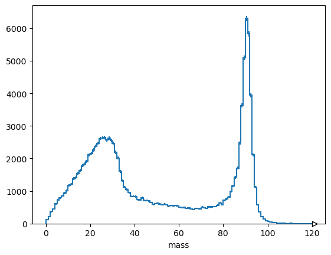
    


<br><br><br><br><br>

Now let's do the whole thing in one cell and time it.


```python
starttime = time.time()

# read data
muons = events.arrays(
    ["pt", "eta", "phi", "charge"],
    aliases={"pt": "Muon_pt", "eta": "Muon_eta", "phi": "Muon_phi", "charge": "Muon_charge"},
    array_cache=None,   # no cheating!
)

# compute
cut = (ak.num(muons.charge) >= 2) & (ak.sum(muons.charge[:, :2], axis=1) == 0)
mu1 = muons[cut, 0]
mu2 = muons[cut, 1]
h = hist.Hist.new.Reg(120, 0, 120, name="mass").Double()
h.fill(np.sqrt(2*mu1.pt*mu2.pt*(np.cosh(mu1.eta - mu2.eta) - np.cos(mu1.phi - mu2.phi))))

uproot_time = time.time() - starttime
print(f"total time: {uproot_time} sec")
```

    total time: 0.03031301498413086 sec


```python
pyroot_time / uproot_time
```


    119.12456937911941


It's in the same ballpark as C++. It can be 1.5× to 2× slower, but it's much closer to C++ on a log plot than it is to Python "for" loops.

<br><br><br><br><br>

## The Pythonic HEP ecosystem

Uproot is not a framework, it _only_ does ROOT I/O. Awkward Array handles array manipulation, hist does histograms, etc.

It is part of this complete breakfast:


<br><br><br><br><br>

## Uproot

Uproot is a Python package that reads and writes ROOT files and is only concerned with reading and writing (no analysis, no plotting, etc.). It interacts with NumPy, Awkward Array, and Pandas for computations, boost-histogram/hist for histogram manipulation and plotting, Vector for Lorentz vector functions and transformations, Coffea for scale-up, etc.

Uproot is implemented using only Python and Python libraries. It doesn’t have a compiled part or require a specific version of ROOT. (This means that if you do use ROOT for something other than I/O, your choice of ROOT version is not constrained by I/O.)


As a consequence of being an independent implementation of ROOT I/O, Uproot might not be able to read/write certain data types. Which data types are not implemented is a moving target, as new ones are always being added. A good approach for reading data is to just try it and see if Uproot complains. For writing, see the lists of supported types in the Uproot documentation (blue boxes in the text).

<br><br><br><br><br>

The documentation is at [https://uproot.readthedocs.io/](https://uproot.readthedocs.io/).


<br><br><br><br><br>

## Reading data from a file

### Opening the file

To open a file for reading, pass the name of the file to [uproot.open](https://uproot.readthedocs.io/en/latest/uproot.reading.open.html). In scripts, it is good practice to use [Python’s with](https://realpython.com/python-with-statement/) statement to close the file when you’re done, but if you’re working interactively, you can use a direct assignment.

To access a remote file via HTTP or XRootD, use a `"http://..."`, `"https://..."`, or `"root://..."` URL. If the Python interface to XRootD is not installed, the error message will explain how to install it.


```python
import uproot

filename = "data/uproot-Event.root"

file = uproot.open(filename)
```

<br><br><br><br><br>

### Listing contents

This “file” object actually represents a directory, and the named objects in that directory are accessible with a dict-like interface. Thus, `keys`, `values`, and `items` return the key names and/or read the data. If you want to just list the objects without reading, use keys. (This is like ROOT’s `ls()`, except that you get a Python list.)


```python
file.keys()
```


    ['ProcessID0;1', 'htime;1', 'T;1', 'hstat;1']


Often, you want to know the type of each object as well, so [uproot.ReadOnlyDirectory](https://uproot.readthedocs.io/en/latest/uproot.reading.ReadOnlyDirectory.html) objects also have a classnames method, which returns a dict of object names to class names (without reading them).


```python
file.classnames()
```


    {'ProcessID0;1': 'TProcessID',
     'htime;1': 'TH1F',
     'T;1': 'TTree',
     'hstat;1': 'TH1F'}


<br><br><br><br><br>

### Reading a histogram

If you’re familiar with ROOT, `TH1F` would be recognizable as histograms and `TTree` would be recognizable as a dataset. To read one of the histograms, put its name in square brackets:


```python
h = file["hstat"]
h
```


    <TH1F (version 2) at 0x000359a70050>


Uproot doesn’t do any plotting or histogram manipulation, so the most useful methods of `h` begin with `“to”`: `to_boost` (boost-histogram), `to_hist` (hist), `to_numpy` (NumPy’s 2-tuple of contents and edges), `to_pyroot` (PyROOT), etc.


```python
h.to_hist().plot()
```


    [StairsArtists(stairs=<matplotlib.patches.StepPatch object at 0x359b97190>, errorbar=<ErrorbarContainer object of 3 artists>, legend_artist=<ErrorbarContainer object of 3 artists>)]


    
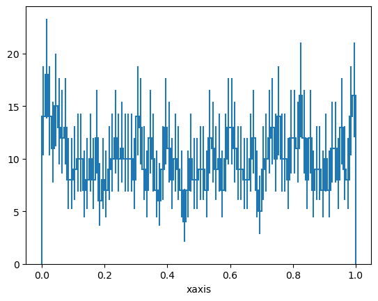
    


Uproot histograms also satisfy the [UHI plotting protocol](https://uhi.readthedocs.io/en/latest/plotting.html), so they have methods like `values` (bin contents), `variances` (errors squared), and `axes`.


```python
h.values()
h.variances()
list(h.axes[0])  # "x", "y", "z" or 0, 1, 2
```


    [array([0.  , 0.01]),
     array([0.01, 0.02]),
     array([0.02, 0.03]),
     array([0.03, 0.04]),
     array([0.04, 0.05]),
     array([0.05, 0.06]),
     array([0.06, 0.07]),
     array([0.07, 0.08]),
     array([0.08, 0.09]),
     array([0.09, 0.1 ]),
     array([0.1 , 0.11]),
     array([0.11, 0.12]),
     array([0.12, 0.13]),
     array([0.13, 0.14]),
     array([0.14, 0.15]),
     array([0.15, 0.16]),
     array([0.16, 0.17]),
     array([0.17, 0.18]),
     array([0.18, 0.19]),
     array([0.19, 0.2 ]),
     array([0.2 , 0.21]),
     array([0.21, 0.22]),
     array([0.22, 0.23]),
     array([0.23, 0.24]),
     array([0.24, 0.25]),
     array([0.25, 0.26]),
     array([0.26, 0.27]),
     array([0.27, 0.28]),
     array([0.28, 0.29]),
     array([0.29, 0.3 ]),
     array([0.3 , 0.31]),
     array([0.31, 0.32]),
     array([0.32, 0.33]),
     array([0.33, 0.34]),
     array([0.34, 0.35]),
     array([0.35, 0.36]),
     array([0.36, 0.37]),
     array([0.37, 0.38]),
     array([0.38, 0.39]),
     array([0.39, 0.4 ]),
     array([0.4 , 0.41]),
     array([0.41, 0.42]),
     array([0.42, 0.43]),
     array([0.43, 0.44]),
     array([0.44, 0.45]),
     array([0.45, 0.46]),
     array([0.46, 0.47]),
     array([0.47, 0.48]),
     array([0.48, 0.49]),
     array([0.49, 0.5 ]),
     array([0.5 , 0.51]),
     array([0.51, 0.52]),
     array([0.52, 0.53]),
     array([0.53, 0.54]),
     array([0.54, 0.55]),
     array([0.55, 0.56]),
     array([0.56, 0.57]),
     array([0.57, 0.58]),
     array([0.58, 0.59]),
     array([0.59, 0.6 ]),
     array([0.6 , 0.61]),
     array([0.61, 0.62]),
     array([0.62, 0.63]),
     array([0.63, 0.64]),
     array([0.64, 0.65]),
     array([0.65, 0.66]),
     array([0.66, 0.67]),
     array([0.67, 0.68]),
     array([0.68, 0.69]),
     array([0.69, 0.7 ]),
     array([0.7 , 0.71]),
     array([0.71, 0.72]),
     array([0.72, 0.73]),
     array([0.73, 0.74]),
     array([0.74, 0.75]),
     array([0.75, 0.76]),
     array([0.76, 0.77]),
     array([0.77, 0.78]),
     array([0.78, 0.79]),
     array([0.79, 0.8 ]),
     array([0.8 , 0.81]),
     array([0.81, 0.82]),
     array([0.82, 0.83]),
     array([0.83, 0.84]),
     array([0.84, 0.85]),
     array([0.85, 0.86]),
     array([0.86, 0.87]),
     array([0.87, 0.88]),
     array([0.88, 0.89]),
     array([0.89, 0.9 ]),
     array([0.9 , 0.91]),
     array([0.91, 0.92]),
     array([0.92, 0.93]),
     array([0.93, 0.94]),
     array([0.94, 0.95]),
     array([0.95, 0.96]),
     array([0.96, 0.97]),
     array([0.97, 0.98]),
     array([0.98, 0.99]),
     array([0.99, 1.  ])]


<br><br><br>

**Three-minute exercise:** find the 2D histogram and plot it.


```python
histograms = uproot.open("data/HiggsZZ4mu_histograms.root")
histograms
```


    <ReadOnlyDirectory '/' at 0x000359b72b50>


```python
histograms.file
```


    <ReadOnlyFile 'data/HiggsZZ4mu_histograms.root' at 0x000359bf5e50>


In Uproot, a directory is a dict-like object with subscripting (square brackets), [keys](https://uproot.readthedocs.io/en/latest/uproot.reading.ReadOnlyDirectory.html#keys), [values](https://uproot.readthedocs.io/en/latest/uproot.reading.ReadOnlyDirectory.html#values), [items](https://uproot.readthedocs.io/en/latest/uproot.reading.ReadOnlyDirectory.html#items), and [classnames](https://uproot.readthedocs.io/en/latest/uproot.reading.ReadOnlyDirectory.html#classnames) methods.


```python
histograms["Z"]
```


    <ReadOnlyDirectory '/Z' at 0x000359bd7a50>


```python
histograms["Z"]["4mu"]
```


    <ReadOnlyDirectory '/Z/4mu' at 0x000359bfe850>


Try `recursive`, `filter_name`, and `filter_classname` arguments.


```python
histograms.keys()
```


    ['num;1',
     'num/NGMuons;1',
     'num/NMuons;1',
     'num/Nelectrons;1',
     'num/NGoodGMuons;1',
     'num/NGoodRecMuons;1',
     'num/NGoodElectron;1',
     'Z;1',
     'Z/all;1',
     'Z/all/GMmass;1',
     'Z/all/GMmass_extended;1',
     'Z/all/GMmass_extended_600;1',
     'Z/all/massZto2muon;1',
     'Z/all/massZto2e;1',
     'Z/4mu;1',
     'Z/4mu/by_pt;1',
     'Z/4mu/by_pt/mZ12_4mu;1',
     'Z/4mu/by_pt/mZ34_4mu;1',
     'Z/4mu/by_pt/mZ13_4mu;1',
     'Z/4mu/by_pt/mZ24_4mu;1',
     'Z/4mu/by_pt/mZ14_4mu;1',
     'Z/4mu/by_pt/mZ23_4mu;1',
     'Z/4mu/by_mass;1',
     'Z/4mu/by_mass/mZa_4mu;1',
     'Z/4mu/by_mass/mZb_4mu;1',
     'Z/4e;1',
     'Z/4e/by_pt;1',
     'Z/4e/by_pt/mZ12_4e;1',
     'Z/4e/by_pt/mZ34_4e;1',
     'Z/4e/by_pt/mZ13_4e;1',
     'Z/4e/by_pt/mZ24_4e;1',
     'Z/4e/by_pt/mZ14_4e;1',
     'Z/4e/by_pt/mZ23_4e;1',
     'Z/4e/by_mass;1',
     'Z/4e/by_mass/mZa_4e;1',
     'Z/4e/by_mass/mZb_4e;1',
     'Z/2mu2e;1',
     'Z/2mu2e/massZmu_2mu2e;1',
     'Z/2mu2e/massZe_2mu2e;1',
     'H;1',
     'H/4mu;1',
     'H/4mu/mass4mu_7TeV;1',
     'H/4mu/mass4mu_8TeV;1',
     'H/4mu/mass4mu_8TeV_low;1',
     'H/4mu/mass4mu_full;1',
     'H/4e;1',
     'H/4e/mass4e_7TeV;1',
     'H/4e/mass4e_8TeV;1',
     'H/4e/mass4e_8TeV_low;1',
     'H/4e/mass4e_full;1',
     'H/2mu2e;1',
     'H/2mu2e/mZa_2mu2e;1',
     'H/2mu2e/mZb_2mu2e;1',
     'H/2mu2e/mass2mu2e_7TeV;1',
     'H/2mu2e/mass2mu2e_8TeV;1',
     'H/2mu2e/mass2mu2e_8TeV_low;1',
     'H/2mu2e/mass2mu2e_full;1',
     'muon;1',
     'muon/GM_momentum;1',
     'muon/b4_GM_pT;1',
     'muon/b4_GM_eta;1',
     'muon/GM_phi;1',
     'muon/GM_chi2;1',
     'muon/GM_ndof;1',
     'muon/GM_normchi2;1',
     'muon/GM_validhits;1',
     'muon/GM_pixelhits;1',
     'muon/after_GM_pT;1',
     'muon/after_GM_eta;1',
     'muon/RM_momentum;1',
     'muon/b4_RM_pt;1',
     'muon/b4_RM_eta;1',
     'muon/RM_phi;1',
     'muon/RM_chi2;1',
     'muon/RM_Ndof;1',
     'muon/RM_NormChi2;1',
     'muon/RM_goodMuonChamberHit;1',
     'muon/RM_dxy;1',
     'muon/RM_RelPFIso;1',
     'muon/after_RM_RelPFIso;1',
     'muon/RM_validhits;1',
     'muon/RM_pixelhits;1',
     'muon/after_RM_pt_Z2mu;1',
     'muon/after_RM_eta_Z2mu;1',
     'muon/after_RM_pt;1',
     'muon/after_RM_eta;1',
     'muon/after_relPFIso_2mu;1',
     'muon/after_relPFIso_2e;1',
     'muon/after_pt_2mu2e;1',
     'muon/after_eta_2mu2e;1',
     'electron;1',
     'electron/e_momentum;1',
     'electron/e_eT;1',
     'electron/b4_e_pT;1',
     'electron/b4_e_eta;1',
     'electron/e_phi;1',
     'electron/e_SC_eta;1',
     'electron/e_SC_rawE;1',
     'electron/e_RelPFIso;1',
     'electron/after_e_RelPFIso;1',
     'electron/e_RelPFIso_pT;1',
     'electron/e_dxy;1',
     'electron/after_e_pT_Zto2e;1',
     'electron/after_e_eta_Zto2e;1',
     'electron/after_e_pT;1',
     'electron/after_e_eta;1',
     'electron/after_e_pT_2mu2e;1',
     'electron/after_e_eta_2mu2e;1',
     'electron/SIP3d_mu;1',
     'electron/SIP3d_e;1',
     'electron/e_misshit;1']


Most histograms and graphs can be converted to types in other Python libraries.

Try the `to_hist()` method on this one.


```python
histograms["Z/all/massZto2muon"]
```


    <TH1D (version 3) at 0x000359be1190>


```python
histograms
```


    <ReadOnlyDirectory '/' at 0x000359b72b50>


## Solution (no peeking!)


```python
{key: value for key, value in histograms.classnames().items() if value == "TH2D"}
```


    {'electron/e_RelPFIso_pT;1': 'TH2D'}


<br><br><br><br><br>

## Reading a TTree

A TTree represents a potentially large dataset. Getting it from the [uproot.ReadOnlyDirectory](https://uproot.readthedocs.io/en/latest/uproot.reading.ReadOnlyDirectory.html) only returns its TBranch names and types. The `show` method is a convenient way to list its contents:


```python
t = file["T"]
t.show()
```

    name                 | typename                 | interpretation                
    ---------------------+--------------------------+-------------------------------
    event                | Event                    | AsGroup(<TBranchElement 'ev...
    event/TObject        | (group of fUniqueID:u... | AsGroup(<TBranchElement 'TO...
    event/TObject/fUn... | uint32_t                 | AsDtype('>u4')
    event/TObject/fBits  | uint32_t                 | AsDtype('>u4')
    event/fType[20]      | int8_t[20]               | AsDtype("('i1', (20,))")
    event/fEventName     | char*                    | AsStrings(length_bytes='4')
    event/fNtrack        | int32_t                  | AsDtype('>i4')
    event/fNseg          | int32_t                  | AsDtype('>i4')
    event/fNvertex       | uint32_t                 | AsDtype('>u4')
    event/fFlag          | uint32_t                 | AsDtype('>u4')
    event/fTemperature   | float                    | AsDtype('>f4', 'float64')
    event/fMeasures[10]  | int32_t[10]              | AsDtype("('>i4', (10,))")
    event/fMatrix[4][4]  | float[4][4]              | AsDtype("('>f4', (4, 4))", ...
    event/fClosestDis... | unknown[]                | AsObjects(AsArray(False, Tr...
    event/fEvtHdr        | EventHeader              | AsGroup(<TBranchElement 'fE...
    event/fEvtHdr/fEv... | int32_t                  | AsDtype('>i4')
    event/fEvtHdr/fEv... | int32_t                  | AsDtype('>i4')
    event/fEvtHdr/fEv... | int32_t                  | AsDtype('>i4')
    event/fTracks        | TClonesArray*            | AsGroup(<TBranchElement 'fT...
    event/fTracks/fTr... | uint32_t[]               | AsJagged(AsDtype('>u4'))
    event/fTracks/fTr... | uint32_t[]               | AsJagged(AsDtype('>u4'))
    event/fTracks/fTr... | float[]                  | AsJagged(AsDtype('>f4'))
    event/fTracks/fTr... | float[]                  | AsJagged(AsDtype('>f4'))
    event/fTracks/fTr... | float[]                  | AsJagged(AsDtype('>f4'))
    event/fTracks/fTr... | float[]                  | AsJagged(AsDtype('>f4'))
    event/fTracks/fTr... | Float16_t[]              | AsJagged(AsFloat16(0.0, 0.0...
    event/fTracks/fTr... | Float16_t[]              | AsJagged(AsFloat16(0.0, 0.0...
    event/fTracks/fTr... | Float16_t[]              | AsJagged(AsFloat16(0.0, 0.0...
    event/fTracks/fTr... | float[]                  | AsJagged(AsDtype('>f4'))
    event/fTracks/fTr... | Float16_t[]              | AsJagged(AsFloat16(0, 0, 12))
    event/fTracks/fTr... | Float16_t[]              | AsJagged(AsFloat16(0, 0, 12))
    event/fTracks/fTr... | Float16_t[]              | AsJagged(AsFloat16(0, 0, 12))
    event/fTracks/fTr... | Float16_t[]              | AsJagged(AsFloat16(0, 0, 12))
    event/fTracks/fTr... | Float16_t[]              | AsJagged(AsFloat16(0, 0, 12))
    event/fTracks/fTr... | Float16_t[]              | AsJagged(AsFloat16(0, 0, 12))
    event/fTracks/fTr... | Double32_t[]             | AsJagged(AsDouble32(-1.0, 1...
    event/fTracks/fTr... | Double32_t[][3]          | AsJagged(AsDouble32(-30.0, ...
    event/fTracks/fTr... | int32_t[]                | AsJagged(AsDtype('>i4'))
    event/fTracks/fTr... | int16_t[]                | AsJagged(AsDtype('>i2'))
    event/fTracks/fTr... | uint32_t[]               | AsJagged(AsDtype('>u4'))
    event/fTracks/fTr... | unknown[][]              | AsObjects(AsArray(True, Fal...
    event/fTracks/fTr... | uint32_t[]               | AsJagged(AsDtype('>u4'))
    event/fTracks/fTr... | uint32_t[]               | AsJagged(AsDtype('>u4'))
    event/fTracks/fTr... | uint32_t[]               | AsJagged(AsDtype('>u4'))
    event/fTracks/fTr... | uint32_t[]               | AsJagged(AsDtype('>u4'))
    event/fTracks/fTr... | uint8_t[][]              | AsObjects(AsArray(True, Fal...
    event/fTracks/fTr... | float[][3]               | AsJagged(AsDtype("('>f4', (...
    event/fHighPt        | TRefArray*               | AsObjects(AsPointer(Model_T...
    event/fMuons         | TRefArray*               | AsObjects(AsPointer(Model_T...
    event/fLastTrack     | TRef                     | AsStridedObjects(Model_TRef)
    event/fWebHistogram  | TRef                     | AsStridedObjects(Model_TRef)
    event/fH             | TH1F                     | AsObjects(Model_TH1F)
    event/fTriggerBits   | TBits                    | AsGroup(<TBranchElement 'fT...
    event/fTriggerBit... | (group of fTriggerBit... | AsGroup(<TBranchElement 'fT...
    event/fTriggerBit... | uint32_t                 | AsDtype('>u4')
    event/fTriggerBit... | uint32_t                 | AsDtype('>u4')
    event/fTriggerBit... | uint32_t                 | AsDtype('>u4')
    event/fTriggerBit... | uint32_t                 | AsDtype('>u4')
    event/fTriggerBit... | uint8_t[]                | AsJagged(AsDtype('uint8'), ...
    event/fIsValid       | bool                     | AsDtype('bool')


Be aware that you can get the same information from `keys` (an [uproot.TTree](https://uproot.readthedocs.io/en/latest/uproot.behaviors.TTree.TTree.html) is dict-like), `typename`, and `interpretation`.


```python
t.keys()
t["event/fNtrack"]
t["event/fNtrack"].typename
t["event/fNtrack"].interpretation
```


    AsDtype('>i4')


(If an [uproot.TBranch](https://uproot.readthedocs.io/en/latest/uproot.behaviors.TBranch.TBranch.html) has no `interpretation`, it can’t be read by Uproot.)

The most direct way to read data from an [uproot.TBranch](https://uproot.readthedocs.io/en/latest/uproot.behaviors.TBranch.TBranch.html) is by calling its `array` method.


```python
t["event/fNtrack"].array()
```


<pre>[600,
 604,
 603,
 594,
 595,
 598,
 595,
 600,
 592,
 598,
 ...,
 603,
 605,
 609,
 599,
 587,
 598,
 600,
 596,
 593]
------------------
backend: cpu
nbytes: 4.0 kB
type: 1000 * int32</pre>


We’ll consider other methods in the next lesson.

<br><br><br><br><br>

## Reading a… what is that?


This file also contains an instance of type [TProcessID](https://root.cern.ch/doc/master/classTProcessID.html). These aren’t typically useful in data analysis, but Uproot manages to read it anyway because it follows certain conventions (it has “class streamers”). It’s presented as a generic object with an `all_members` property for its data members (through all superclasses).


```python
file["ProcessID0"]
file["ProcessID0"].all_members
```


    {'@fUniqueID': 0,
     '@fBits': 50331648,
     'fName': 'ProcessID0',
     'fTitle': '3ec87674-3aa2-11e9-bb02-0301a8c0beef'}


Here’s a more useful example of that: a supernova search with the IceCube experiment has custom classes for its data, which Uproot reads and represents as objects with `all_members`.


```python
icecube = uproot.open("data/icecube-supernovae.root")
icecube.keys()
```


    ['config;1',
     'config/analysis;1',
     'config/detector;1',
     'config/run;1',
     'sn_all;1',
     'sn_gps;1',
     'sn_range;1',
     'sn_o2rout;1',
     'sn_o2cand;1',
     'sn_omwatch;1',
     'sn_sigsim;1']


```python
icecube.classname_of("config/detector")
```


    'I3Eval_t'


It is possible to read an `I3Eval_t` object because ROOT stores the "how to read" instructions in the file (called "streamers").


```python
icecube.file.show_streamers("I3Eval_t")
```

    I3Eval_t::ChannelContainer_t (v1)
    
    Sni3DataArray (v1)
    
    TObject (v1)
        fUniqueID: unsigned int (TStreamerBasicType)
        fBits: unsigned int (TStreamerBasicType)
    
    I3Eval_t (v7): TObject (v1)
        theDataArray: Sni3DataArray* (TStreamerObjectAnyPointer)
        NumberOfChannels: int (TStreamerBasicType)
        NoAvailableSlices: int (TStreamerBasicType)
        AvailableDataSize: int (TStreamerBasicType)
        mGPSCardId: int (TStreamerBasicType)
        mGPSPrescale: int (TStreamerBasicType)
        mGPSEventNo: int (TStreamerBasicType)
        mScalerCardId: int (TStreamerBasicType)
        mScalerStartChannel: int (TStreamerBasicType)
        StartUTC: long (TStreamerBasicType)
        MaxChannels: int (TStreamerBasicType)
        mMaxJitterLogs: int (TStreamerBasicType)
        Channel: I3Eval_t::ChannelContainer_t* (TStreamerObjectAnyPointer)
        ChannelIDMap: map<long,int> (TStreamerSTL)
        BadChannelIDSet: set<long> (TStreamerSTL)
        ChannelID: long* (TStreamerBasicPointer)
        Deadtime: double* (TStreamerBasicPointer)
        Efficiency: double* (TStreamerBasicPointer)


```python
icecube["config/detector"]
```


    <I3Eval_t (version 7) at 0x000359ce3e50>


```python
icecube["config/detector"].all_members
```


    {'@fUniqueID': 0,
     '@fBits': 50331648,
     'theDataArray': <Sni3DataArray (version 1) at 0x000359b79ed0>,
     'NumberOfChannels': 5160,
     'NoAvailableSlices': -1,
     'AvailableDataSize': 0,
     'mGPSCardId': 0,
     'mGPSPrescale': 20000000,
     'mGPSEventNo': 92824,
     'mScalerCardId': 0,
     'mScalerStartChannel': 0,
     'StartUTC': 272924620173109013,
     'MaxChannels': 5160,
     'mMaxJitterLogs': 20,
     'Channel': <I3Eval_t::ChannelContainer_t (version 1) at 0x000359a7f190>,
     'ChannelIDMap': <STLMap {46612627560: 896, ..., 281410180683757: 2689} at 0x000359a7c110>,
     'BadChannelIDSet': <STLSet {58348614635591, 60068372029697, ..., 258905191174588} at 0x000359b92d90>,
     'ChannelID': array([ 47303335284587,  20579555797555, 106634453247646, ...,
            255380957221937, 107432791511293, 280205879548048],
           shape=(5160,), dtype='>i8'),
     'Deadtime': array([250., 250., 250., ..., 250., 250., 250.],
           shape=(5160,), dtype='>f8'),
     'Efficiency': array([1.  , 1.  , 1.  , ..., 1.35, 1.35, 1.35],
           shape=(5160,), dtype='>f8')}


```python
icecube["config/detector"].member("ChannelIDMap")
```


    <STLMap {46612627560: 896, ..., 281410180683757: 2689} at 0x000359a7c110>


Unlike histograms, these objects have no methods to help you unpack the data; it's all in [members](https://uproot.readthedocs.io/en/latest/uproot.model.Model.html#members), [all_members](https://uproot.readthedocs.io/en/latest/uproot.model.Model.html#all-members), [has_member](https://uproot.readthedocs.io/en/latest/uproot.model.Model.html#has-member), and [member](https://uproot.readthedocs.io/en/latest/uproot.model.Model.html#member).

<br><br><br><br><br>

## Writing data to a file

Uproot’s ability to <i>write</i> data is more limited than its ability to <i>read data</i>, but some useful cases are possible.

<br><br><br><br>

### Opening files for writing

First of all, a file must be opened for writing, either by creating a completely new file or updating an existing one.


```python
output1 = uproot.recreate("completely-new-file.root")
output2 = uproot.update("existing-file.root")
```

(Uproot cannot write over a network; output files must be local.)

<br><br><br><br>

### Writing strings and histograms

These [uproot.WritableDirectory](https://uproot.readthedocs.io/en/latest/uproot.writing.writable.WritableDirectory.html) objects have a dict-like interface: you can put data in them by assigning to square brackets.


```python
output1["some_string"] = "This will be a TObjString."

output1["some_histogram"] = file["hstat"]

import numpy as np

output1["nested_directory/another_histogram"] = np.histogram(
    np.random.normal(0, 1, 1000000)
)
```

In ROOT, the name of an object is a property of the object, but in Uproot, it’s a key in the TDirectory that holds the object, so that’s why the name is on the left-hand side of the assignment, in square brackets. Only the data types listed in the blue box in [the documentation](https://uproot.readthedocs.io/en/latest/basic.html#writing-objects-to-a-file) are supported: mostly just histograms.

<br><br><br><br>

### Writing TTrees

TTrees are potentially large and might not fit in memory. Generally, you’ll need to write them in batches.

One way to do this is to assign the first batch and `extend` it with subsequent batches:


```python
import numpy as np

output1["tree1"] = {
    "x": np.random.randint(0, 10, 1_000_000),
    "y": np.random.normal(0, 1, 1_000_000),
}
output1["tree1"].extend(
    {"x": np.random.randint(0, 10, 1_000_000), "y": np.random.normal(0, 1, 1_000_000)}
)
output1["tree1"].extend(
    {"x": np.random.randint(0, 10, 1_000_000), "y": np.random.normal(0, 1, 1_000_000)}
)
```

another is to create an empty TTree with [uproot.WritableDirectory.mktree](https://uproot.readthedocs.io/en/latest/uproot.writing.writable.WritableDirectory.html#mktree), so that every write is an extension.


```python
output1.mktree("tree2", {"x": np.int32, "y": np.float64})
output1["tree2"].extend(
    {"x": np.random.randint(0, 10, 1_000_000), "y": np.random.normal(0, 1, 1_000_000)}
)
output1["tree2"].extend(
    {"x": np.random.randint(0, 10, 1_000_000), "y": np.random.normal(0, 1, 1_000_000)}
)
output1["tree2"].extend(
    {"x": np.random.randint(0, 10, 1_000_000), "y": np.random.normal(0, 1, 1_000_000)}
)
```

Performance tips are given in the next lesson, but in general, it pays to write few large batches, rather than many small batches.

The only data types that can be assigned or passed to `extend` are listed in the blue box in [this documentation](https://uproot.readthedocs.io/en/latest/basic.html#writing-ttrees-to-a-file). This includes jagged arrays (described in the lesson after next), but not more complex types.

<br><br><br><br>


### Reading and writing RNTuples

TTree has been the default format to store large datasets in ROOT files for decades. However, it has slowly become outdated and are not optimized for modern systems. This is where the RNTuple format comes in. It is a modern serialization format that is designed with modern systems in mind and is planned to replace TTree in the coming years. [Version 1.0.0.0](https://cds.cern.ch/record/2923186) is out and will be supported "forever".


RNTuples are much simpler than TTrees by design, and this time there is an official specification, which makes it much easier for third-party I/O packages like Uproot to support. Uproot already supports reading the full RNTuple specification, meaning that you can read any RNTuple you find in the wild. It also supports writing a large part of the specification, and intends to support as much as it makes sense for data analysis.

To ease the transition into RNTuples, we are designing the interface to match the one for TTrees as closely as possible. Let's look at a simple example for reading and writing RNTuples.


```python
import uproot

filename = ("data/ntpl001_staff_rntuple_v1-0-0-0.root")

file = uproot.open(filename)
```

This time, if we print the class names, we see that there is an RNTuple instead of a TTree.


```python
file.classnames()
```


    {'Staff;1': 'ROOT::RNTuple'}


Then to read the data from the RNTuple works in an analogous way.


```python
rntuple = file["Staff"]
data = rntuple.arrays()
data
```


<pre>[{Category: 202, Flag: 15, Age: 58, Service: 28, Children: 0, Grade: 10, ...},
 {Category: 530, Flag: 15, Age: 63, Service: 33, Children: 0, Grade: 9, ...},
 {Category: 316, Flag: 15, Age: 56, Service: 31, Children: 2, Grade: 9, ...},
 {Category: 361, Flag: 15, Age: 61, Service: 35, Children: 0, Grade: 9, ...},
 {Category: 302, Flag: 15, Age: 52, Service: 24, Children: 2, Grade: 9, ...},
 {Category: 303, Flag: 15, Age: 60, Service: 33, Children: 0, Grade: 7, ...},
 {Category: 302, Flag: 15, Age: 53, Service: 25, Children: 1, Grade: 9, ...},
 {Category: 361, Flag: 15, Age: 60, Service: 32, Children: 1, Grade: 8, ...},
 {Category: 340, Flag: 15, Age: 51, Service: 28, Children: 0, Grade: 8, ...},
 {Category: 361, Flag: 15, Age: 56, Service: 32, Children: 1, Grade: 7, ...},
 ...,
 {Category: 214, Flag: 3, Age: 28, Service: 0, Children: 0, Grade: 9, ...},
 {Category: 505, Flag: 2, Age: 39, Service: 0, Children: 0, Grade: 9, ...},
 {Category: 211, Flag: 7, Age: 38, Service: 0, Children: 1, Grade: 9, ...},
 {Category: 301, Flag: 1, Age: 26, Service: 0, Children: 0, Grade: 6, ...},
 {Category: 500, Flag: 7, Age: 51, Service: 0, Children: 0, Grade: 13, ...},
 {Category: 415, Flag: 5, Age: 25, Service: 0, Children: 1, Grade: 4, ...},
 {Category: 565, Flag: 4, Age: 35, Service: 0, Children: 2, Grade: 4, ...},
 {Category: 204, Flag: 3, Age: 28, Service: 0, Children: 0, Grade: 8, ...},
 {Category: 500, Flag: 5, Age: 43, Service: 0, Children: 2, Grade: 12, ...}]
--------------------------------------------------------------------------------------------------------------------------------------------------------------------------------------------------------------------------------
backend: cpu
nbytes: 188.9 kB
type: 3354 * {
    Category: int32,
    Flag: uint32,
    Age: int32,
    Service: int32,
    Children: int32,
    Grade: int32,
    Step: int32,
    Hrweek: int32,
    Cost: int32,
    Division: string,
    Nation: string
}</pre>


Writing again works in a very similar way to TTrees. However, since TTrees are still the default format used in more places, writing something like `file[key] = data` will default to writing the data as a TTree. When we want to write an RNTuple, we need to specifically tell Uproot that we want to do so. For now, we need to use an Awkward Array (which will be covered in a later lesson) to specify the data, but the interface will be extended to match TTrees.


```python
import awkward as ak

data = ak.Array({"my_int_data": [1, 2, 3], "my_float_data": [1.0, 2.0, 3.0]})
more_data = ak.Array({"my_int_data": [4, 5, 6], "my_float_data": [4.0, 5.0, 6.0]})

output3 = uproot.recreate("new-file-with-rntuple.root")

rntuple = output3.mkrntuple("my_rntuple", data)
rntuple.extend(more_data)
```

For the rest of the tutorial we will stick to using TTrees since this is still the main data format that you'll encounter for now.

<br><br>


### 📌 Key Points
 * Uproot TDirectories and TTrees have a dict-like interface.
 * Uproot reading methods are primarily intended to get data into a more specialized library.
 * Uproot writing is more limited, but it can write histograms, TTrees, and RNTuples.


<br><br><br><br><br>

## TTree details

### ROOT file structure and terminology

A ROOT file ([ROOT TFile](https://root.cern.ch/doc/master/classTFile.html), [uproot.ReadOnlyFile](https://uproot.readthedocs.io/en/latest/uproot.reading.ReadOnlyFile.html)) is like a little filesystem containing nested directories ([ROOT TDirectory](https://root.cern.ch/doc/master/classTDirectory.html), [uproot.ReadOnlyDirectory](https://uproot.readthedocs.io/en/latest/uproot.reading.ReadOnlyDirectory.html)). In Uproot, nested directories are presented as nested dicts.

Any class instance ([ROOT TObject](https://root.cern.ch/doc/master/classTObject.html), [uproot.Model](https://uproot.readthedocs.io/en/latest/uproot.model.Model.html)) can be stored in a directory, including types such as histograms (e.g. [ROOT TH1](https://root.cern.ch/doc/master/classTH1.html), [uproot.behaviors.TH1.TH1](https://uproot.readthedocs.io/en/latest/uproot.behaviors.TH1.TH1.html)).

One of these classes, TTree ([ROOT TTree](https://root.cern.ch/doc/master/classTTree.html), [uproot.TTree](https://uproot.readthedocs.io/en/latest/uproot.behaviors.TTree.TTree.html)), is a gateway to large datasets. A TTree is roughly like a Pandas DataFrame in that it represents a table of data. The columns are called TBranches ([ROOT TBranch](https://root.cern.ch/doc/master/classTBranch.html), [uproot.TBranch](https://uproot.readthedocs.io/en/latest/uproot.behaviors.TBranch.TBranch.html)), which can be nested (unlike Pandas), and the data can have any C++ type (unlike Pandas, which can store any Python type).

A TTree is often too large to fit in memory, and sometimes (rarely) even a single TBranch is too large to fit in memory. Each TBranch is therefore broken down into TBaskets ([ROOT TBasket](https://root.cern/doc/master/classTBasket.html), [uproot.models.TBasket.Model_TBasket](https://uproot.readthedocs.io/en/latest/uproot.models.TBasket.Model_TBasket.html)), which are “batches” of data. (These are the same batches that each call to `extend` writes in the previous lesson.) TBaskets are the smallest unit that can be read from a TTree: if you want to read the first entry, you have to read the first TBasket.


As a data analyst, you’ll likely be concerned with TTrees and TBranches first-hand, but only TBaskets when efficiency issues come up. Files with large TBaskets might require a lot of memory to read; files with small TBaskets will be slower to read (in ROOT also, but especially in Uproot). Megabyte-sized TBaskets are usually ideal.

<br><br><br><br>

### Examples with a large TTree
[This file](https://opendata.web.cern.ch/record/12341) is 2.1 GB, hosted by CERN’s Open Data Portal.


```python
import uproot

file = uproot.open(
    ###"root://eospublic.cern.ch//eos/opendata/cms/derived-data/AOD2NanoAODOutreachTool/Run2012BC_DoubleMuParked_Muons.root"
    "data/HiggsZZ4mu.root"
)
file.classnames()
```


    {'Events;5': 'TTree'}


#### Why the ;74 and ;75?

You may have been wondering about the numbers after the semicolons. These are ROOT “cycle numbers,” which allow objects with the same name to be distinguishable. They’re used when an object needs to be overwritten as it grows without losing the last valid copy of that object, so that a ROOT file can be read even if the writing process failed partway through.

In this case, the last version of this TTree was number 75, and number 74 is the second-to-last.

If you don’t specify cycle numbers, Uproot will pick the last for you, which is almost always what you want. (In other words, you can ignore them.)

Just asking for the [uproot.TTree](https://uproot.readthedocs.io/en/latest/uproot.behaviors.TTree.TTree.html) object and printing it out _does not_ read the whole dataset.


```python
tree = file["Events"]
tree.show()
```

    name                 | typename                 | interpretation                
    ---------------------+--------------------------+-------------------------------
    run                  | int32_t                  | AsDtype('>i4')
    luminosityBlock      | uint32_t                 | AsDtype('>u4')
    event                | uint64_t                 | AsDtype('>u8')
    nMuon                | uint32_t                 | AsDtype('>u4')
    Muon_pt              | float[]                  | AsJagged(AsDtype('>f4'))
    Muon_eta             | float[]                  | AsJagged(AsDtype('>f4'))
    Muon_phi             | float[]                  | AsJagged(AsDtype('>f4'))
    Muon_mass            | float[]                  | AsJagged(AsDtype('>f4'))
    Muon_charge          | int32_t[]                | AsJagged(AsDtype('>i4'))
    MET_pt               | float                    | AsDtype('>f4')
    MET_phi              | float                    | AsDtype('>f4')
    nGenPart             | uint32_t                 | AsDtype('>u4')
    GenPart_pt           | float[]                  | AsJagged(AsDtype('>f4'))
    GenPart_eta          | float[]                  | AsJagged(AsDtype('>f4'))
    GenPart_phi          | float[]                  | AsJagged(AsDtype('>f4'))
    GenPart_pdgId        | int32_t[]                | AsJagged(AsDtype('>i4'))


<br><br><br><br>

### Reading part of a TTree
In the last lesson, we learned that the most direct way to read one TBranch is to call [uproot.TBranch.array](https://uproot.readthedocs.io/en/latest/uproot.behaviors.TBranch.TBranch.html#array).


```python
tree["nMuon"].array()
```


<pre>[0,
 2,
 0,
 3,
 1,
 1,
 0,
 0,
 1,
 2,
 ...,
 2,
 2,
 3,
 5,
 2,
 0,
 2,
 3,
 4]
---------------------
backend: cpu
nbytes: 1.2 MB
type: 299683 * uint32</pre>


However, it takes a long time because a lot of data have to be sent over the network.

To limit the amount of data read, set `entry_start` and `entry_stop` to the range you want. The `entry_start` is inclusive, `entry_stop` exclusive, and the first entry would be indexed by `0`, just like slices in an array interface (first lesson). Uproot only reads as many TBaskets as are needed to provide these entries.


```python
tree["nMuon"].array(entry_start=1_000, entry_stop=2_000)
```


<pre>[0,
 2,
 1,
 1,
 2,
 0,
 1,
 2,
 2,
 4,
 ...,
 0,
 2,
 1,
 0,
 0,
 0,
 3,
 0,
 0]
-------------------
backend: cpu
nbytes: 4.0 kB
type: 1000 * uint32</pre>


These are the building blocks of a parallel data reader: each is responsible for a different slice. (See also [uproot.TTree.num_entries_for](https://uproot.readthedocs.io/en/latest/uproot.behaviors.TTree.TTree.html#num-entries-for) and [uproot.TTree.common_entry_offsets](https://uproot.readthedocs.io/en/latest/uproot.behaviors.TTree.TTree.html#common-entry-offsets), which can be used to pick `entry_start`/`entry_stop` in optimal ways.)

<br><br><br><br>

### Reading multiple TBranches at once
Suppose you know that you will need all of the muon TBranches. Asking for them in one request is more efficient than asking for each TBranch individually because the server can be working on reading the later TBaskets from disk while the earlier TBaskets are being sent over the network to you. Whereas a TBranch has an `array` method, the TTree has an `arrays` (plural) method for getting multiple arrays.


```python
muons = tree.arrays(
    ["Muon_pt", "Muon_eta", "Muon_phi", "Muon_mass", "Muon_charge"], entry_stop=1_000
)
muons
```


<pre>[{Muon_pt: [], Muon_eta: [], Muon_phi: [], Muon_mass: [], ...},
 {Muon_pt: [18.6, 23.6], Muon_eta: [-0.179, ...], Muon_phi: [...], ...},
 {Muon_pt: [], Muon_eta: [], Muon_phi: [], Muon_mass: [], ...},
 {Muon_pt: [26.7, 21.4, 5.65], Muon_eta: [-1.23, ...], Muon_phi: [...], ...},
 {Muon_pt: [7.62], Muon_eta: [2.15], Muon_phi: [0.129], Muon_mass: ..., ...},
 {Muon_pt: [6.58], Muon_eta: [1.79], Muon_phi: [-1.61], Muon_mass: ..., ...},
 {Muon_pt: [], Muon_eta: [], Muon_phi: [], Muon_mass: [], ...},
 {Muon_pt: [], Muon_eta: [], Muon_phi: [], Muon_mass: [], ...},
 {Muon_pt: [8.51], Muon_eta: [0.553], Muon_phi: [2.55], Muon_mass: ..., ...},
 {Muon_pt: [8.25, 23.5], Muon_eta: [0.493, ...], Muon_phi: [...], ...},
 ...,
 {Muon_pt: [], Muon_eta: [], Muon_phi: [], Muon_mass: [], ...},
 {Muon_pt: [29.6, 15.5], Muon_eta: [0.403, ...], Muon_phi: [...], ...},
 {Muon_pt: [79.4, 22.5, ..., 4.18, 3.36], Muon_eta: [...], Muon_phi: ..., ...},
 {Muon_pt: [6.85], Muon_eta: [0.98], Muon_phi: [-0.874], Muon_mass: ..., ...},
 {Muon_pt: [], Muon_eta: [], Muon_phi: [], Muon_mass: [], ...},
 {Muon_pt: [4.56, 37.1], Muon_eta: [-2.38, 1.33], Muon_phi: [...], ...},
 {Muon_pt: [], Muon_eta: [], Muon_phi: [], Muon_mass: [], ...},
 {Muon_pt: [19.5, 11.8], Muon_eta: [-1.34, ...], Muon_phi: [...], ...},
 {Muon_pt: [], Muon_eta: [], Muon_phi: [], Muon_mass: [], ...}]
-----------------------------------------------------------------------------------------------------------------------------------------------------------------
backend: cpu
nbytes: 67.5 kB
type: 1000 * {
    Muon_pt: var * float32,
    Muon_eta: var * float32,
    Muon_phi: var * float32,
    Muon_mass: var * float32,
    Muon_charge: var * int32
}</pre>


Now all five of these TBranches are in the output, `muons`, which is an Awkward Array. An Awkward Array of multiple TBranches has a dict-like interface, so we can get each variable from it by


```python
muons["Muon_pt"]
muons["Muon_eta"]
muons["Muon_phi"]  # etc.
```


<pre>[[],
 [2.13, -2.09],
 [],
 [-1.39, 1.03, 0.0785],
 [0.129],
 [-1.61],
 [],
 [],
 [2.55],
 [-0.0942, 1.05],
 ...,
 [],
 [0.494, 1.01],
 [0.0845, 0.86, -2.38, -0.832, -2.87, -1.03],
 [-0.874],
 [],
 [0.532, 2.2],
 [],
 [1.35, -2.25],
 []]
---------------------------------------------
backend: cpu
nbytes: 13.5 kB
type: 1000 * var * float32</pre>


#### Beware! It’s `tree.arrays` that actually reads the data!
If you’re not careful with the [uproot.TTree.arrays](https://uproot.readthedocs.io/en/latest/uproot.behaviors.TTree.TTree.html#arrays) call, you could end up waiting a long time for data you don’t want or you could run out of memory. Reading everything with


```python
everything = tree.arrays()
```

and then picking out the arrays you want is usually not a good idea. At the very least, set an `entry_stop`.

<br><br><br><br>

### Selecting TBranches by name
Suppose you have many muon TBranches and you don’t want to list them all. The [uproot.TTree.keys](https://uproot.readthedocs.io/en/latest/uproot.behaviors.TTree.TTree.html#keys) and [uproot.TTree.arrays](https://uproot.readthedocs.io/en/latest/uproot.behaviors.TTree.TTree.html#arrays) both take a `filter_name` argument that can select them in various ways (see documentation). In particular, it’s good to use the `keys` first, to know which branches match your filter, followed by `arrays`, to actually read them.


```python
tree.keys(filter_name="Muon_*")

tree.arrays(filter_name="Muon_*", entry_stop=1_000)
```


<pre>[{Muon_pt: [], Muon_eta: [], Muon_phi: [], Muon_mass: [], ...},
 {Muon_pt: [18.6, 23.6], Muon_eta: [-0.179, ...], Muon_phi: [...], ...},
 {Muon_pt: [], Muon_eta: [], Muon_phi: [], Muon_mass: [], ...},
 {Muon_pt: [26.7, 21.4, 5.65], Muon_eta: [-1.23, ...], Muon_phi: [...], ...},
 {Muon_pt: [7.62], Muon_eta: [2.15], Muon_phi: [0.129], Muon_mass: ..., ...},
 {Muon_pt: [6.58], Muon_eta: [1.79], Muon_phi: [-1.61], Muon_mass: ..., ...},
 {Muon_pt: [], Muon_eta: [], Muon_phi: [], Muon_mass: [], ...},
 {Muon_pt: [], Muon_eta: [], Muon_phi: [], Muon_mass: [], ...},
 {Muon_pt: [8.51], Muon_eta: [0.553], Muon_phi: [2.55], Muon_mass: ..., ...},
 {Muon_pt: [8.25, 23.5], Muon_eta: [0.493, ...], Muon_phi: [...], ...},
 ...,
 {Muon_pt: [], Muon_eta: [], Muon_phi: [], Muon_mass: [], ...},
 {Muon_pt: [29.6, 15.5], Muon_eta: [0.403, ...], Muon_phi: [...], ...},
 {Muon_pt: [79.4, 22.5, ..., 4.18, 3.36], Muon_eta: [...], Muon_phi: ..., ...},
 {Muon_pt: [6.85], Muon_eta: [0.98], Muon_phi: [-0.874], Muon_mass: ..., ...},
 {Muon_pt: [], Muon_eta: [], Muon_phi: [], Muon_mass: [], ...},
 {Muon_pt: [4.56, 37.1], Muon_eta: [-2.38, 1.33], Muon_phi: [...], ...},
 {Muon_pt: [], Muon_eta: [], Muon_phi: [], Muon_mass: [], ...},
 {Muon_pt: [19.5, 11.8], Muon_eta: [-1.34, ...], Muon_phi: [...], ...},
 {Muon_pt: [], Muon_eta: [], Muon_phi: [], Muon_mass: [], ...}]
-----------------------------------------------------------------------------------------------------------------------------------------------------------------
backend: cpu
nbytes: 67.5 kB
type: 1000 * {
    Muon_pt: var * float32,
    Muon_eta: var * float32,
    Muon_phi: var * float32,
    Muon_mass: var * float32,
    Muon_charge: var * int32
}</pre>


(There are also `filter_typename` and `filter_branch` for more options.)

<br><br><br><br>

### Scaling up, making a plot
The best way to figure out what you’re doing is to tinker with small datasets, and then scale them up. Here, we take 1000 events and compute dimuon masses.


```python
muons = tree.arrays(entry_stop=1_000)
cut = muons["nMuon"] == 2

pt0 = muons["Muon_pt", cut, 0]
pt1 = muons["Muon_pt", cut, 1]
eta0 = muons["Muon_eta", cut, 0]
eta1 = muons["Muon_eta", cut, 1]
phi0 = muons["Muon_phi", cut, 0]
phi1 = muons["Muon_phi", cut, 1]

import numpy as np

mass = np.sqrt(2 * pt0 * pt1 * (np.cosh(eta0 - eta1) - np.cos(phi0 - phi1)))

import hist

masshist = hist.Hist(hist.axis.Regular(120, 0, 120, label="mass [GeV]"))
masshist.fill(mass)
masshist.plot()
```


    [StairsArtists(stairs=<matplotlib.patches.StepPatch object at 0x34cfa9b90>, errorbar=<ErrorbarContainer object of 3 artists>, legend_artist=<ErrorbarContainer object of 3 artists>)]


    
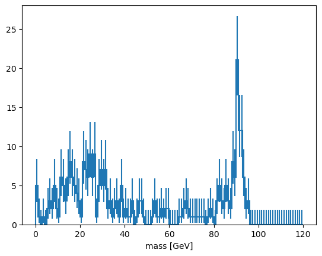
    


That worked (there’s a Z peak). Now to do this over the whole file, we should be more careful about what we’re reading,


```python
tree.keys(filter_name=["nMuon", "/Muon_(pt|eta|phi)/"])
```


    ['nMuon', 'Muon_pt', 'Muon_eta', 'Muon_phi']


and accumulate data gradually with [uproot.TTree.iterate](https://uproot.readthedocs.io/en/latest/uproot.behaviors.TTree.TTree.html#iterate). This handles the `entry_start`/`entry_stop` in a loop.


```python
masshist = hist.Hist(hist.axis.Regular(120, 0, 120, label="mass [GeV]"))

for muons, report in tree.iterate(filter_name=["nMuon", "/Muon_(pt|eta|phi)/"], report=True):
    print(f"Processing entries {report.start} to {report.stop}")
    cut = muons["nMuon"] == 2
    pt0 = muons["Muon_pt", cut, 0]
    pt1 = muons["Muon_pt", cut, 1]
    eta0 = muons["Muon_eta", cut, 0]
    eta1 = muons["Muon_eta", cut, 1]
    phi0 = muons["Muon_phi", cut, 0]
    phi1 = muons["Muon_phi", cut, 1]
    mass = np.sqrt(2 * pt0 * pt1 * (np.cosh(eta0 - eta1) - np.cos(phi0 - phi1)))
    masshist.fill(mass)
    print(masshist.sum() / tree.num_entries)

masshist.plot();
```

    Processing entries 0 to 299683
    0.3036675420360848


    
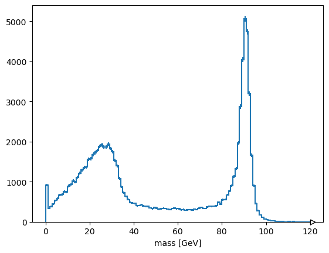
    


<br><br><br><br>


### Getting data into NumPy or Pandas
In all of the above examples, the `array`, `arrays`, and `iterate` methods return Awkward Arrays. The Awkward Array library is useful for exactly this kind of data (jagged arrays: more in the next lesson), but you might be working with libraries that only recognize NumPy arrays or Pandas DataFrames.

Use `library="np"` or `library="pd"` to get NumPy or Pandas, respectively.


```python
tree["nMuon"].array(library="np", entry_stop=10_000)

tree.arrays(library="np", entry_stop=10_000)

tree.arrays(library="pd", entry_stop=10_000)
```


<div>
<style scoped>
    .dataframe tbody tr th:only-of-type {
        vertical-align: middle;
    }

    .dataframe tbody tr th {
        vertical-align: top;
    }

    .dataframe thead th {
        text-align: right;
    }
</style>
<table border="1" class="dataframe">
  <thead>
    <tr style="text-align: right;">
      <th></th>
      <th>run</th>
      <th>luminosityBlock</th>
      <th>event</th>
      <th>nMuon</th>
      <th>Muon_pt</th>
      <th>Muon_eta</th>
      <th>Muon_phi</th>
      <th>Muon_mass</th>
      <th>Muon_charge</th>
      <th>MET_pt</th>
      <th>MET_phi</th>
      <th>nGenPart</th>
      <th>GenPart_pt</th>
      <th>GenPart_eta</th>
      <th>GenPart_phi</th>
      <th>GenPart_pdgId</th>
    </tr>
  </thead>
  <tbody>
    <tr>
      <th>0</th>
      <td>1</td>
      <td>13</td>
      <td>1201</td>
      <td>0</td>
      <td>[]</td>
      <td>[]</td>
      <td>[]</td>
      <td>[]</td>
      <td>[]</td>
      <td>19.496290</td>
      <td>3.096666</td>
      <td>6</td>
      <td>[60.43461608886719, 27.03217887878418, 60.4346...</td>
      <td>[-0.7820958495140076, -2.3512237071990967, -0....</td>
      <td>[-2.21305251121521, -0.6086280941963196, -2.21...</td>
      <td>[11, -11, 11, -15, -11, -15]</td>
    </tr>
    <tr>
      <th>1</th>
      <td>1</td>
      <td>13</td>
      <td>1202</td>
      <td>2</td>
      <td>[18.583789825439453, 23.630338668823242]</td>
      <td>[-0.17873963713645935, 0.22412824630737305]</td>
      <td>[2.1292223930358887, -2.0946476459503174]</td>
      <td>[0.10565836727619171, 0.10565836727619171]</td>
      <td>[1, -1]</td>
      <td>20.397919</td>
      <td>-2.180577</td>
      <td>6</td>
      <td>[18.733409881591797, 23.816869735717773, 32.09...</td>
      <td>[-0.17861033976078033, 0.22458051145076752, -1...</td>
      <td>[2.1295831203460693, -2.0947155952453613, -1.6...</td>
      <td>[-13, 13, -11, 13, -11, -13]</td>
    </tr>
    <tr>
      <th>2</th>
      <td>1</td>
      <td>13</td>
      <td>1203</td>
      <td>0</td>
      <td>[]</td>
      <td>[]</td>
      <td>[]</td>
      <td>[]</td>
      <td>[]</td>
      <td>28.817572</td>
      <td>2.616833</td>
      <td>1</td>
      <td>[40.565895080566406]</td>
      <td>[-0.33271655440330505]</td>
      <td>[-0.06153199449181557]</td>
      <td>[-15]</td>
    </tr>
    <tr>
      <th>3</th>
      <td>1</td>
      <td>13</td>
      <td>1204</td>
      <td>3</td>
      <td>[26.678863525390625, 21.356121063232422, 5.648...</td>
      <td>[-1.2300245761871338, 1.2668139934539795, 0.87...</td>
      <td>[-1.3949246406555176, 1.0259664058685303, 0.07...</td>
      <td>[0.10565836727619171, 0.10565836727619171, 0.1...</td>
      <td>[-1, 1, 1]</td>
      <td>4.415469</td>
      <td>-0.206256</td>
      <td>5</td>
      <td>[26.755929946899414, 22.26161003112793, 22.261...</td>
      <td>[-1.2301405668258667, 1.266518235206604, 1.266...</td>
      <td>[-1.3949953317642212, 1.0261328220367432, 1.02...</td>
      <td>[13, -13, -13, 13, -13]</td>
    </tr>
    <tr>
      <th>4</th>
      <td>1</td>
      <td>13</td>
      <td>1205</td>
      <td>1</td>
      <td>[7.621268272399902]</td>
      <td>[2.153585195541382]</td>
      <td>[0.12853343784809113]</td>
      <td>[0.10565836727619171]</td>
      <td>[-1]</td>
      <td>5.856652</td>
      <td>2.472323</td>
      <td>10</td>
      <td>[7.496843338012695, 49.52935028076172, 24.5504...</td>
      <td>[2.1539559364318848, 1.2729040384292603, 2.181...</td>
      <td>[0.12829485535621643, -2.153761625289917, 1.27...</td>
      <td>[13, -11, 11, -11, -11, 11, -11, -11, -11, 11]</td>
    </tr>
    <tr>
      <th>...</th>
      <td>...</td>
      <td>...</td>
      <td>...</td>
      <td>...</td>
      <td>...</td>
      <td>...</td>
      <td>...</td>
      <td>...</td>
      <td>...</td>
      <td>...</td>
      <td>...</td>
      <td>...</td>
      <td>...</td>
      <td>...</td>
      <td>...</td>
      <td>...</td>
    </tr>
    <tr>
      <th>9995</th>
      <td>1</td>
      <td>514</td>
      <td>51396</td>
      <td>3</td>
      <td>[19.476654052734375, 16.23060417175293, 9.4744...</td>
      <td>[1.4180338382720947, 1.2422826290130615, 0.944...</td>
      <td>[2.878394365310669, -0.11724910885095596, 3.00...</td>
      <td>[0.10565836727619171, 0.10565836727619171, 0.1...</td>
      <td>[1, 1, -1]</td>
      <td>10.900043</td>
      <td>-2.764597</td>
      <td>9</td>
      <td>[19.630573272705078, 16.285367965698242, 9.460...</td>
      <td>[1.4180697202682495, 1.242085337638855, 0.9440...</td>
      <td>[2.877746105194092, -0.11749473214149475, 3.00...</td>
      <td>[-13, -13, 13, 15, -13, -13, 13, 13, -13]</td>
    </tr>
    <tr>
      <th>9996</th>
      <td>1</td>
      <td>514</td>
      <td>51397</td>
      <td>1</td>
      <td>[17.293930053710938]</td>
      <td>[-0.6075558662414551]</td>
      <td>[-2.472750663757324]</td>
      <td>[0.10565836727619171]</td>
      <td>[1]</td>
      <td>16.870754</td>
      <td>-2.544646</td>
      <td>5</td>
      <td>[17.413728713989258, 17.413728713989258, 31.73...</td>
      <td>[-0.6075693964958191, -0.6075693964958191, -0....</td>
      <td>[-2.472949504852295, -2.472949504852295, -0.23...</td>
      <td>[-13, -13, 15, 15, -15]</td>
    </tr>
    <tr>
      <th>9997</th>
      <td>1</td>
      <td>514</td>
      <td>51398</td>
      <td>2</td>
      <td>[16.284423828125, 35.66704177856445]</td>
      <td>[-1.3586664199829102, -0.39609432220458984]</td>
      <td>[-2.4358296394348145, 0.3309451937675476]</td>
      <td>[0.10565836727619171, 0.10565836727619171]</td>
      <td>[-1, 1]</td>
      <td>41.246101</td>
      <td>-1.923917</td>
      <td>6</td>
      <td>[16.38582992553711, 35.52251434326172, 16.3858...</td>
      <td>[-1.359019160270691, -0.3962712287902832, -1.3...</td>
      <td>[-2.436025619506836, 0.330924391746521, -2.436...</td>
      <td>[13, -13, 13, -13, -13, -13]</td>
    </tr>
    <tr>
      <th>9998</th>
      <td>1</td>
      <td>514</td>
      <td>51399</td>
      <td>2</td>
      <td>[22.828134536743164, 14.181641578674316]</td>
      <td>[-1.1843562126159668, -0.3602685034275055]</td>
      <td>[2.7041208744049072, 2.52846360206604]</td>
      <td>[0.10565836727619171, 0.10565836727619171]</td>
      <td>[-1, -1]</td>
      <td>19.279821</td>
      <td>1.352284</td>
      <td>7</td>
      <td>[22.694652557373047, 8.113852500915527, 44.442...</td>
      <td>[-1.1844141483306885, 0.052676282823085785, -0...</td>
      <td>[2.7038819789886475, 2.8672797679901123, -2.65...</td>
      <td>[13, -13, -11, 11, -11, 13, 11]</td>
    </tr>
    <tr>
      <th>9999</th>
      <td>1</td>
      <td>514</td>
      <td>51400</td>
      <td>0</td>
      <td>[]</td>
      <td>[]</td>
      <td>[]</td>
      <td>[]</td>
      <td>[]</td>
      <td>11.330474</td>
      <td>0.300385</td>
      <td>5</td>
      <td>[32.36711502075195, 11.835474967956543, 32.367...</td>
      <td>[-0.9258637428283691, -0.3985985219478607, -0....</td>
      <td>[2.5428812503814697, -2.701794147491455, 2.542...</td>
      <td>[-11, 11, -11, 15, 11]</td>
    </tr>
  </tbody>
</table>
<p>10000 rows × 16 columns</p>
</div>


NumPy is great for non-jagged data like the `"nMuon"` branch, but it has to represent an unknown number of muons per event as an array of NumPy arrays (i.e. Python objects).

Pandas can be made to represent multiple particles per event by putting this structure in a [pd.MultiIndex](https://pandas.pydata.org/pandas-docs/stable/user_guide/advanced.html), but not when the DataFrame contains more than one particle type (e.g. muons and electrons). Use separate DataFrames for these cases. If it helps, note that there’s another route to DataFrames: by reading the data as an Awkward Array and calling [ak.to_pandas](https://awkward-array.org/doc/main/reference/generated/ak.to_dataframe.html) on it. (Some methods use more memory than others, and I’ve found Pandas to be unusually memory-intensive.)

Or use Awkward Arrays (next lesson).

<br><br><br>

### 📌 Key Points

 * ROOT files have a structure that enables partial reading. This is essential for large datasets.
 * Be aware of how much data you’re reading and when.
 * The Python + Jupyter + Uproot interface provides a gradual path from interactive tinkering to scaled-up workflows.


<br><br><br><br><br>

# Jagged, ragged, Awkward Arrays

## What is Awkward Array?

The previous lesson included a tricky slice:


```python
cut = muons["nMuon"] == 2

pt0 = muons["Muon_pt", cut, 0]
```

The three parts of `muons["Muon_pt", cut, 0]` slice

1. selects the `"Muon_pt"` field of all records in the array,
2. applies `cut`, a boolean array, to select only events with two muons,
3. selects the first (`0`) muon from each of those pairs. Similarly for the second (`1`) muons.

NumPy would not be able to perform such a slice, or even represent an array of variable-length lists without resorting to arrays of objects.


```python
import numpy as np

# generates a ValueError
np.array([[0.0, 1.1, 2.2], [], [3.3, 4.4], [5.5], [6.6, 7.7, 8.8, 9.9]])
```


    ---------------------------------------------------------------------------

    ValueError                                Traceback (most recent call last)

    Cell In[71], line 4
          1 import numpy as np
          3 # generates a ValueError
    ----> 4 np.array([[0.0, 1.1, 2.2], [], [3.3, 4.4], [5.5], [6.6, 7.7, 8.8, 9.9]])


    ValueError: setting an array element with a sequence. The requested array has an inhomogeneous shape after 1 dimensions. The detected shape was (5,) + inhomogeneous part.


Awkward Array is intended to fill this gap:


```python
import awkward as ak

ak.Array([[0.0, 1.1, 2.2], [], [3.3, 4.4], [5.5], [6.6, 7.7, 8.8, 9.9]])
```


<pre>[[0, 1.1, 2.2],
 [],
 [3.3, 4.4],
 [5.5],
 [6.6, 7.7, 8.8, 9.9]]
-----------------------
backend: cpu
nbytes: 128 B
type: 5 * var * float64</pre>


Arrays like this are sometimes called "[jagged arrays](https://en.wikipedia.org/wiki/Jagged_array)" and sometimes "ragged arrays."

<br><br><br><br><br>


## Slicing in Awkward Array

Basic slices are a generalization of NumPy's—what NumPy would do if it had variable-length lists.


```python
array = ak.Array([[0.0, 1.1, 2.2], [], [3.3, 4.4], [5.5], [6.6, 7.7, 8.8, 9.9]])
array.tolist()

array[2]
array[-1, 1]
array[2:, 0]
array[2:, 1:]
array[:, 0]
```


    ---------------------------------------------------------------------------

    IndexError                                Traceback (most recent call last)

    Cell In[73], line 8
          6 array[2:, 0]
          7 array[2:, 1:]
    ----> 8 array[:, 0]


    File ~/miniconda3/envs/2025-06-20-hsf-iris-hep-uproot-awkward-tutorial/lib/python3.11/site-packages/awkward/highlevel.py:1105, in Array.__getitem__(self, where)
        676 def __getitem__(self, where):
        677     """
        678     Args:
        679         where (many types supported; see below): Index of positions to
       (...)   1103     have the same dimension as the array being indexed.
       1104     """
    -> 1105     with ak._errors.SlicingErrorContext(self, where):
       1106         # Handle named axis
       1107         (_, ndim) = self._layout.minmax_depth
       1108         named_axis = _get_named_axis(self)


    File ~/miniconda3/envs/2025-06-20-hsf-iris-hep-uproot-awkward-tutorial/lib/python3.11/site-packages/awkward/_errors.py:80, in ErrorContext.__exit__(self, exception_type, exception_value, traceback)
         78     self._slate.__dict__.clear()
         79     # Handle caught exception
    ---> 80     raise self.decorate_exception(exception_type, exception_value)
         81 else:
         82     # Step out of the way so that another ErrorContext can become primary.
         83     if self.primary() is self:


    File ~/miniconda3/envs/2025-06-20-hsf-iris-hep-uproot-awkward-tutorial/lib/python3.11/site-packages/awkward/highlevel.py:1113, in Array.__getitem__(self, where)
       1109 where = _normalize_named_slice(named_axis, where, ndim)
       1111 NamedAxis.mapping = named_axis
    -> 1113 indexed_layout = prepare_layout(self._layout._getitem(where, NamedAxis))
       1115 if NamedAxis.mapping:
       1116     return ak.operations.ak_with_named_axis._impl(
       1117         indexed_layout,
       1118         named_axis=NamedAxis.mapping,
       (...)   1121         attrs=self._attrs,
       1122     )


    File ~/miniconda3/envs/2025-06-20-hsf-iris-hep-uproot-awkward-tutorial/lib/python3.11/site-packages/awkward/contents/content.py:649, in Content._getitem(self, where, named_axis)
        640 named_axis.mapping = _named_axis
        642 next = ak.contents.RegularArray(
        643     this,
        644     this.length,
        645     1,
        646     parameters=None,
        647 )
    --> 649 out = next._getitem_next(nextwhere[0], nextwhere[1:], None)
        651 if out.length is not unknown_length and out.length == 0:
        652     return out._getitem_nothing()


    File ~/miniconda3/envs/2025-06-20-hsf-iris-hep-uproot-awkward-tutorial/lib/python3.11/site-packages/awkward/contents/regulararray.py:550, in RegularArray._getitem_next(self, head, tail, advanced)
        544 nextcontent = self._content._carry(nextcarry, True)
        546 if advanced is None or (
        547     advanced.length is not unknown_length and advanced.length == 0
        548 ):
        549     return RegularArray(
    --> 550         nextcontent._getitem_next(nexthead, nexttail, advanced),
        551         nextsize,
        552         self.length,
        553         parameters=self._parameters,
        554     )
        555 else:
        556     nextadvanced = ak.index.Index64.empty(nextcarry.length, nplike)


    File ~/miniconda3/envs/2025-06-20-hsf-iris-hep-uproot-awkward-tutorial/lib/python3.11/site-packages/awkward/contents/listarray.py:754, in ListArray._getitem_next(self, head, tail, advanced)
        748 head = ak._slicing.normalize_integer_like(head)
        749 assert (
        750     nextcarry.nplike is self._backend.nplike
        751     and self._starts.nplike is self._backend.nplike
        752     and self._stops.nplike is self._backend.nplike
        753 )
    --> 754 self._maybe_index_error(
        755     self._backend[
        756         "awkward_ListArray_getitem_next_at",
        757         nextcarry.dtype.type,
        758         self._starts.dtype.type,
        759         self._stops.dtype.type,
        760     ](
        761         nextcarry.data,
        762         self._starts.data,
        763         self._stops.data,
        764         lenstarts,
        765         head,
        766     ),
        767     slicer=head,
        768 )
        769 nextcontent = self._content._carry(nextcarry, True)
        770 return nextcontent._getitem_next(nexthead, nexttail, advanced)


    File ~/miniconda3/envs/2025-06-20-hsf-iris-hep-uproot-awkward-tutorial/lib/python3.11/site-packages/awkward/contents/content.py:295, in Content._maybe_index_error(self, error, slicer)
        293 else:
        294     message = self._backend.format_kernel_error(error)
    --> 295     raise ak._errors.index_error(self, slicer, message)


    IndexError: cannot slice ListArray (of length 5) with array(0): index out of range while attempting to get index 0 (in compiled code: https://github.com/scikit-hep/awkward/blob/awkward-cpp-46/awkward-cpp/src/cpu-kernels/awkward_ListArray_getitem_next_at.cpp#L21)

    
    This error occurred while attempting to slice
    
        <Array [[0, 1.1, 2.2], ..., [6.6, 7.7, ..., 9.9]] type='5 * var * float64'>
    
    with
    
        (:, 0)


**Quick quiz:** why does the last one raise an error?


```python
###%cat hint1.txt
```

Boolean and integer slices work, too:


```python
array[[True, False, True, False, True]]

array[[2, 3, 3, 1]]
```


<pre>[[3.3, 4.4],
 [5.5],
 [5.5],
 []]
-----------------------
backend: cpu
nbytes: 144 B
type: 4 * var * float64</pre>


Like NumPy, boolean arrays for slices can be computed, and functions like [ak.num](https://awkward-array.readthedocs.io/en/latest/_auto/ak.num.html) are helpful for that.


```python
ak.num(array)

ak.num(array) > 0

array[ak.num(array) > 0, 0]
array[ak.num(array) > 1, 1]
```


<pre>[1.1,
 4.4,
 7.7]
-----------------
backend: cpu
nbytes: 24 B
type: 3 * float64</pre>


Now consider this (similar to an example from the first lesson):


```python
cut = array * 10 % 2 == 0

array[cut]
```


<pre>[[0, 2.2],
 [],
 [4.4],
 [],
 [6.6, 8.8]]
-----------------------
backend: cpu
nbytes: 88 B
type: 5 * var * float64</pre>


This array, `cut`, is not just an array of booleans. It's a jagged array of booleans. All of its nested lists fit into `array`'s nested lists, so it can deeply select numbers, rather than selecting lists.

<br><br><br><br>

## Application: selecting particles, rather than events

Returning to the big TTree from the previous lesson,


```python
import uproot
import awkward as ak

file = uproot.open(
    ###"root://eospublic.cern.ch//eos/opendata/cms/derived-data/AOD2NanoAODOutreachTool/Run2012BC_DoubleMuParked_Muons.root"
    "data/HiggsZZ4mu.root"
)
tree = file["Events"]

muon_pt = tree["Muon_pt"].array(entry_stop=10)
```

This jagged array of booleans selects all *muons* with at least 20 GeV:


```python
particle_cut = muon_pt > 20

muon_pt[particle_cut]
```


<pre>[[],
 [23.6],
 [],
 [26.7, 21.4],
 [],
 [],
 [],
 [],
 [],
 [23.5]]
------------------------
backend: cpu
nbytes: 104 B
type: 10 * var * float32</pre>


and this non-jagged array of booleans (made with [ak.any](https://awkward-array.readthedocs.io/en/latest/_auto/ak.any.html)) selects all events *that have* a muon with at least 20 GeV:


```python
event_cut = ak.any(muon_pt > 20, axis=1)

muon_pt[event_cut]
```


<pre>[[18.6, 23.6],
 [26.7, 21.4, 5.65],
 [8.25, 23.5]]
-----------------------
backend: cpu
nbytes: 88 B
type: 3 * var * float32</pre>


**Quick quiz:** construct exactly the same `event_cut` using [ak.max](https://awkward-array.readthedocs.io/en/latest/_auto/ak.max.html).


```python

```

**Quick quiz:** apply both cuts; that is, select muons with over 20 GeV from events that have them.


```python

```

_Hint:_ you'll want to make a


```python
cleaned = muon_pt[particle_cut]
```

intermediary and you can't use the variable `event_cut`, as-is.


_Hint:_ the final result should be a jagged array, just like muon_pt, but with fewer lists and fewer items in those lists.

## Solution (no peeking!)


```python
cleaned = muon_pt[particle_cut]
final_result = cleaned[event_cut]
final_result.tolist()
```


    [[23.630338668823242],
     [26.678863525390625, 21.356121063232422],
     [23.482236862182617]]


<br><br><br><br><br>


# Combinatorics in Awkward Array

Variable-length lists present more problems than just slicing and computing formulas array-at-a-time. Often, we want to combine particles in all possible pairs (within each event) to look for decay chains.

## Pairs from two arrays, pairs from a single array

Awkward Array has functions that generate these combinations. For instance, [ak.cartesian](https://awkward-array.readthedocs.io/en/latest/_auto/ak.cartesian.html) takes a Cartesian product per event (when `axis=1`, the default).


```python
numbers = ak.Array([[1, 2, 3], [], [5, 7], [11]])
letters = ak.Array([["a", "b"], ["c"], ["d"], ["e", "f"]])

pairs = ak.cartesian((numbers, letters))
```

These `pairs` are 2-tuples, which are like records in how they're sliced out of an array: using strings.


```python
pairs["0"]
pairs["1"]
```


<pre>[[&#x27;a&#x27;, &#x27;b&#x27;, &#x27;a&#x27;, &#x27;b&#x27;, &#x27;a&#x27;, &#x27;b&#x27;],
 [],
 [&#x27;d&#x27;, &#x27;d&#x27;],
 [&#x27;e&#x27;, &#x27;f&#x27;]]
--------------------------------
backend: cpu
nbytes: 206 B
type: 4 * var * string</pre>


There's also [ak.unzip](https://awkward-array.readthedocs.io/en/latest/_auto/ak.unzip.html), which extracts every field into a separate array (opposite of [ak.zip](https://awkward-array.readthedocs.io/en/latest/_auto/ak.zip.html)).


```python
lefts, rights = ak.unzip(pairs)
lefts
rights
```


<pre>[[&#x27;a&#x27;, &#x27;b&#x27;, &#x27;a&#x27;, &#x27;b&#x27;, &#x27;a&#x27;, &#x27;b&#x27;],
 [],
 [&#x27;d&#x27;, &#x27;d&#x27;],
 [&#x27;e&#x27;, &#x27;f&#x27;]]
--------------------------------
backend: cpu
nbytes: 206 B
type: 4 * var * string</pre>


Note that these `lefts` and `rights` are not the original `numbers` and `letters`: they have been duplicated and have the same shape.

The Cartesian product is equivalent to this C++ `for` loop over two collections:

```cpp
for (int i = 0; i < numbers.size(); i++) {
  for (int j = 0; j < letters.size(); j++) {
    // compute formula with numbers[i] and letters[j]
  }
}
```

Sometimes, though, we want to find all pairs within a single collection, without repetition. That would be equivalent to this C++ `for` loop:

```cpp
for (int i = 0; i < numbers.size(); i++) {
  for (int j = i + 1; i < numbers.size(); j++) {
    // compute formula with numbers[i] and numbers[j]
  }
}
```

The Awkward function for this case is [ak.combinations](https://awkward-array.readthedocs.io/en/latest/_auto/ak.combinations.html).


```python
pairs = ak.combinations(numbers, 2)
pairs

lefts, rights = ak.unzip(pairs)

lefts * rights  # they line up, so we can compute formulas
```


<pre>[[2, 3, 6],
 [],
 [35],
 []]
---------------------
backend: cpu
nbytes: 72 B
type: 4 * var * int64</pre>


<br><br><br><br><br>

## Application to dimuons

The dimuon search in the previous lesson was a little naive in that we required *exactly two* muons to exist in every event and only computed the mass of that combination. If a third muon were present because it's a complex electroweak decay or because something was mismeasured, we would be blind to the other two muons. They might be real dimuons.

A better procedure would be to look for all pairs of muons in an event and apply some criteria for selecting them.

In this example, we'll [ak.zip](https://awkward-array.readthedocs.io/en/latest/_auto/ak.zip.html) the muon variables together into records.


```python
import uproot
import awkward as ak

file = uproot.open(
    ###"root://eospublic.cern.ch//eos/opendata/cms/derived-data/AOD2NanoAODOutreachTool/Run2012BC_DoubleMuParked_Muons.root"
    "data/HiggsZZ4mu.root"
)
tree = file["Events"]

arrays = tree.arrays(filter_name="/Muon_(pt|eta|phi|charge)/", entry_stop=10000)

muons = ak.zip(
    {
        "pt": arrays["Muon_pt"],
        "eta": arrays["Muon_eta"],
        "phi": arrays["Muon_phi"],
        "charge": arrays["Muon_charge"],
    }
)

arrays.type
muons.type
```


    ArrayType(ListType(RecordType([NumpyType('float32'), NumpyType('float32'), NumpyType('float32'), NumpyType('int32')], ['pt', 'eta', 'phi', 'charge'])), 10000, None)


The difference between `arrays` and `muons` is that `arrays` contains separate lists of `"Muon_pt"`, `"Muon_eta"`, `"Muon_phi"`, `"Muon_charge"`, while `muons` contains lists of records with `"pt"`, `"eta"`, `"phi"`, `"charge"` fields.

Now we can compute pairs of muon *objects*


```python
pairs = ak.combinations(muons, 2)

pairs.type
```


    ArrayType(ListType(RecordType([RecordType([NumpyType('float32'), NumpyType('float32'), NumpyType('float32'), NumpyType('int32')], ['pt', 'eta', 'phi', 'charge']), RecordType([NumpyType('float32'), NumpyType('float32'), NumpyType('float32'), NumpyType('int32')], ['pt', 'eta', 'phi', 'charge'])], None)), 10000, None)


and separate them into arrays of the first muon and the second muon in each pair.


```python
mu1, mu2 = ak.unzip(pairs)
```

**Quick quiz:** how would you ensure that all lists of records in `mu1` and `mu2` have the same lengths? _Hint:_ see [ak.num](https://awkward-array.readthedocs.io/en/latest/_auto/ak.num.html) and [ak.all](https://awkward-array.readthedocs.io/en/latest/_auto/ak.all.html).


```python

```

Since they do have the same lengths, we can use them in a formula.


```python
import numpy as np

mass = np.sqrt(
    2 * mu1.pt * mu2.pt * (np.cosh(mu1.eta - mu2.eta) - np.cos(mu1.phi - mu2.phi))
)
```

**Quick quiz:** how many masses do we have in each event? How does this compare with `muons`, `mu1`, and `mu2`?


```python

```

<br><br><br><br><br>

## Plotting the jagged array

Since this `mass` is a jagged array, it can't be directly histogrammed. Histograms take a set of *numbers* as inputs, but this array contains *lists*.

Supposing you just want to plot the numbers from the lists, you can use [ak.flatten](https://awkward-array.readthedocs.io/en/latest/_auto/ak.flatten.html) to flatten one level of list or [ak.ravel](https://awkward-array.readthedocs.io/en/latest/_auto/ak.ravel.html) to flatten all levels.


```python
import hist

hist.Hist(hist.axis.Regular(120, 0, 120, label="mass [GeV]")).fill(
    ak.ravel(mass)
).plot()
```


    [StairsArtists(stairs=<matplotlib.patches.StepPatch object at 0x35d1d9d90>, errorbar=<ErrorbarContainer object of 3 artists>, legend_artist=<ErrorbarContainer object of 3 artists>)]


    
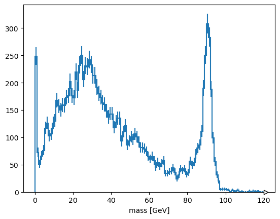
    


Alternatively, suppose you want to plot the *maximum* mass-candidate in each event, biasing it toward Z bosons? [ak.max](https://awkward-array.readthedocs.io/en/latest/_auto/ak.max.html) is a different function that picks one element from each list, when used with `axis=1`.


```python
ak.max(mass, axis=1)
```


<pre>[None,
 36.9,
 None,
 88.4,
 None,
 None,
 None,
 None,
 None,
 22.9,
 ...,
 90.6,
 None,
 None,
 72.8,
 35.6,
 None,
 53.1,
 15.6,
 None]
----------------------
backend: cpu
nbytes: 50.0 kB
type: 10000 * ?float32</pre>


Some values are `None` because there is no maximum of an empty list. [ak.flatten](https://awkward-array.readthedocs.io/en/latest/_auto/ak.flatten.html)/[ak.ravel](https://awkward-array.readthedocs.io/en/latest/_auto/ak.ravel.html) remove missing values (`None`) as well as squashing lists,


```python
ak.flatten(ak.max(mass, axis=1), axis=0)
```


<pre>[36.9,
 88.4,
 22.9,
 70.1,
 91,
 74.6,
 59.8,
 92,
 552,
 21.3,
 ...,
 21.7,
 64.5,
 73.8,
 91.9,
 90.6,
 72.8,
 35.6,
 53.1,
 15.6]
--------------------
backend: cpu
nbytes: 19.1 kB
type: 4764 * float32</pre>


but so does removing the empty lists in the first place.


```python
ak.max(mass[ak.num(mass) > 0], axis=1)
```


<pre>[36.9,
 88.4,
 22.9,
 70.1,
 91,
 74.6,
 59.8,
 92,
 552,
 21.3,
 ...,
 21.7,
 64.5,
 73.8,
 91.9,
 90.6,
 72.8,
 35.6,
 53.1,
 15.6]
---------------------
backend: cpu
nbytes: 23.8 kB
type: 4764 * ?float32</pre>


<br><br><br><br><br>


## Exercise: select pairs of muons with opposite charges

This is neither an event-level cut nor a particle-level cut, it is a cut on particle *pairs*.

### Solution (no peeking!)

The `mu1` and `mu2` variables are the left and right halves of muon pairs. Therefore,


```python
cut = (mu1.charge != mu2.charge)
```

has the right multiplicity to be applied to the `mass` array.


```python
hist.Hist(hist.axis.Regular(120, 0, 120, label="mass [GeV]")).fill(
  ak.ravel(mass[cut])
).plot()
```


    [StairsArtists(stairs=<matplotlib.patches.StepPatch object at 0x35de190d0>, errorbar=<ErrorbarContainer object of 3 artists>, legend_artist=<ErrorbarContainer object of 3 artists>)]


    
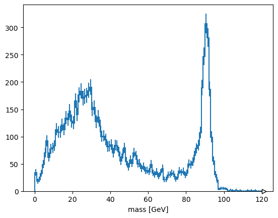
    


plots the cleaned muon pairs.

<br><br><br><br><br>

## Exercise (harder): plot the one mass candidate per event that is strictly closest to the Z mass

Instead of just taking the maximum mass in each event, find the one with the minimum difference between computed mass and `zmass = 91`.

Hint: use [ak.argmin](https://awkward-array.readthedocs.io/en/latest/_auto/ak.argmin.html) with `keepdims=True`.

Anticipating one of the future lessons, you could get a more accurate mass by asking the Particle library:


```python
import particle, hepunits

zmass = particle.Particle.findall("Z0")[0].mass / hepunits.GeV
```

### Solution (no peeking!)

Instead of maximizing `mass`, we want to minimize `abs(mass - zmass)` and apply that choice to `mass`. [ak.argmin](https://awkward-array.readthedocs.io/en/latest/_auto/ak.argmin.html) returns the *index position* of this minimum difference, which we can then apply to the original `mass`. However, without `keepdims=True`, [ak.argmin](https://awkward-array.readthedocs.io/en/latest/_auto/ak.argmin.html) removes the dimension we would need for this array to have the same nested shape as `mass`. Therefore, we `keepdims=True` and then use [ak.ravel](https://awkward-array.readthedocs.io/en/latest/_auto/ak.ravel.html) to get rid of missing values and flatten lists.

The last step would require two applications of [ak.flatten](https://awkward-array.readthedocs.io/en/latest/_auto/ak.flatten.html): one for squashing lists at the first level and another for removing `None` at the second level.


```python
which = ak.argmin(abs(mass - zmass), axis=1, keepdims=True)
hist.Hist(hist.axis.Regular(120, 0, 120, label="mass [GeV]")).fill(
    ak.drop_none(ak.ravel(mass[which]))
).plot()
```


    [StairsArtists(stairs=<matplotlib.patches.StepPatch object at 0x35de83290>, errorbar=<ErrorbarContainer object of 3 artists>, legend_artist=<ErrorbarContainer object of 3 artists>)]


    
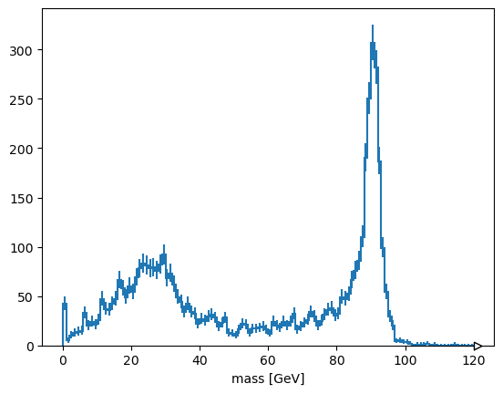
    


<br><br><br><br>

### 📌 Key Points

 * NumPy (and almost all array libraries) is only for rectilinear collections of numbers: arrays, tables, and tensors.
 * Awkward Array extends NumPy’s slicing and array-manipulation to jagged arrays and more general data types (such as nested records).
 * These extensions are useful for physics.
 * There’s usually more than one way to get what you want.

<br><br><br><br><br>

# Histogram manipulations and fitting

## Histogram libraries

Mainstream Python has libraries for filling histograms.

## NumPy

NumPy, for instance, has an [np.histogram](https://numpy.org/doc/stable/reference/generated/numpy.histogram.html) function.


```python
import uproot

tree = uproot.open("data/Zmumu.root")["events"]

import numpy as np

np.histogram(tree["M"].array())
```


<pre>[[172, 89, 29, 69, 277, 1.64e+03, 24, 0, 2, 2],
 [0.389, 17.6, 34.7, 51.9, 69.1, 86.2, 103, 121, 138, 155, 172]]
----------------------------------------------------------------
backend: cpu
nbytes: 192 B
type: 2 * var * float64</pre>


Because of NumPy's prominence, this 2-tuple of arrays (bin contents and edges) is a widely recognized histogram format, though it lacks many of the features high-energy physicists expect (under/overflow, axis labels, uncertainties, etc.).

<br><br><br><br><br>

## Matplotlib

Matplotlib also has a [plt.hist](https://matplotlib.org/stable/api/_as_gen/matplotlib.pyplot.hist.html) function.


```python
import matplotlib.pyplot as plt

plt.hist(tree["M"].array());
```


    
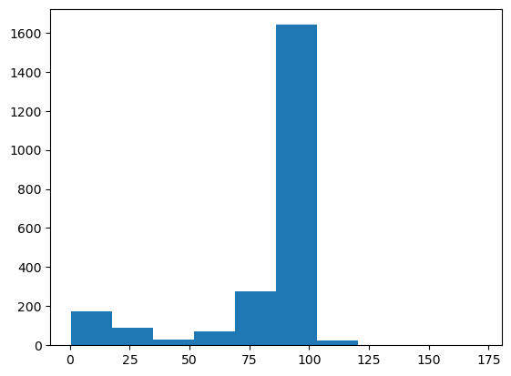
    


In addition to the same bin contents and edges as NumPy, Matplotlib includes a plottable graphic.

<br><br><br><br><br>

## Boost-histogram and hist

The main feature that these functions lack (without some effort) is refillability. High-energy physicists usually want to fill histograms with more data than can fit in memory, which means setting bin intervals on an empty container and filling it in batches (sequentially or in parallel).

Boost-histogram is a library designed for that purpose. It is intended as an infrastructure component. You can explore its "low-level" functionality upon importing it:


```python
import boost_histogram as bh
```

A more user-friendly layer (with plotting, for instance) is provided by a library called "hist."


```python
import hist

h = hist.Hist(hist.axis.Regular(120, 60, 120, name="mass"))

h.fill(tree["M"].array())

h.plot();
```


    
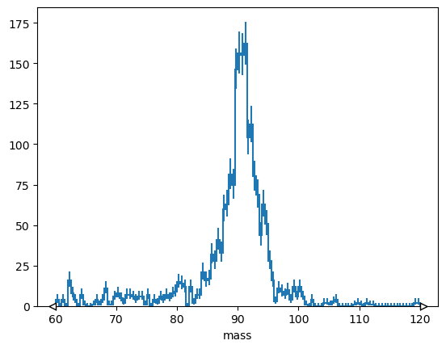
    


<br><br><br><br><br>

## Universal Histogram Indexing (UHI)

There is an attempt within Scikit-HEP to standardize what array-like slices mean for a histogram. ([See documentation](https://uhi.readthedocs.io/en/latest/indexing.html).)

Naturally, integer slices should select a range of bins,


```python
h[10:110].plot();
```


    
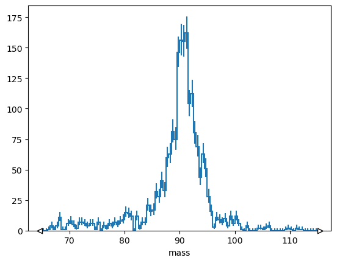
    


but often you want to select bins by coordinate value


```python
# Explicit version
h[hist.loc(90) :].plot();
```


    

    


```python
# Short version
h[90j:].plot();
```


    
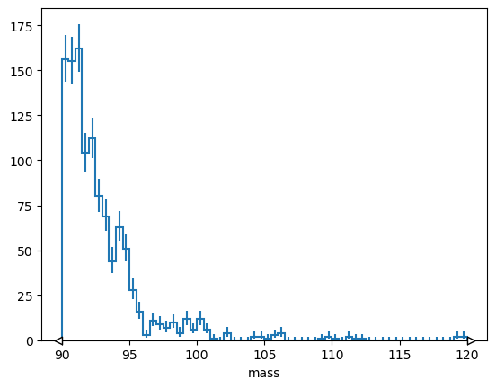
    


or rebin by a factor,


```python
# Explicit version
h[:: hist.rebin(2)].plot();
```


    

    


```python
# Short version
h[::2j].plot();
```


    
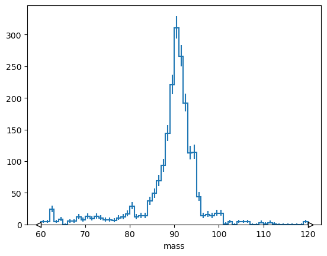
    


or sum over a range.


```python
# Explicit version
h[hist.loc(80) : hist.loc(100) : sum]
```


    1784.0


```python
# Short version
h[90j:100j:sum]
```


    1102.0


Things get more interesting when a histogram has multiple dimensions.


```python
import uproot
import hist
import awkward as ak

picodst = uproot.open(
    "https://pivarski-princeton.s3.amazonaws.com/pythia_ppZee_run17emb.picoDst.root:PicoDst"
)

vertexhist = hist.Hist(
    hist.axis.Regular(600, -1, 1, label="x"),
    hist.axis.Regular(600, -1, 1, label="y"),
    hist.axis.Regular(40, -200, 200, label="z"),
)

vertex_data = picodst.arrays(filter_name="*mPrimaryVertex[XYZ]")

vertexhist.fill(
    ak.flatten(vertex_data["Event.mPrimaryVertexX"]),
    ak.flatten(vertex_data["Event.mPrimaryVertexY"]),
    ak.flatten(vertex_data["Event.mPrimaryVertexZ"]),
)

vertexhist[:, :, sum].plot2d_full();
```


    
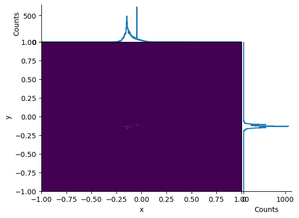
    


```python
vertexhist[-0.25j:0.25j, -0.25j:0.25j, sum].plot2d_full();
```


    
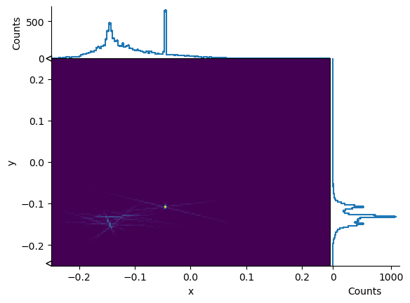
    


```python
vertexhist[sum, sum, :].plot();
```


    
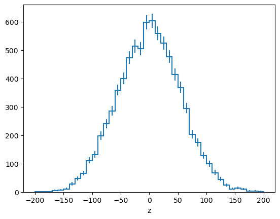
    


```python
vertexhist[-0.25j:0.25j:sum, -0.25j:0.25j:sum, :].plot();
```


    
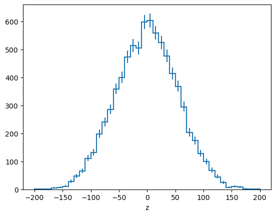
    


A histogram object can have more dimensions than you can reasonably visualize—you can slice, rebin, and project it into something visual later.

<br><br><br><br>

# Fitting histograms

By directly writing a loss function in Minuit:


```python
import numpy as np
import iminuit.cost

norm = len(h.axes[0].widths) / (h.axes[0].edges[-1] - h.axes[0].edges[0]) / h.sum()


def f(x, background, mu, gamma):
    return (
        background
        + (1 - background) * gamma**2 / ((x - mu) ** 2 + gamma**2) / np.pi / gamma
    )


loss = iminuit.cost.LeastSquares(
    h.axes[0].centers, h.values() * norm, np.sqrt(h.variances()) * norm, f
)
loss.mask = h.variances() > 0

minimizer = iminuit.Minuit(loss, background=0, mu=91, gamma=4)

minimizer.migrad()
minimizer.hesse()

(h * norm).plot()
plt.plot(loss.x, f(loss.x, *minimizer.values));
```


    
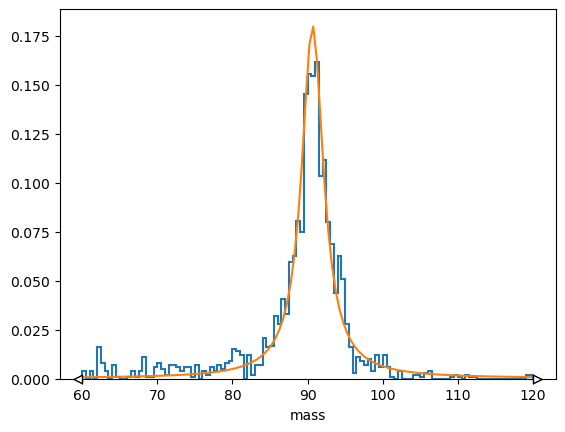
    


Or through zfit, a Pythonic RooFit-like fitter:


```python
import zfit

binned_data = zfit.data.BinnedData.from_hist(h)

binning = zfit.binned.RegularBinning(120, 60, 120, name="mass")
space = zfit.Space("mass", binning=binning)

background = zfit.Parameter("background", 0)
mu = zfit.Parameter("mu", 91)
gamma = zfit.Parameter("gamma", 4)
unbinned_model = zfit.pdf.SumPDF(
    [zfit.pdf.Uniform(60, 120, space), zfit.pdf.Cauchy(mu, gamma, space)], [background]
)

model = zfit.pdf.BinnedFromUnbinnedPDF(unbinned_model, space)
loss = zfit.loss.BinnedNLL(model, binned_data)

minimizer = zfit.minimize.Minuit()
result = minimizer.minimize(loss)

binned_data.to_hist().plot(density=1)
model.to_hist().plot(density=1)
```


    ---------------------------------------------------------------------------

    ModuleNotFoundError                       Traceback (most recent call last)

    Cell In[115], line 1
    ----> 1 import zfit
          3 binned_data = zfit.data.BinnedData.from_hist(h)
          5 binning = zfit.binned.RegularBinning(120, 60, 120, name="mass")


    ModuleNotFoundError: No module named 'zfit'


<br><br><br>

### 📌 Key Points

 * High-energy physicists approach histogramming in a different way from NumPy, Matplotlib, SciPy, etc.
 * Scikit-HEP tools make histogramming and fitting Pythonic.

<br><br><br><br><br>

# Lorentz vectors

In keeping with the "many small packages" philosophy, 2D/3D/Lorentz vectors are handled by a package named Vector. This is where you can find calculations like `deltaR` and coordinate transformations.


```python
import vector

one = vector.obj(px=1, py=0, pz=0)
two = vector.obj(px=0, py=1, pz=1)

one + two

one.deltaR(two)

one.to_rhophieta()
two.to_rhophieta()
```


    MomentumObject3D(pt=1.0, phi=1.5707963267948966, eta=0.881373587019543)


To fit in with the rest of the ecosystem, Vector must be an array-oriented library. Arrays of 2D/3D/Lorentz vectors are processed in bulk.

`MomentumNumpy2D`, `MomentumNumpy3D`, `MomentumNumpy4D` are NumPy array subtypes: NumPy arrays can be *cast* to these types and get all the vector functions.


```python
import uproot
import awkward as ak
import vector

tree = uproot.open("data/Zmumu.root")["events"]

one = ak.to_numpy(tree.arrays(filter_name=["E1", "p[xyz]1"]))
two = ak.to_numpy(tree.arrays(filter_name=["E2", "p[xyz]2"]))

one.dtype.names = ("E", "px", "py", "pz")
two.dtype.names = ("E", "px", "py", "pz")

one = one.view(vector.MomentumNumpy4D)
two = two.view(vector.MomentumNumpy4D)

one + two

one.deltaR(two)

one.to_rhophieta()
two.to_rhophieta()
```


    MomentumNumpy3D([(37.7582, -0.441078, -1.05138), (44.7322,  2.74126 , -1.21769),
                     (44.3927,  2.7413  , -1.21776), ...,
                     (72.8781, -2.77524 , -1.4827 ), (73.6852, -2.77519 , -1.48227),
                     (73.6852, -2.77519 , -1.48227)],
                    shape=(2304,), dtype=[('rho', '<f8'), ('phi', '<f8'), ('eta', '<f8')])


After `vector.register_awkward()` is called, `"Momentum2D"`, `"Momentum3D"`, `"Momentum4D"` are record names that Awkward Array will recognize to get all the vector functions.


```python
vector.register_awkward()

tree = uproot.open("data/uproot-HZZ.root")["events"]

array = tree.arrays(filter_name=["Muon_E", "Muon_P[xyz]"])

muons = ak.zip(
    {"px": array.Muon_Px, "py": array.Muon_Py, "pz": array.Muon_Pz, "E": array.Muon_E},
    with_name="Momentum4D",
)
mu1, mu2 = ak.unzip(ak.combinations(muons, 2))

mu1 + mu2

mu1.deltaR(mu2)

muons.to_rhophieta()
```


<pre>[[{rho: 54.2, phi: -2.92, eta: -0.15, px: -52.9, py: -11.7}, {...}],
 [{rho: 24.4, phi: -1.6, eta: 0.754, px: -0.816, py: -24.4}],
 [{rho: 53.6, phi: -0.417, eta: 0.207, px: 49, py: -21.7}, {...}],
 [{rho: 88.6, phi: -1.32, eta: 2.22, px: 22.1, py: -85.8}, {...}],
 [{rho: 81, phi: 0.979, eta: -0.955, px: 45.2, py: 67.2}, {rho: ..., ...}],
 [{rho: 41.6, phi: 1.35, eta: -0.345, px: 9.23, py: 40.6}, {...}],
 [{rho: 44.4, phi: -1.28, eta: -1.76, px: 12.5, py: -42.5}, {...}],
 [{rho: 38.4, phi: -0.43, eta: 2.11, px: 34.9, py: -16}],
 [{rho: 106, phi: 2.09, eta: 0.329, px: -53.2, py: 92}, {rho: 12.3, ...}],
 [{rho: 85.5, phi: 2.47, eta: 0.6, px: -67, py: 53.2}, {rho: 39.5, ...}],
 ...,
 [{rho: 35.3, phi: 1.13, eta: -2.19, px: 14.9, py: 32}],
 [{rho: 42.6, phi: -2.17, eta: -0.437, px: -24.2, py: -35}],
 [{rho: 43.2, phi: -1.79, eta: -1.19, px: -9.2, py: -42.2}],
 [{rho: 45, phi: 0.696, eta: -1.92, px: 34.5, py: 28.8}, {rho: 33.2, ...}],
 [{rho: 41.9, phi: -2.79, eta: 1.18, px: -39.3, py: -14.6}],
 [{rho: 37.8, phi: -0.384, eta: 2.15, px: 35.1, py: -14.2}],
 [{rho: 33.5, phi: -2.67, eta: -1.24, px: -29.8, py: -15.3}],
 [{rho: 63.6, phi: 1.55, eta: 1.67, px: 1.14, py: 63.6}],
 [{rho: 42.9, phi: -0.98, eta: 1.06, px: 23.9, py: -35.7}]]
-----------------------------------------------------------------------------------------------------------------------
backend: cpu
nbytes: 95.9 kB
type: 2421 * var * Momentum3D[
    rho: float32,
    phi: float32,
    eta: float32,
    px: float32,
    py: float32
]</pre>


<br><br><br><br><br>

# Particle properties and PDG identifiers

The Particle library provides all of the particle masses, decay widths and more from the PDG.
It further contains a series of tools to programmatically query particle properties and use several identification schemes.


```python
import particle
from hepunits import GeV

particle.Particle.findall("pi")

z_boson = particle.Particle.from_name("Z0")
z_boson.mass / GeV, z_boson.width / GeV

print(z_boson.describe())

particle.Particle.from_pdgid(111)

particle.Particle.findall(
    lambda p: p.pdgid.is_meson and p.pdgid.has_strange and p.pdgid.has_charm
)

print(particle.PDGID(211).info())

pdgid = particle.Corsika7ID(11).to_pdgid()
particle.Particle.from_pdgid(pdgid)
```

    Name: Z0             ID: 23           Latex: $Z^{0}$
    Mass  = 91188.0 ± 2.0 MeV
    Width = 2495.5 ± 2.3 MeV
    Q (charge)        = 0       J (total angular) = 1.0      P (space parity) = None
    C (charge parity) = None    I (isospin)       = None     G (G-parity)     = None
        Antiparticle name: Z0 (antiparticle status: Same)
    A              None
    J              0.0
    L              0
    S              0
    Z              None
    abspid         211
    charge         1.0
    has_bottom     False
    has_charm      False
    has_down       True
    has_fundamental_anti False
    has_strange    False
    has_top        False
    has_up         True
    is_Qball       False
    is_Rhadron     False
    is_SUSY        False
    is_baryon      False
    is_diquark     False
    is_dyon        False
    is_excited_quark_or_lepton False
    is_gauge_boson_or_higgs False
    is_generator_specific False
    is_hadron      True
    is_lepton      False
    is_meson       True
    is_nucleus     False
    is_pentaquark  False
    is_quark       False
    is_sm_gauge_boson_or_higgs False
    is_sm_lepton   False
    is_sm_quark    False
    is_special_particle False
    is_technicolor False
    is_valid       True
    j_spin         1
    l_spin         1
    s_spin         1
    three_charge   3
    


$K^{+}$


<br><br><br><br><br>

# Jet clustering

In a high-energy pp collision, for instance, a spray of hadrons is produced which is clustered into `jets' of particles and this method/process is called jet-clustering.  The anti-kt jet clustering algorithm is one such algorithm used to combine particles/hadrons that are close to each other into jets.

Some people need to do jet-clustering at the analysis level. The fastjet package makes it possible to do that an (Awkward) array at a time.


```python
%pip install fastjet
```

    Collecting fastjet
      Downloading fastjet-3.5.0.1-cp311-cp311-macosx_11_0_arm64.whl.metadata (4.7 kB)
    Requirement already satisfied: awkward>=2 in /Users/yana/miniconda3/envs/2025-06-20-hsf-iris-hep-uproot-awkward-tutorial/lib/python3.11/site-packages (from fastjet) (2.8.3)
    Requirement already satisfied: numpy>=1.13.3 in /Users/yana/miniconda3/envs/2025-06-20-hsf-iris-hep-uproot-awkward-tutorial/lib/python3.11/site-packages (from fastjet) (2.2.0)
    Requirement already satisfied: vector in /Users/yana/miniconda3/envs/2025-06-20-hsf-iris-hep-uproot-awkward-tutorial/lib/python3.11/site-packages (from fastjet) (1.6.2)
    Requirement already satisfied: awkward-cpp==46 in /Users/yana/miniconda3/envs/2025-06-20-hsf-iris-hep-uproot-awkward-tutorial/lib/python3.11/site-packages (from awkward>=2->fastjet) (46)
    Requirement already satisfied: fsspec>=2022.11.0 in /Users/yana/miniconda3/envs/2025-06-20-hsf-iris-hep-uproot-awkward-tutorial/lib/python3.11/site-packages (from awkward>=2->fastjet) (2025.5.1)
    Requirement already satisfied: importlib-metadata>=4.13.0 in /Users/yana/miniconda3/envs/2025-06-20-hsf-iris-hep-uproot-awkward-tutorial/lib/python3.11/site-packages (from awkward>=2->fastjet) (8.7.0)
    Requirement already satisfied: packaging in /Users/yana/miniconda3/envs/2025-06-20-hsf-iris-hep-uproot-awkward-tutorial/lib/python3.11/site-packages (from awkward>=2->fastjet) (25.0)
    Requirement already satisfied: zipp>=3.20 in /Users/yana/miniconda3/envs/2025-06-20-hsf-iris-hep-uproot-awkward-tutorial/lib/python3.11/site-packages (from importlib-metadata>=4.13.0->awkward>=2->fastjet) (3.23.0)
    Downloading fastjet-3.5.0.1-cp311-cp311-macosx_11_0_arm64.whl (2.3 MB)
       ━━━━━━━━━━━━━━━━━━━━━━━━━━━━━━━━━━━━━━━━ 2.3/2.3 MB 13.3 MB/s eta 0:00:00
    [?25hInstalling collected packages: fastjet
    Successfully installed fastjet-3.5.0.1
    Note: you may need to restart the kernel to use updated packages.


```python
import uproot
import awkward as ak
import particle
from hepunits import GeV
import vector

vector.register_awkward()

picodst = uproot.open(
    "https://pivarski-princeton.s3.amazonaws.com/pythia_ppZee_run17emb.picoDst.root:PicoDst"
)
px, py, pz = ak.unzip(
    picodst.arrays(filter_name=["Track/Track.mPMomentum[XYZ]"], entry_stop=100)
)

probable_mass = particle.Particle.from_name("pi+").mass / GeV

pseudojets = ak.zip(
    {"px": px, "py": py, "pz": pz, "mass": probable_mass}, with_name="Momentum4D"
)
good_pseudojets = pseudojets[pseudojets.pt > 0.1]

import fastjet

jetdef = fastjet.JetDefinition(fastjet.antikt_algorithm, 1.0)

clusterseq = fastjet.ClusterSequence(good_pseudojets, jetdef)
clusterseq.inclusive_jets()

ak.num(good_pseudojets), ak.num(clusterseq.inclusive_jets())
```


    (<Array [24, 19, 13, 36, 39, 48, ..., 57, 41, 35, 34, 20, 93] type='100 * int64'>,
     <Array [8, 6, 6, 7, 8, 9, 8, 7, ..., 9, 8, 7, 6, 7, 4, 11] type='100 * int64'>)


    #--------------------------------------------------------------------------
    #                         FastJet release 3.5.0
    #                 M. Cacciari, G.P. Salam and G. Soyez                  
    #     A software package for jet finding and analysis at colliders      
    #                           https://fastjet.fr                           
    #	                                                                      
    # Please cite EPJC72(2012)1896 [arXiv:1111.6097] if you use this package
    # for scientific work and optionally PLB641(2006)57 [hep-ph/0512210].   
    #                                                                       
    # FastJet is provided without warranty under the GNU GPL v2 or higher.  
    # It uses T. Chan's closest pair algorithm, S. Fortune's Voronoi code,
    # CGAL and 3rd party plugin jet algorithms. See COPYING file for details.
    #--------------------------------------------------------------------------


This fastjet package uses Vector to get coordinate transformations and all the Lorentz vector methods you're accustomed to having in pseudo-jet objects. I used Particle to impute the mass of particles with only track-level information.

See how all the pieces accumulate?

### 📌 Key Points

 * Instead of building vector methods into multiple packages, a standalone package provides just that.
 * The value of these small packages amplify when used together.


<br><br><br><br>


## Exercise 1: Explore the content of the following file `data/Zmumu.root`:


```python
zmumu_file = uproot.open("data/Zmumu.root")
zmumu_file.classnames()
```

Often, the best thing to do first with an unfamiliar TTree is [show](https://uproot.readthedocs.io/en/latest/uproot.behaviors.TTree.TTree.html#show).


```python
zmumu = zmumu_file["events"]
zmumu.show()
```

Keep in mind that

   * TTrees are dict-like objects with subscripting (square brackets), [keys](https://uproot.readthedocs.io/en/latest/uproot.behaviors.TTree.TTree.html#keys), [values](https://uproot.readthedocs.io/en/latest/uproot.behaviors.TTree.TTree.html#values), [items](https://uproot.readthedocs.io/en/latest/uproot.behaviors.TTree.TTree.html#items), and [typenames](https://uproot.readthedocs.io/en/latest/uproot.behaviors.TTree.TTree.html#typenames) methods (like directories)
   * you can access all of the above data with methods: you don't have to parse the [show](https://uproot.readthedocs.io/en/latest/uproot.behaviors.TTree.TTree.html#show) string!


```python
zmumu.keys()
```


```python
zmumu.typenames()
```


```python
{name: branch.interpretation for name, branch in zmumu.items()}
```

<br><br><br><br><br>

## Exercise 2: Reading TBranches into arrays

The basic method is to get a TBranch (with square brackets) and call [array](https://uproot.readthedocs.io/en/latest/uproot.behaviors.TBranch.TBranch.html#array).


```python
zmumu["M"].array()
```

Some important parameters:

   * `entry_start`, `entry_stop` to limit how much you read (if it's big)
   * `library="np"` for NumPy arrays, `library="ak"` for Awkward Arrays, and `library="pd"` for Pandas (Series or DataFrame)


```python
zmumu["M"].array(entry_stop=5)
```

Get a NumPy (not Awkward) array:


```python
zmumu["M"].array(library="np")
```

Get a Pandas Series:


```python
zmumu["M"].array(library="pd")
```

<br><br><br><br><br>

## Exercise 3: Reading many arrays at once

The [arrays](https://uproot.readthedocs.io/en/latest/uproot.behaviors.TBranch.HasBranches.html#arrays) method retrieves many TBranches into a "group" of arrays.

What a "group" means depends on the library.

Awkward Arrays group data in records (substructure within the array).


```python
zmumu.arrays()
```

A "group" of NumPy arrays is a dict (unless you specify `how`):


```python
zmumu.arrays(library="np")
```

A "group" of Pandas Series is a DataFrame:


```python
zmumu.arrays(library="pd")
```

The first argument can be used to extract TBranches by name:


```python
zmumu.arrays(["px1", "py1", "px2", "py2"], library="pd")
```

But this argument actually takes arbitrary (Python) expressions.


```python
zmumu.arrays(["sqrt(px1**2 + py1**2)", "sqrt(px2**2 + py2**2)"], library="pd")
```

This is to support any [aliases](https://uproot.readthedocs.io/en/latest/uproot.behaviors.TTree.TTree.html#aliases) that might be in the [TTree](https://uproot.readthedocs.io/en/latest/uproot.behaviors.TTree.TTree.html), but you can make up your own `aliases` on the spot.


```python
zmumu.arrays(
    ["pt1", "pt2"],
    {"pt1": "sqrt(px1**2 + py1**2)", "pt2": "sqrt(px2**2 + py2**2)"},
    library="pd",
)
```

The fact that these are interpreted as expressions has some "gotchas":

   * nested branches, paths with "`/`", _would be interpreted as division!_
   * wildcards, paths with "`*`", _would be interpreted as multiplication!_

For pattern-matching on TBranches, use the `filter_name`, `filter_typename`, and `filter_branch` arguments of [arrays](https://uproot.readthedocs.io/en/latest/uproot.behaviors.TBranch.HasBranches.html#arrays).


```python
zmumu.arrays(filter_name="p[xyz]*", library="pd")
```

These filters have the same meaning as in [keys](https://uproot.readthedocs.io/en/latest/uproot.behaviors.TBranch.HasBranches.html#keys) and [typenames](https://uproot.readthedocs.io/en/latest/uproot.behaviors.TBranch.HasBranches.html#typenames), so you can test your filters without reading data.


```python
zmumu.keys(filter_name="p[xyz]*")
```


```python
zmumu.typenames(filter_name="p[xyz]*")
```

<br><br><br>

## Exercise 4: Get arrays in manageable chunks

The [iterate](https://uproot.readthedocs.io/en/latest/uproot.behaviors.TBranch.HasBranches.html#iterate) method is like [arrays](https://uproot.readthedocs.io/en/latest/uproot.behaviors.TBranch.HasBranches.html#arrays), but it can be used in a loop over chunks of the array.

How large are the chunks? You should set that with `step_size`.


```python
for arrays in zmumu.iterate(step_size=300):
    print(repr(arrays))
```


```python
for arrays in zmumu.iterate(step_size="50 kB"):   # 50 kB is very small! for illustrative purposes only!
    print(repr(arrays))
```

<br><br><br>

## Exercise 5: Collections of files (like TChain)

Each of the single-TTree array-reading methods has a corresponding multi-file function.

   * The equivalent of TTree [arrays](https://uproot.readthedocs.io/en/latest/uproot.behaviors.TTree.TTree.html#arrays) is [uproot.concatenate](https://uproot.readthedocs.io/en/latest/uproot.behaviors.TBranch.concatenate.html). _(Reads everything at once: use this as a convenience on datasets you know are small!)_
   * The equivalent of TTree [iterate](https://uproot.readthedocs.io/en/latest/uproot.behaviors.TTree.TTree.html#iterate) is [uproot.iterate](https://uproot.readthedocs.io/en/latest/uproot.behaviors.TBranch.iterate.html). _(This is the most useful one.)_

Demo of scanning through a large (remote) file:


```python
import IPython
import matplotlib.pyplot as plt
import matplotlib.pylab
```


```python
h = hist.Hist.new.Reg(100, 0, 500, name="mass").Double()

for muons in uproot.iterate(
    # filename(s)
    ["data/HiggsZZ4mu.root:Events"],

    # expressions
    ["pt", "eta", "phi", "charge"],
    aliases={"pt": "Muon_pt", "eta": "Muon_eta", "phi": "Muon_phi", "charge": "Muon_charge"},    

    # the all-important step_size!
    step_size="1 MB",
):
    # do everything you're going to do to this array
    cut = (ak.num(muons.charge) >= 2) & (ak.sum(muons.charge[:, :2], axis=1) == 0)
    mu1 = muons[cut, 0]
    mu2 = muons[cut, 1]

    # such as filling a histogram
    h.fill(np.sqrt(2*mu1.pt*mu2.pt*(np.cosh(mu1.eta - mu2.eta) - np.cos(mu1.phi - mu2.phi))))

    h.plot()
    plt.yscale("log")
    IPython.display.display(matplotlib.pylab.gcf())
    IPython.display.clear_output(wait=True)

    if h.counts().sum() > 300000:
        break
```

<br><br><br><br><br>

## Exercise 6: What if the data are not one-dimensional or rectilinear arrays?

Consider this ROOT file (simulation used in the Higgs discovery, converted to NanoAOD).


```python
events = uproot.open("data/HiggsZZ4mu.root:Events")
```

Some data, such as missing energy (MET), consist of a single value per collision event and can be represented by normal NumPy arrays.


```python
nonjagged = events["MET_pt"].array(entry_stop=20, library="np")
nonjagged
```

Normal NumPy slicing rules apply.


```python
nonjagged[:5]
```

<br><br><br><br><br>

Some data cannot. There's a different number of muons in each event, so we need variable-length nested lists to represent their transverse momenta ($p_T$).


```python
jagged_awkward = events["Muon_pt"].array(entry_stop=20)
jagged_awkward
```


```python
jagged_awkward.tolist()
```

It is _possible_ to read these data into NumPy, but with a considerable cost.


```python
jagged_numpy = events["Muon_pt"].array(entry_stop=20, library="np")
jagged_numpy
```

This is an _array of NumPy arrays_ (because you can put Python objects in NumPy arrays—not recommended).

You might want to consider the inner arrays to be a second dimension and use normal slicing rules:


```python
jagged_awkward[:, :1]
```


```python
jagged_numpy[:, :1]
```

In NumPy, you can't. NumPy doesn't know that all the contents of this array are arrays of the same type.

You know this and can write a loop in Python:


```python
np.array([x[:1] for x in jagged_numpy], dtype=object)
```

But this isn't recommended. It's non-idiomatic and slow.

<br><br><br><br><br>

Pandas can work with this "jagged" data through indexing.


```python
events.arrays(filter_name=["Muon_*"], library="pd")
```

But there are limitations. Try loading non-muon branches in the same DataFrame.

<br><br><br><br><br>

## Awkward Array

Awkward Array is a library for manipulating JSON-like data using NumPy-like idioms.


<br><br><br><br><br>

The documentation is at [https://awkward-array.org/](https://awkward-array.org/).


<br><br><br><br><br>

Consider this Parquet file of the same dataset. It can be read into an Awkward Array, just like the ROOT file.


```python
array = ak.from_parquet("data/HiggsZZ4mu.parquet")
array
```


```python
array.fields
```


```python
array[0].tolist()
```


```python
array.muons.pt
```

<br><br><br><br><br>

I've restructured it a little ("NanoEvents-style" vs "NanoAOD-style"), but we can easily make the data from ROOT look just like the data from Parquet.


```python
nanoaod_style = events.arrays(filter_name="Muon_*")
nanoaod_style.type
```


```python
array.muons.type
```


```python
nanoevents_style = ak.zip({
    "pt": nanoaod_style.Muon_pt,
    "eta": nanoaod_style.Muon_eta,
    "phi": nanoaod_style.Muon_phi,
    "mass": nanoaod_style.Muon_mass,
    "charge": nanoaod_style.Muon_charge,
})
nanoevents_style.type
```

<br><br><br><br><br>

In general, Awkward Array data types "`T`" can be:

   * numbers, booleans, date-times, etc.
   * variable-length and fixed-length lists of `T`
   * records with named or unnamed (tuple) fields of type `T1`, `T2`, ...
   * missing values: `T` _or_ `None`
   * heterogeneous types: `T1` _or_ `T2` _or_ ...

<br><br><br><br><br>

## Changing structure

Although the `tolist()` form of the data looks like JSON objects, the data are actually in a very fluid "columnar" form.

You can, for instance, turn an array from entry-per-event into entry-per-lumiblock by increasing the nesting by one.


```python
array.luminosityBlock
```


```python
lumilengths = ak.run_lengths(array.luminosityBlock)
lumilengths
```


```python
array_by_lumi = ak.unflatten(array, lumilengths, axis=0)
array_by_lumi
```

This is an array of lists (luminosity blocks) of records (collision events) containing lists of records (muons, generator-level particles, etc.).


```python
array_by_lumi.luminosityBlock[0]
```


```python
array.type
```


```python
array_by_lumi.type
```

So, for example, you can add up $p_T$ values along any of three dimensions.


```python
ak.sum(array_by_lumi.muons.pt, axis=-1)
```

Summing (or "reducing" in general) is well-defined for irregular data shapes, depending on a choice of alignment. We left-align.


<br><br><br><br><br>

## Practical analysis

To get beyond theory, let's do some realistic things with the data.


```python
array.muons
```

A cut is an array of booleans.


```python
cut = ak.num(array.muons) >= 2
cut
```


```python
array.muons[cut]
```

Notice that there are now fewer events than there had been before.

Sometimes, that's a problem for composing cuts—having to know which cuts have been applied to which arrays of booleans.

We can avoid that problem by masking: rejected events are replaced by "`None`", rather than removed.


```python
m = array.muons
m.mask[cut]
m
```


```python
selected_muons = array.muons[cut]

selected_muons.charge[:, 0] + selected_muons.charge[:, 1] == 0
```

The `[:, 0]`, `[:, 1]` syntax assumes that a first and second muon exists (it does, because of the selection) and ignores all others.

In you want to consider combinations of all good particles in each event, so there are functions for constructing that.

<table style="margin-left: 0px">
    <tr style="background: white"><td style="font-size: 1.75em; font-weight: bold; text-align: center"><a href="https://awkward-array.readthedocs.io/en/latest/_auto/ak.cartesian.html">ak.cartesian</a></td><td style="font-size: 1.75em; font-weight: bold; text-align: center"><a href="https://awkward-array.readthedocs.io/en/latest/_auto/ak.combinations.html">ak.combinations</a></td></tr>
    <tr style="background: white"><td></td><td></td></tr>
</table>


```python
ak.combinations(array.muons, 2).type
```


```python
mu1, mu2 = ak.unzip(ak.combinations(array.muons, 2))
mu1, mu2
```

These are not just the first two muons in each event: they are all combinations of two (without duplication).


```python
h = hist.Hist.new.Reg(120, 0, 120, name="mass").Double()
h.fill(ak.flatten(
    np.sqrt(2*mu1.pt*mu2.pt*(np.cosh(mu1.eta - mu2.eta) - np.cos(mu1.phi - mu2.phi)))
))
```

<br><br><br><br><br>

## Example: reconstructed/generator-level matching with ΔR


```python
gen = ak.with_name(array.gen, "Momentum3D")
gen
```


```python
gen.fields
```

First, make all reco-gen pairs. (`nested=True` puts all pairs with a given reco muon in a new nested list.)


```python
reco_gen = ak.cartesian({"muon": muons, "gen": gen}, nested=True)
reco_gen
```

Break them into two arrays to make them easier to work with.


```python
mu, g = ak.unzip(reco_gen)
mu, g
```

Now we can compute an array of ΔR values.


```python
mu.deltaR(g)
```


```python
hist.Hist.new.Reg(100, 0, 5).Double().fill(
    ak.flatten(mu.deltaR(g), axis=None)
)
```

Some are very close to zero, some not.

How about if we look only at generator-level muons? Only non-muons?


```python
hist.Hist.new.Reg(100, 0, 5).Double().fill(
    ak.flatten(mu.deltaR(g)[abs(g.pdgId) == 13], axis=None)
)
```

What we want is not ΔR for _all_ reco-gen pairs, but the minimum ΔR for each reco muon.

[ak.min](https://awkward-array.readthedocs.io/en/latest/_auto/ak.min.html) is a reducer, removing that extra layer of nested list we made with `nested=True`.


```python
mu.deltaR(g)
```


```python
ak.min(mu.deltaR(g), axis=-1)
```

Zoom into small ranges of ΔR.


```python
hist.Hist.new.Reg(100, 0, 5).Double().fill(
    ak.flatten(ak.min(mu.deltaR(g), axis=-1), axis=None)
)
```

Instead of just plotting the minimum, let's get the [ak.argmin](https://awkward-array.readthedocs.io/en/latest/_auto/ak.argmin.html), the index position of the best ΔR.

(`keepdims=True` keeps the reducer from removing a dimension, which we'll need for the slice in the next step. The best indexes are in length-1 lists.)


```python
best = ak.argmin(mu.deltaR(g), axis=-1, keepdims=True)
best
```

This slice picks out the reco-gen pairs with minimal ΔR.


```python
reco_gen[best]
```

And there you have it: an array of `{muon: ABC, gen: XYZ}` pairs representing the best match for each reco muon.


```python
ak.flatten(reco_gen[best], axis=-1)[:4].tolist()
```

<br><br><br><br><br>

## Numba: a just-in-time compiler for Python

It's possible to do complex combinatorics with array-at-a-time functions, but nested "for" loops would often be easier.

Nested "for" loops can be fast if they're compiled.

[Numba](https://numba.pydata.org/) compiles Python.


```python
import numba as nb
```

Remember how long it takes to run a loop in Python?


```python
starttime = time.time()

sumpt = np.zeros(len(array), np.float64)
for i, event in enumerate(array):
    for muon in event.muons:
        sumpt[i] += muon.pt

python_time = time.time() - starttime
print(f"total time: {python_time} sec")
```

The same loop, in a function preceded by `@nb.jit`, is compiled by Numba when you first call it.


```python
@nb.jit
def calculate_sumpt(array):
    out = np.zeros(len(array), np.float64)
    for i, event in enumerate(array):
        for muon in event.muons:
            out[i] += muon.pt
    return out
```


```python
calculate_sumpt(array)
```


```python
starttime = time.time()

sumpt = calculate_sumpt(array)

numba_time = time.time() - starttime
print(f"total time: {numba_time} sec")
```


```python
python_time / numba_time
```

In many cases, Numba is _faster_ than the corresponding array-at-a-time function.


```python
starttime = time.time()

sumpt = ak.sum(array.muons.pt, axis=-1)

awkward_time = time.time() - starttime
print(f"total time: {awkward_time} sec")
```


```python
python_time / awkward_time
```

**Conclusion:** use array-at-a-time functions when you're working interactively or it's the most concise/easy-to-understand way to write an expression.

Use Numba when you need extreme speed or "for" loops are the most concise/easy-to-understand way to write it.

Convoluted code, just for the sake of using array-at-a-time functions, is not helping anybody!

<br><br><br><br><br>

### Limitations of Numba

Maybe this sounds too good to be true: "Python is slow, but put `@nb.jit` on each function and it will be fast."

The truth is that Numba only works on a _subset_ of Python. It replaces Python code with statically typed, compiled code, and Python is too dynamic of a language for that to always be possible. The Numba team keeps a list of [supported Python language features](https://numba.readthedocs.io/en/stable/reference/pysupported.html) and [supported NumPy functions](https://numba.readthedocs.io/en/stable/reference/numpysupported.html). Numba also only recognizes libraries that have been explicitly extended to work with it. Awkward Array and Vector have been extended; hist will be.

When it fails, the error messages can be hard to understand. Hint: start with a small, do-nothing function and gradually fold in the features you want, to better know which part is causing the error.

If you're willing to learn a new language, [Julia](https://julialang.org/) is designed from the ground up as a just-in-time compilable language.


<br><br><br><br><br>

## Reconstructed/generator-level matching in Numba

Before we repeat the reco-gen matching exercise in Numba, let's build a simple Awkward Array output from a Numba-compiled function using [ak.ArrayBuilder](https://awkward-array.readthedocs.io/en/latest/_auto/ak.ArrayBuilder.html).


```python
@nb.jit
def build_nested(array, builder):
    for event in array:
        builder.begin_list()
        
        for muon in event.muons:
            builder.append(muon.pt)
        
        builder.end_list()
    
    return builder

build_nested(array, ak.ArrayBuilder()).snapshot()
```

It's the same as `array.muons.pt`, so this is definitely an example where the array-at-a-time function is simpler.


```python
array.muons.pt
```

Reco-gen matching, however, is simpler as a nested "for" loop.

Note that we don't have to output the fully formed array; it is enough to use Numba to make the index that we slice arrays with outside of the Numba-compiled function.


```python
@nb.jit
def matching(array_muons, array_gen, builder):
    for muons_event, gen_event in zip(array_muons, array_gen):
        builder.begin_list()

        for muon in muons_event:
            best_i = -1
            best_dr = -1.0
            for i, gen in enumerate(gen_event):
                dr = muon.deltaR(gen)
                if best_i < 0 or dr < best_dr:
                    best_i = i
                    best_dr = dr

            if best_i < 0:
                builder.append(None)
            else:
                builder.append(best_i)

        builder.end_list()

    return builder

index_of_best = matching(muons, gen, ak.ArrayBuilder()).snapshot()
index_of_best
```

This index picks the best generator-level particle for each reconstructed muon.


```python
gen_match = gen[index_of_best]
gen_match
```


```python
ak.num(gen), ak.num(muons), ak.num(gen_match)
```

So building the reco-gen pairs is just an [ak.zip](https://awkward-array.readthedocs.io/en/latest/_auto/ak.zip.html).

_This_ part would be harder in Numba. Use the best tool for each job.


```python
ak.zip({"muons": muons, "gen": gen_match})
```

<br><br><br><br><br>

## Example: identifying Z bosons in H → ZZ → 4μ

The Higgs boson decays to an "on-shell" Z boson (with a mass near 91 GeV) and an "off-shell" Z boson (much lower mass).

In a real analysis, it is necessary to know which is which, because different quality cuts are applied. Given only the four muons, finding the right pair of pairs is a combinatorics problem.

This example solves that problem using only array-at-a-time functions.


```python
four_muons = muons[(ak.num(muons) == 4) & (ak.sum(muons.charge, axis=-1) == 0)]
four_muons
```

General strategy: identify qualitatively distinct collections as separate named arrays.

The names will help you in thinking about the problem.


```python
mu_plus = four_muons[four_muons.charge > 0]
mu_minus = four_muons[four_muons.charge < 0]
mu_plus, mu_minus
```

By construction (the cut defining `four_muons`), all lists in `mu_plus` and `mu_minus` have exactly two items each.


```python
ak.num(mu_plus), ak.num(mu_minus)
```

You can check that explicitly to increase confidence and (if necessary) debug.


```python
ak.all(ak.num(mu_plus) == 2), ak.all(ak.num(mu_minus) == 2)
```

Knowing this (and the fact that 2 is not a large number), we can name each of these to further simplify our structures.


```python
mu_plus_0 = mu_plus[:, 0]
mu_plus_1 = mu_plus[:, 1]
mu_minus_0 = mu_minus[:, 0]
mu_minus_1 = mu_minus[:, 1]

mu_plus_0, mu_plus_1, mu_minus_0, mu_minus_1
```

Now, we _could_ do combinatorics using [ak.combinations](https://awkward-array.readthedocs.io/en/latest/_auto/ak.combinations.html), but with such a small number of known combinations, do it with explicitly named arrays. The structures will be simpler and the names will help you.

For each event, either `z00` and `z11` will be valid or `z01` and `z10` will be valid. The names help you remember this constraint to avoid using the same particle in multiple decays.


```python
z00 = mu_plus_0 + mu_minus_0
z11 = mu_plus_1 + mu_minus_1

z01 = mu_plus_0 + mu_minus_1
z10 = mu_plus_1 + mu_minus_0
```

As an aside, instead of hard-coding the Z mass, get it from the [particle](https://github.com/scikit-hep/particle#readme) package, which is like a Pythonic PDG.


```python
import particle
```


```python
particle.Particle.from_name("Z0")
```


```python
particle.Particle.from_name("Z0").mass
```


```python
zGeV = particle.Particle.from_name("Z0").mass / 1000
```

Another aside, [np.minimum](https://numpy.org/doc/stable/reference/generated/numpy.minimum.html) is an array-at-a-time function to find element-by-element minima between two arrays.


```python
np.minimum(np.array([1, 2, 3, 4, 5]), np.array([5, 4, 3, 2, 1]))
```

We can use that to find the closest-to-on-shell Z in each of the two scenarios: 0011 (`z00` and `z11`) or 0110 (`z01` and `z10`).


```python
zdist_0011 = np.minimum(abs(z00.mass - zGeV), abs(z11.mass - zGeV))
zdist_0110 = np.minimum(abs(z01.mass - zGeV), abs(z10.mass - zGeV))
zdist_0011, zdist_0110
```

For each event `i`, either `zdist_0011[i]` is nearly zero because it contains a real on-shell Z and a real off-shell Z or `zdist_0110[i]` is.

For each `i`, the wrong case has two crossed muon pairs, not correctly identified Zs, which are both far from 91 GeV.


```python
is_0011 = zdist_0011 < zdist_0110
is_0011
```

With an array of booleans, we can pick the right pairing element-by-element using [ak.where](https://awkward-array.readthedocs.io/en/latest/_auto/ak.where.html).

Try negating the booleans with `~`.


```python
hist.Hist.new.Reg(100, 0, 100, name="distance from 91 GeV").Double().fill(
    ak.where(is_0011, zdist_0011, zdist_0110)
)
```

Now we'd like to select _objects_ with `is_0011`, rather than numbers, so we first have to build the right objects.

Each element needs to be two Z bosons, an array of length-2 lists of Lorentz vectors.

We can construct this individually for the array of 0011 cases and the array of 0110 cases.

`np.newaxis` unflattens an array by putting each element in a length-1 nested list. (See the [slicing documentation](https://awkward-array.readthedocs.io/en/latest/_auto/ak.Array.html#ak-array-getitem).)


```python
z00.type
```


```python
z00[:, np.newaxis].type
```

And we can [ak.concatenate](https://awkward-array.readthedocs.io/en/latest/_auto/ak.concatenate.html) two such things at `axis=1` to get length-2 lists.


```python
z0011_pair = ak.concatenate((z00[:, np.newaxis], z11[:, np.newaxis]), axis=1)
z0110_pair = ak.concatenate((z01[:, np.newaxis], z10[:, np.newaxis]), axis=1)
z0011_pair, z0110_pair
```


```python
ak.num(z0011_pair), ak.num(z0110_pair)
```

Now apply [ak.where](https://awkward-array.readthedocs.io/en/latest/_auto/ak.where.html) list by list to pick the right pair of Zs for each event.


```python
correct_pair = ak.where(is_0011[..., None], z0011_pair, z0110_pair)
correct_pair
```


```python
ak.num(correct_pair)
```


```python
hist.Hist.new.Reg(120, 0, 120, name="mass").Double().fill(
    correct_pair[:, 0].mass
)
```

For completeness, look at the wrong pairs:


```python
hist.Hist.new.Reg(120, 0, 120, name="mass").Double().fill(
    ak.where(~is_0011[..., None], z0011_pair, z0110_pair)[:, 0].mass
)
```

Each of these length-2 lists has a correctly reconstructed on-shell Z and a correctly reconstructed off-shell Z, but in no particular order.

We can sort them by their distance to 91 GeV.


```python
sort_index = ak.argsort(abs(correct_pair.mass - zGeV), axis=1)
sort_index
```


```python
sorted_pair = correct_pair[sort_index]
sorted_pair
```


```python
hist.Hist.new.Reg(120, 0, 120, name="mass").Double().fill(
    sorted_pair[:, 0].mass
)
```

Adding the Lorentz vectors of both Zs gives us the Higgs mass (though we didn't have to correctly identify them to do this):


```python
hist.Hist.new.Reg(150, 0, 150, name="mass").Double().fill(
    (sorted_pair[:, 0] + sorted_pair[:, 1]).mass
)
```

<br><br><br><br><br>

## Identifying Z bosons in H → ZZ → 4μ with Numba

Now let's do the same thing with Numba, starting with the hard part: pairing muons into right and wrong combinations and using proximity to 91 GeV of _one_ member of each pair of Z candidates to identify the right combination.


```python
four_muons
```


```python
ak.num(four_muons)
```


```python
ak.sum(four_muons.charge, axis=-1)
```

Pre-sorting the muons with an array-at-a-time function makes it easier to write the Numba-compiled function.


```python
sorted_four_muons = four_muons[ak.argsort(four_muons.charge, axis=1)]
sorted_four_muons.charge
```

The logic for picking the right pair is similar to the array-at-a-time case, but instead of "`z00[i]`" being a single Z candidate with `z00` being an array over all events, `z00` is a single Z candidate in a for loop over events.

In this example, we use the [ak.ArrayBuilder](https://awkward-array.readthedocs.io/en/latest/_auto/ak.ArrayBuilder.html) to make the output vector records directly. Just be sure to name them `"Momentum4D"`, so that they are recognized as vectors and not generic records.

(TODO: it would be nice if ArrayBuilder's `append` would take Lorentz vector objects without having to rebuild them...)


```python
@nb.jit
def make_z_pairs(sorted_four_muons, builder):
    for event in sorted_four_muons:
        # unpack the sorted four muons into appropriately named variables
        mum0, mum1, mup0, mup1 = event

        # either z00 and z11 are correct or z01 and z10 are correct
        z00 = mup0 + mum0
        z11 = mup1 + mum1
        
        z01 = mup0 + mum1
        z10 = mup1 + mum0
        
        # the correct pair of Zs is the pair that has one Z close to 91 GeV
        zdist_0011 = min(abs(z00.mass - zGeV), abs(z11.mass - zGeV))
        zdist_0110 = min(abs(z01.mass - zGeV), abs(z10.mass - zGeV))

        if zdist_0011 < zdist_0110:
            # z00 and z11 are correct
            builder.begin_list()
            builder.begin_record("Momentum4D")
            builder.field("px"); builder.append(z00.px)
            builder.field("py"); builder.append(z00.py)
            builder.field("pz"); builder.append(z00.pz)
            builder.field("E"); builder.append(z00.E)
            builder.end_record()
            builder.begin_record("Momentum4D")
            builder.field("px"); builder.append(z11.px)
            builder.field("py"); builder.append(z11.py)
            builder.field("pz"); builder.append(z11.pz)
            builder.field("E"); builder.append(z11.E)
            builder.end_record()
            builder.end_list()

        else:
            # z01 and z10 are correct
            builder.begin_list()
            builder.begin_record("Momentum4D")
            builder.field("px"); builder.append(z01.px)
            builder.field("py"); builder.append(z01.py)
            builder.field("pz"); builder.append(z01.pz)
            builder.field("E"); builder.append(z01.E)
            builder.end_record()
            builder.begin_record("Momentum4D")
            builder.field("px"); builder.append(z10.px)
            builder.field("py"); builder.append(z10.py)
            builder.field("pz"); builder.append(z10.pz)
            builder.field("E"); builder.append(z10.E)
            builder.end_record()
            builder.end_list()

    return builder

correct_pair = make_z_pairs(sorted_four_muons, ak.ArrayBuilder()).snapshot()
correct_pair
```


```python
hist.Hist.new.Reg(120, 0, 120, name="mass").Double().fill(
    correct_pair[:, 0].mass
)
```

Try inverting the selection to make the `correct_pair` contain the incorrect pair!


```python
hist.Hist.new.Reg(150, 0, 150, name="mass").Double().fill(
    (correct_pair[:, 0] + correct_pair[:, 1]).mass
)
```
